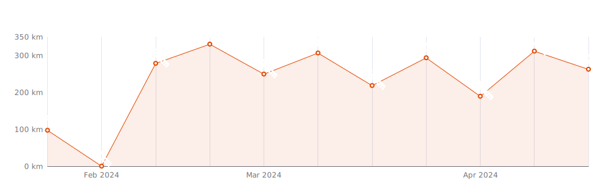
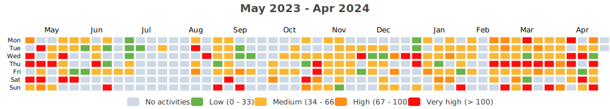
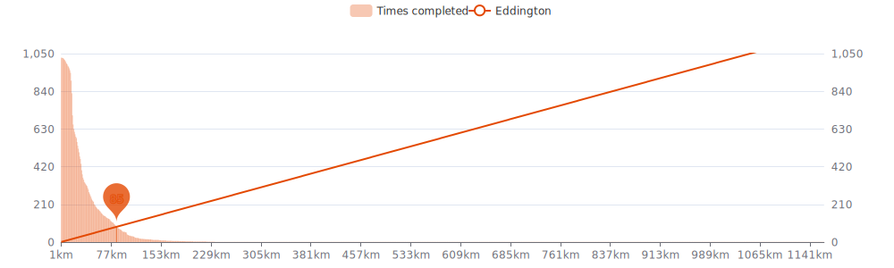
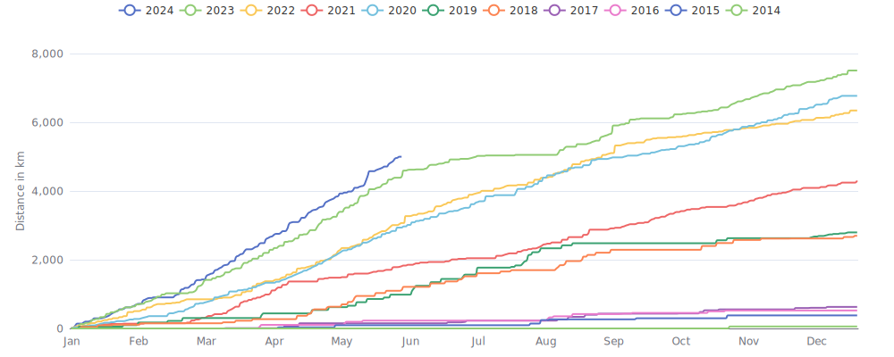

    

Since I began cycling `10 years and 6 months` ago on `02-11-2014`,
I had `998 cycling days`. 
I recorded a total distance of `38 231 km`
(`0.95` trips around the world 🌍 and
`0.099` trips to the moon 🌕),
an elevation of `434 596 m`
(`49.1` times Mount Everest 🏔)
and a total time of `2mos 1w 4d 16h 15m` 🎉

That's a daily average of `11 km`,
a weekly average of `75 km` and a
monthly average of `327 km` 🐣

I burned `926939 calories` doing so, that's about `3 433` pizza slices 🍕

---

<kbd><a href="#weekly-distances">Weekly distances</a></kbd> |
<kbd><a href="#activities">Activities</a></kbd> |
<kbd><a href="#monthly-stats">Monthly stats</a></kbd> |
<kbd><a href="#activity-intensity">Activity intensity</a></kbd> |
<kbd><a href="#stats-per-weekday">Stats per weekday</a></kbd> |
<kbd><a href="#daytime-stats">Daytime stats</a></kbd> |
<kbd><a href="#stats-per-bike">Stats per bike</a></kbd> |
<kbd><a href="#best-power-outputs-over-time">Power outputs</a></kbd> |
<kbd><a href="#eddington-chart">Eddington</a></kbd> |
<kbd><a href="#yearly-distances">Yearly distances</a></kbd> |
<kbd><a href="#distance-breakdown">Distance breakdown</a></kbd> |
<kbd><a href="#challenge-consistency">Challenge consistency</a></kbd> |

## Weekly distances

## Activities

<table>
    <tr>
        <th></th>
        <th></th>
        <th align="center"></th>
        <th align="center"></th>
        <th align="center"></th>
        <th align="center"></th>
        <th align="center"></th>
        <th align="center"></th>
    </tr>
            <tr>
            <td>17-07-24</td>
            <td>
                
<a href="https://www.strava.com/activities/11908714423" title="Kcal: 165 | Gear: Velotaf ">Sortie vélo le midi</a>
            </td>
            <td align="center">7 km</td>
            <td align="center">30 m</td>
            <td align="center">21:53</td>
            <td align="center">123 w</td>
            <td align="center">20.4 km/h</td>
            <td align="center">111</td>
        </tr>
            <tr>
            <td>17-07-24</td>
            <td>
                
<a href="https://www.strava.com/activities/11908352200" title="Kcal: 208 | Gear: Velotaf ">Sortie vélo le matin</a>
            </td>
            <td align="center">8 km</td>
            <td align="center">42 m</td>
            <td align="center">25:01</td>
            <td align="center">120 w</td>
            <td align="center">18.3 km/h</td>
            <td align="center">115</td>
        </tr>
            <tr>
            <td>16-07-24</td>
            <td>
                
<a href="https://www.strava.com/activities/11900549094" title="Kcal: 143 | Gear: Velotaf ">Sortie vélo le midi</a>
            </td>
            <td align="center">6 km</td>
            <td align="center">34 m</td>
            <td align="center">19:34</td>
            <td align="center">123 w</td>
            <td align="center">18 km/h</td>
            <td align="center">110</td>
        </tr>
            <tr>
            <td>15-07-24</td>
            <td>
                
<a href="https://www.strava.com/activities/11894625703" title="Kcal: 398 | Gear: Velotaf ">Sortie vélo le midi</a>
            </td>
            <td align="center">20 km</td>
            <td align="center">103 m</td>
            <td align="center">1:02:26</td>
            <td align="center">124 w</td>
            <td align="center">19.4 km/h</td>
            <td align="center">104</td>
        </tr>
            <tr>
            <td>14-07-24</td>
            <td>
                
<a href="https://www.strava.com/activities/11889726653" title="Kcal: 260 | Gear: Velotaf ">Sortie vélo en soirée</a>
            </td>
            <td align="center">12 km</td>
            <td align="center">63 m</td>
            <td align="center">46:44</td>
            <td align="center">95 w</td>
            <td align="center">15.7 km/h</td>
            <td align="center">99</td>
        </tr>
        </table>

    
Older activities

    <table>
        <tr>
            <th></th>
            <th></th>
            <th align="center"></th>
            <th align="center"></th>
            <th align="center"></th>
            <th align="center"></th>
            <th align="center"></th>
            <th align="center"></th>
        </tr>
                    <tr>
                <td>10-07-24</td>
                <td>
                    
<a href="https://www.strava.com/activities/11857591022" title="Kcal: 132 | Gear: Velotaf ">Sortie vélo de nuit</a>
                </td>
                <td align="center">4 km</td>
                <td align="center">8 m</td>
                <td align="center">13:06</td>
                <td align="center">114 w</td>
                <td align="center">20.3 km/h</td>
                <td align="center">124</td>
            </tr>
                    <tr>
                <td>10-07-24</td>
                <td>
                    
<a href="https://www.strava.com/activities/11856445068" title="Kcal: 142 | Gear: Velotaf ">Sortie vélo en soirée</a>
                </td>
                <td align="center">6 km</td>
                <td align="center">38 m</td>
                <td align="center">18:11</td>
                <td align="center">133 w</td>
                <td align="center">18.6 km/h</td>
                <td align="center">111</td>
            </tr>
                    <tr>
                <td>10-07-24</td>
                <td>
                    
<a href="https://www.strava.com/activities/11855181517" title="Kcal: 242 | Gear: Velotaf ">Sortie vélo le midi</a>
                </td>
                <td align="center">12 km</td>
                <td align="center">76 m</td>
                <td align="center">37:56</td>
                <td align="center">124 w</td>
                <td align="center">19.3 km/h</td>
                <td align="center">102</td>
            </tr>
                    <tr>
                <td>09-07-24</td>
                <td>
                    
<a href="https://www.strava.com/activities/11847302756" title="Kcal: 340 | Gear: Velotaf ">Sortie vélo le midi</a>
                </td>
                <td align="center">14 km</td>
                <td align="center">76 m</td>
                <td align="center">46:54</td>
                <td align="center">119 w</td>
                <td align="center">18.1 km/h</td>
                <td align="center">109</td>
            </tr>
                    <tr>
                <td>08-07-24</td>
                <td>
                    
<a href="https://www.strava.com/activities/11840352917" title="Kcal: 670 | Gear: Velotaf ">Sortie vélo le matin</a>
                </td>
                <td align="center">30 km</td>
                <td align="center">200 m</td>
                <td align="center">1:30:02</td>
                <td align="center">131 w</td>
                <td align="center">19.7 km/h</td>
                <td align="center">109</td>
            </tr>
                    <tr>
                <td>05-07-24</td>
                <td>
                    
<a href="https://www.strava.com/activities/11813775443" title="Kcal: 322 | Gear: Velotaf ">Sortie vélo le midi</a>
                </td>
                <td align="center">13 km</td>
                <td align="center">90 m</td>
                <td align="center">44:20</td>
                <td align="center">116 w</td>
                <td align="center">16.9 km/h</td>
                <td align="center">110</td>
            </tr>
                    <tr>
                <td>04-07-24</td>
                <td>
                    
<a href="https://www.strava.com/activities/11806603047" title="Kcal: 541 | Gear: Velotaf ">Sortie vélo le midi</a>
                </td>
                <td align="center">21 km</td>
                <td align="center">145 m</td>
                <td align="center">1:13:11</td>
                <td align="center">119 w</td>
                <td align="center">17.4 km/h</td>
                <td align="center">112</td>
            </tr>
                    <tr>
                <td>01-07-24</td>
                <td>
                    
<a href="https://www.strava.com/activities/11782283078" title="Kcal: 204 | Gear: Velotaf ">Vélotaf #57</a>
                </td>
                <td align="center">11 km</td>
                <td align="center">49 m</td>
                <td align="center">33:13</td>
                <td align="center">123 w</td>
                <td align="center">19.1 km/h</td>
                <td align="center">101</td>
            </tr>
                    <tr>
                <td>25-06-24</td>
                <td>
                    
<a href="https://www.strava.com/activities/11768682792" title="Kcal: 29270 | Gear: Endurace ">Race Across France 1000 - ...</a>
                </td>
                <td align="center">1 162 km</td>
                <td align="center">17 363 m</td>
                <td align="center">8:45:32</td>
                <td align="center">129 w</td>
                <td align="center">20.5 km/h</td>
                <td align="center">124</td>
            </tr>
                    <tr>
                <td>23-06-24</td>
                <td>
                    
<a href="https://www.strava.com/activities/11765407535" title="Kcal: 249 | Gear: Endurace ">Sortie vélo dans l&#039;après-m...</a>
                </td>
                <td align="center">10 km</td>
                <td align="center">56 m</td>
                <td align="center">31:38</td>
                <td align="center">109 w</td>
                <td align="center">19.2 km/h</td>
                <td align="center">131</td>
            </tr>
                    <tr>
                <td>21-06-24</td>
                <td>
                                    
<a href="https://www.strava.com/activities/11704739295" title="Kcal: 508 | Gear: Home Trainer ">Sortie vélo dans l&#039;après-m...</a>
                </td>
                <td align="center">25 km</td>
                <td align="center">0 m</td>
                <td align="center">45:00</td>
                <td align="center">188 w</td>
                <td align="center">32.8 km/h</td>
                <td align="center">147</td>
            </tr>
                    <tr>
                <td>20-06-24</td>
                <td>
                                    
<a href="https://www.strava.com/activities/11695527074" title="Kcal: 821 | Gear: Home Trainer ">Sortie vélo le matin</a>
                </td>
                <td align="center">27 km</td>
                <td align="center">894 m</td>
                <td align="center">1:16:58</td>
                <td align="center">178 w</td>
                <td align="center">20.9 km/h</td>
                <td align="center">148</td>
            </tr>
                    <tr>
                <td>18-06-24</td>
                <td>
                    
<a href="https://www.strava.com/activities/11682813477" title="Kcal: 502 | Gear: Velotaf ">Vélotaf #56</a>
                </td>
                <td align="center">17 km</td>
                <td align="center">63 m</td>
                <td align="center">55:12</td>
                <td align="center">110 w</td>
                <td align="center">18.5 km/h</td>
                <td align="center">121</td>
            </tr>
                    <tr>
                <td>17-06-24</td>
                <td>
                    
<a href="https://www.strava.com/activities/11675273062" title="Kcal: 304 | Gear: Velotaf ">Vélotaf #55</a>
                </td>
                <td align="center">14 km</td>
                <td align="center">69 m</td>
                <td align="center">43:04</td>
                <td align="center">120 w</td>
                <td align="center">19 km/h</td>
                <td align="center">108</td>
            </tr>
                    <tr>
                <td>17-06-24</td>
                <td>
                                    
<a href="https://www.strava.com/activities/11671753066" title="Kcal: 904 | Gear: Home Trainer ">Sortie vélo le matin</a>
                </td>
                <td align="center">44 km</td>
                <td align="center">0 m</td>
                <td align="center">1:22:00</td>
                <td align="center">184 w</td>
                <td align="center">32.4 km/h</td>
                <td align="center">144</td>
            </tr>
                    <tr>
                <td>14-06-24</td>
                <td>
                    
<a href="https://www.strava.com/activities/11651697551" title="Kcal: 391 | Gear: Endurace ">Go to Boissy entre les gou...</a>
                </td>
                <td align="center">114 km</td>
                <td align="center">904 m</td>
                <td align="center">4:25:17</td>
                <td align="center">n/a</td>
                <td align="center">25.7 km/h</td>
                <td align="center">146</td>
            </tr>
                    <tr>
                <td>13-06-24</td>
                <td>
                                    
<a href="https://www.strava.com/activities/11641554701" title="Kcal: 636 | Gear: Home Trainer ">Sortie vélo le matin</a>
                </td>
                <td align="center">32 km</td>
                <td align="center">0 m</td>
                <td align="center">1:00:45</td>
                <td align="center">175 w</td>
                <td align="center">31.5 km/h</td>
                <td align="center">139</td>
            </tr>
                    <tr>
                <td>12-06-24</td>
                <td>
                    
<a href="https://www.strava.com/activities/11638791157" title="Kcal: 355 | Gear: Velotaf ">Vélotaf #54</a>
                </td>
                <td align="center">17 km</td>
                <td align="center">71 m</td>
                <td align="center">54:03</td>
                <td align="center">110 w</td>
                <td align="center">18.4 km/h</td>
                <td align="center">106</td>
            </tr>
                    <tr>
                <td>11-06-24</td>
                <td>
                    
<a href="https://www.strava.com/activities/11630266967" title="Kcal: 146 | Gear: Velotaf ">Vélotaf #53</a>
                </td>
                <td align="center">8 km</td>
                <td align="center">45 m</td>
                <td align="center">24:40</td>
                <td align="center">131 w</td>
                <td align="center">19.9 km/h</td>
                <td align="center">96</td>
            </tr>
                    <tr>
                <td>10-06-24</td>
                <td>
                    
<a href="https://www.strava.com/activities/11619613442" title="Kcal: 394 | Gear: Velotaf ">Vélotaf #52</a>
                </td>
                <td align="center">18 km</td>
                <td align="center">107 m</td>
                <td align="center">56:37</td>
                <td align="center">118 w</td>
                <td align="center">18.6 km/h</td>
                <td align="center">106</td>
            </tr>
                    <tr>
                <td>10-06-24</td>
                <td>
                                    
<a href="https://www.strava.com/activities/11617460830" title="Kcal: 641 | Gear: Home Trainer ">Sortie vélo le matin</a>
                </td>
                <td align="center">35 km</td>
                <td align="center">0 m</td>
                <td align="center">1:08:00</td>
                <td align="center">157 w</td>
                <td align="center">30.5 km/h</td>
                <td align="center">134</td>
            </tr>
                    <tr>
                <td>07-06-24</td>
                <td>
                    
<a href="https://www.strava.com/activities/11595236911" title="Kcal: 476 | Gear: Velotaf ">Vélotaf #51</a>
                </td>
                <td align="center">22 km</td>
                <td align="center">111 m</td>
                <td align="center">1:13:53</td>
                <td align="center">111 w</td>
                <td align="center">17.9 km/h</td>
                <td align="center">103</td>
            </tr>
                    <tr>
                <td>06-06-24</td>
                <td>
                    
<a href="https://www.strava.com/activities/11587268387" title="Kcal: 1003 | Gear: Endurace ">Sortie vélo le matin</a>
                </td>
                <td align="center">149 km</td>
                <td align="center">1 368 m</td>
                <td align="center">5:35:21</td>
                <td align="center">5 w</td>
                <td align="center">26.7 km/h</td>
                <td align="center">138</td>
            </tr>
                    <tr>
                <td>03-06-24</td>
                <td>
                                    
<a href="https://www.strava.com/activities/11563799538" title="Kcal: 574 | Gear: Home Trainer ">Sortie vélo dans l&#039;après-m...</a>
                </td>
                <td align="center">30 km</td>
                <td align="center">0 m</td>
                <td align="center">1:00:00</td>
                <td align="center">160 w</td>
                <td align="center">30.3 km/h</td>
                <td align="center">134</td>
            </tr>
                    <tr>
                <td>03-06-24</td>
                <td>
                    
<a href="https://www.strava.com/activities/11562704998" title="Kcal: 346 | Gear: Velotaf ">Vélotaf #50</a>
                </td>
                <td align="center">13 km</td>
                <td align="center">78 m</td>
                <td align="center">39:14</td>
                <td align="center">126 w</td>
                <td align="center">19.6 km/h</td>
                <td align="center">117</td>
            </tr>
                    <tr>
                <td>01-06-24</td>
                <td>
                                    
<a href="https://www.strava.com/activities/11545659728" title="Kcal: 628 | Gear: Home Trainer ">Hang Ten in Scotland</a>
                </td>
                <td align="center">31 km</td>
                <td align="center">340 m</td>
                <td align="center">1:00:21</td>
                <td align="center">182 w</td>
                <td align="center">30.8 km/h</td>
                <td align="center">141</td>
            </tr>
                    <tr>
                <td>31-05-24</td>
                <td>
                    
<a href="https://www.strava.com/activities/11539624907" title="Kcal: 498 | Gear: Velotaf ">Vélotaf #49</a>
                </td>
                <td align="center">17 km</td>
                <td align="center">62 m</td>
                <td align="center">57:56</td>
                <td align="center">104 w</td>
                <td align="center">17.2 km/h</td>
                <td align="center">118</td>
            </tr>
                    <tr>
                <td>30-05-24</td>
                <td>
                    
<a href="https://www.strava.com/activities/11531191621" title="Kcal: 2040 | Gear: Endurace ">Sortie vélo le matin</a>
                </td>
                <td align="center">80 km</td>
                <td align="center">797 m</td>
                <td align="center">3:07:47</td>
                <td align="center">159 w</td>
                <td align="center">25.6 km/h</td>
                <td align="center">129</td>
            </tr>
                    <tr>
                <td>29-05-24</td>
                <td>
                    
<a href="https://www.strava.com/activities/11532173107" title="Kcal: 974 | Gear: Velotaf ">Velotaf #47</a>
                </td>
                <td align="center">41 km</td>
                <td align="center">192 m</td>
                <td align="center">2:02:39</td>
                <td align="center">119 w</td>
                <td align="center">20.2 km/h</td>
                <td align="center">113</td>
            </tr>
                    <tr>
                <td>28-05-24</td>
                <td>
                    
<a href="https://www.strava.com/activities/11518484463" title="Kcal: 435 | Gear: Velotaf ">Vélotaf #46</a>
                </td>
                <td align="center">16 km</td>
                <td align="center">69 m</td>
                <td align="center">53:24</td>
                <td align="center">111 w</td>
                <td align="center">18.3 km/h</td>
                <td align="center">114</td>
            </tr>
                    <tr>
                <td>28-05-24</td>
                <td>
                                    
<a href="https://www.strava.com/activities/11514775914" title="Kcal: 606 | Gear: Home Trainer ">06. Sweet Spot Summit in W...</a>
                </td>
                <td align="center">25 km</td>
                <td align="center">259 m</td>
                <td align="center">52:06</td>
                <td align="center">203 w</td>
                <td align="center">29.2 km/h</td>
                <td align="center">155</td>
            </tr>
                    <tr>
                <td>27-05-24</td>
                <td>
                    
<a href="https://www.strava.com/activities/11509979183" title="Kcal: 1882 | Gear: Endurace ">Sortie vélo dans l&#039;après-m...</a>
                </td>
                <td align="center">74 km</td>
                <td align="center">717 m</td>
                <td align="center">2:52:19</td>
                <td align="center">158 w</td>
                <td align="center">25.8 km/h</td>
                <td align="center">139</td>
            </tr>
                    <tr>
                <td>25-05-24</td>
                <td>
                                    
<a href="https://www.strava.com/activities/11491497923" title="Kcal: 682 | Gear: Home Trainer ">Zwift Academy Road: Workou...</a>
                </td>
                <td align="center">32 km</td>
                <td align="center">364 m</td>
                <td align="center">1:02:04</td>
                <td align="center">192 w</td>
                <td align="center">31.2 km/h</td>
                <td align="center">157</td>
            </tr>
                    <tr>
                <td>24-05-24</td>
                <td>
                    
<a href="https://www.strava.com/activities/11486242303" title="Kcal: 684 | Gear: Velotaf ">Vélotaf #45</a>
                </td>
                <td align="center">27 km</td>
                <td align="center">105 m</td>
                <td align="center">1:26:59</td>
                <td align="center">113 w</td>
                <td align="center">18.7 km/h</td>
                <td align="center">113</td>
            </tr>
                    <tr>
                <td>23-05-24</td>
                <td>
                    
<a href="https://www.strava.com/activities/11478981638" title="Kcal: 615 | Gear: Velotaf ">Vélotaf #44</a>
                </td>
                <td align="center">20 km</td>
                <td align="center">85 m</td>
                <td align="center">1:07:07</td>
                <td align="center">111 w</td>
                <td align="center">18.1 km/h</td>
                <td align="center">118</td>
            </tr>
                    <tr>
                <td>22-05-24</td>
                <td>
                    
<a href="https://www.strava.com/activities/11474174984" title="Kcal: 535 | Gear: Velotaf ">Vélotaf #43</a>
                </td>
                <td align="center">24 km</td>
                <td align="center">71 m</td>
                <td align="center">1:16:21</td>
                <td align="center">111 w</td>
                <td align="center">18.9 km/h</td>
                <td align="center">107</td>
            </tr>
                    <tr>
                <td>21-05-24</td>
                <td>
                                    
<a href="https://www.strava.com/activities/11461352331" title="Kcal: 652 | Gear: Home Trainer ">Progressive 11&#039;s #2 in Ric...</a>
                </td>
                <td align="center">32 km</td>
                <td align="center">288 m</td>
                <td align="center">1:01:09</td>
                <td align="center">186 w</td>
                <td align="center">31.5 km/h</td>
                <td align="center">142</td>
            </tr>
                    <tr>
                <td>18-05-24</td>
                <td>
                    
<a href="https://www.strava.com/activities/11441953973" title="Kcal: 189 | Gear: Endurace ">Sortie vélo de nuit</a>
                </td>
                <td align="center">10 km</td>
                <td align="center">33 m</td>
                <td align="center">32:11</td>
                <td align="center">75 w</td>
                <td align="center">19.1 km/h</td>
                <td align="center">116</td>
            </tr>
                    <tr>
                <td>18-05-24</td>
                <td>
                    
<a href="https://www.strava.com/activities/11438221336" title="Kcal: 2876 | Gear: Endurace ">Retour Toulouse</a>
                </td>
                <td align="center">128 km</td>
                <td align="center">1 001 m</td>
                <td align="center">4:52:27</td>
                <td align="center">140 w</td>
                <td align="center">26.3 km/h</td>
                <td align="center">120</td>
            </tr>
                    <tr>
                <td>17-05-24</td>
                <td>
                    
<a href="https://www.strava.com/activities/11434161261" title="Kcal: 5210 | Gear: Endurace ">Marie Blanque, Aubisque, S...</a>
                </td>
                <td align="center">169 km</td>
                <td align="center">3 408 m</td>
                <td align="center">8:59:15</td>
                <td align="center">132 w</td>
                <td align="center">18.8 km/h</td>
                <td align="center">126</td>
            </tr>
                    <tr>
                <td>16-05-24</td>
                <td>
                    
<a href="https://www.strava.com/activities/11434156225" title="Kcal: 3272 | Gear: Endurace ">Col de Behorleguy</a>
                </td>
                <td align="center">103 km</td>
                <td align="center">2 183 m</td>
                <td align="center">5:21:14</td>
                <td align="center">145 w</td>
                <td align="center">19.3 km/h</td>
                <td align="center">122</td>
            </tr>
                    <tr>
                <td>16-05-24</td>
                <td>
                    
<a href="https://www.strava.com/activities/11423238148" title="Kcal: 215 | Gear: Endurace ">Vélo du midi</a>
                </td>
                <td align="center">9 km</td>
                <td align="center">57 m</td>
                <td align="center">30:46</td>
                <td align="center">94 w</td>
                <td align="center">18.1 km/h</td>
                <td align="center">102</td>
            </tr>
                    <tr>
                <td>15-05-24</td>
                <td>
                    
<a href="https://www.strava.com/activities/11417717497" title="Kcal: 207 | Gear: Velotaf ">Vélotaf #42</a>
                </td>
                <td align="center">10 km</td>
                <td align="center">33 m</td>
                <td align="center">35:07</td>
                <td align="center">102 w</td>
                <td align="center">17.1 km/h</td>
                <td align="center">100</td>
            </tr>
                    <tr>
                <td>15-05-24</td>
                <td>
                    
<a href="https://www.strava.com/activities/11414910935" title="Kcal: 108 | Gear: Velotaf ">Vélotaf #41</a>
                </td>
                <td align="center">6 km</td>
                <td align="center">33 m</td>
                <td align="center">17:01</td>
                <td align="center">125 w</td>
                <td align="center">19.4 km/h</td>
                <td align="center">102</td>
            </tr>
                    <tr>
                <td>14-05-24</td>
                <td>
                    
<a href="https://www.strava.com/activities/11408959238" title="Kcal: 403 | Gear: Velotaf ">Vélotaf #40</a>
                </td>
                <td align="center">20 km</td>
                <td align="center">77 m</td>
                <td align="center">1:10:45</td>
                <td align="center">106 w</td>
                <td align="center">17.3 km/h</td>
                <td align="center">101</td>
            </tr>
                    <tr>
                <td>13-05-24</td>
                <td>
                                    
<a href="https://www.strava.com/activities/11399979538" title="Kcal: 544 | Gear: Home Trainer ">Pre-Race in New York</a>
                </td>
                <td align="center">27 km</td>
                <td align="center">418 m</td>
                <td align="center">56:26</td>
                <td align="center">169 w</td>
                <td align="center">28.4 km/h</td>
                <td align="center">148</td>
            </tr>
                    <tr>
                <td>11-05-24</td>
                <td>
                    
<a href="https://www.strava.com/activities/11383424437" title="Kcal: 2188 | Gear: Lapierre ">Col de la Machine et col d...</a>
                </td>
                <td align="center">76 km</td>
                <td align="center">1 336 m</td>
                <td align="center">3:18:31</td>
                <td align="center">144 w</td>
                <td align="center">22.9 km/h</td>
                <td align="center">146</td>
            </tr>
                    <tr>
                <td>10-05-24</td>
                <td>
                    
<a href="https://www.strava.com/activities/11375841372" title="Kcal: 850 | Gear: Lapierre ">Sortie vélo le matin</a>
                </td>
                <td align="center">33 km</td>
                <td align="center">482 m</td>
                <td align="center">1:50:42</td>
                <td align="center">93 w</td>
                <td align="center">17.7 km/h</td>
                <td align="center">119</td>
            </tr>
                    <tr>
                <td>08-05-24</td>
                <td>
                    
<a href="https://www.strava.com/activities/11361834847" title="Kcal: 723 | Gear: Lapierre ">La classique avec les nouv...</a>
                </td>
                <td align="center">32 km</td>
                <td align="center">465 m</td>
                <td align="center">1:45:37</td>
                <td align="center">103 w</td>
                <td align="center">18.2 km/h</td>
                <td align="center">113</td>
            </tr>
                    <tr>
                <td>06-05-24</td>
                <td>
                                    
<a href="https://www.strava.com/activities/11346621288" title="Kcal: 508 | Gear: Home Trainer ">05. Endurance Ascent in Fr...</a>
                </td>
                <td align="center">26 km</td>
                <td align="center">150 m</td>
                <td align="center">45:17</td>
                <td align="center">196 w</td>
                <td align="center">34.5 km/h</td>
                <td align="center">142</td>
            </tr>
            </table>

## Monthly stats

<table>
    <thead>
    <tr>
        <th>&nbsp;&nbsp;&nbsp;&nbsp;&nbsp;</th>
        <th># of rides</th>
        <th align="center"></th>
        <th align="center"></th>
        <th align="center"></th>
        <th align="center"></th>
    </tr>
    </thead>
    <tbody>
            <tr>
            <td align="center">July 2024</td>
            <td align="center">13</td>
            <td align="center">164 km</td>
            <td align="center">954 m</td>
            <td align="center">8h 52m</td>
            <td align="center">0</td>
        </tr>
            <tr>
            <td align="center">June 2024</td>
            <td align="center">18</td>
            <td align="center">1 766 km</td>
            <td align="center">21 469 m</td>
            <td align="center">3d 8h 37m</td>
            <td align="center">0</td>
        </tr>
            <tr>
            <td align="center">May 2024</td>
            <td align="center">28</td>
            <td align="center">1 210 km</td>
            <td align="center">13 896 m</td>
            <td align="center">2d 5h 54m</td>
            <td align="center">0</td>
        </tr>
            <tr>
            <td align="center">April 2024</td>
            <td align="center">29</td>
            <td align="center">1 135 km</td>
            <td align="center">14 451 m</td>
            <td align="center">1d 22h 35m</td>
            <td align="center">0</td>
        </tr>
            <tr>
            <td align="center">March 2024</td>
            <td align="center">31</td>
            <td align="center">1 187 km</td>
            <td align="center">10 558 m</td>
            <td align="center">1d 22h 17m</td>
            <td align="center">0</td>
        </tr>
            <tr>
            <td align="center">February 2024</td>
            <td align="center">19</td>
            <td align="center">727 km</td>
            <td align="center">7 016 m</td>
            <td align="center">1d 4h 45m</td>
            <td align="center">0</td>
        </tr>
            <tr>
            <td align="center">January 2024</td>
            <td align="center">26</td>
            <td align="center">665 km</td>
            <td align="center">5 480 m</td>
            <td align="center">1d 4h 5m</td>
            <td align="center">0</td>
        </tr>
            <tr>
            <td align="center">December 2023</td>
            <td align="center">18</td>
            <td align="center">446 km</td>
            <td align="center">3 957 m</td>
            <td align="center">18h 55m</td>
            <td align="center">0</td>
        </tr>
            <tr>
            <td align="center">November 2023</td>
            <td align="center">25</td>
            <td align="center">612 km</td>
            <td align="center">4 096 m</td>
            <td align="center">1d 3h 40m</td>
            <td align="center">0</td>
        </tr>
            <tr>
            <td align="center">October 2023</td>
            <td align="center">16</td>
            <td align="center">319 km</td>
            <td align="center">3 148 m</td>
            <td align="center">15h 27m</td>
            <td align="center">0</td>
        </tr>
            <tr>
            <td align="center">September 2023</td>
            <td align="center">15</td>
            <td align="center">666 km</td>
            <td align="center">5 253 m</td>
            <td align="center">1d 2h 32m</td>
            <td align="center">0</td>
        </tr>
            <tr>
            <td align="center">August 2023</td>
            <td align="center">9</td>
            <td align="center">393 km</td>
            <td align="center">5 780 m</td>
            <td align="center">18h 27m</td>
            <td align="center">0</td>
        </tr>
            <tr>
            <td align="center">July 2023</td>
            <td align="center">7</td>
            <td align="center">118 km</td>
            <td align="center">1 526 m</td>
            <td align="center">5h 59m</td>
            <td align="center">0</td>
        </tr>
            <tr>
            <td align="center">June 2023</td>
            <td align="center">17</td>
            <td align="center">549 km</td>
            <td align="center">5 994 m</td>
            <td align="center">1d 1h 25m</td>
            <td align="center">0</td>
        </tr>
            <tr>
            <td align="center">May 2023</td>
            <td align="center">29</td>
            <td align="center">1 169 km</td>
            <td align="center">13 083 m</td>
            <td align="center">1d 21h 13m</td>
            <td align="center">0</td>
        </tr>
            <tr>
            <td align="center">April 2023</td>
            <td align="center">27</td>
            <td align="center">984 km</td>
            <td align="center">11 384 m</td>
            <td align="center">1d 14h 26m</td>
            <td align="center">0</td>
        </tr>
            <tr>
            <td align="center">March 2023</td>
            <td align="center">35</td>
            <td align="center">960 km</td>
            <td align="center">8 546 m</td>
            <td align="center">1d 14h 20m</td>
            <td align="center">0</td>
        </tr>
            <tr>
            <td align="center">February 2023</td>
            <td align="center">21</td>
            <td align="center">427 km</td>
            <td align="center">3 676 m</td>
            <td align="center">17h 23m</td>
            <td align="center">0</td>
        </tr>
            <tr>
            <td align="center">January 2023</td>
            <td align="center">33</td>
            <td align="center">642 km</td>
            <td align="center">5 554 m</td>
            <td align="center">1d 3h 51m</td>
            <td align="center">0</td>
        </tr>
            <tr>
            <td align="center">December 2022</td>
            <td align="center">13</td>
            <td align="center">339 km</td>
            <td align="center">3 504 m</td>
            <td align="center">13h 51m</td>
            <td align="center">0</td>
        </tr>
            <tr>
            <td align="center">November 2022</td>
            <td align="center">13</td>
            <td align="center">214 km</td>
            <td align="center">996 m</td>
            <td align="center">11h 34m</td>
            <td align="center">0</td>
        </tr>
            <tr>
            <td align="center">October 2022</td>
            <td align="center">20</td>
            <td align="center">228 km</td>
            <td align="center">1 009 m</td>
            <td align="center">13h 41m</td>
            <td align="center">0</td>
        </tr>
            <tr>
            <td align="center">September 2022</td>
            <td align="center">29</td>
            <td align="center">617 km</td>
            <td align="center">5 685 m</td>
            <td align="center">1d 3h 49m</td>
            <td align="center">0</td>
        </tr>
            <tr>
            <td align="center">August 2022</td>
            <td align="center">15</td>
            <td align="center">682 km</td>
            <td align="center">13 658 m</td>
            <td align="center">1d 9h 9m</td>
            <td align="center">0</td>
        </tr>
            <tr>
            <td align="center">July 2022</td>
            <td align="center">24</td>
            <td align="center">455 km</td>
            <td align="center">4 330 m</td>
            <td align="center">19h 37m</td>
            <td align="center">0</td>
        </tr>
            <tr>
            <td align="center">June 2022</td>
            <td align="center">31</td>
            <td align="center">769 km</td>
            <td align="center">9 475 m</td>
            <td align="center">1d 8h 39m</td>
            <td align="center">0</td>
        </tr>
            <tr>
            <td align="center">May 2022</td>
            <td align="center">30</td>
            <td align="center">939 km</td>
            <td align="center">12 022 m</td>
            <td align="center">1d 15h 49m</td>
            <td align="center">0</td>
        </tr>
            <tr>
            <td align="center">April 2022</td>
            <td align="center">31</td>
            <td align="center">630 km</td>
            <td align="center">5 119 m</td>
            <td align="center">1d 1h 6m</td>
            <td align="center">0</td>
        </tr>
            <tr>
            <td align="center">March 2022</td>
            <td align="center">19</td>
            <td align="center">525 km</td>
            <td align="center">3 879 m</td>
            <td align="center">20h 48m</td>
            <td align="center">0</td>
        </tr>
            <tr>
            <td align="center">February 2022</td>
            <td align="center">24</td>
            <td align="center">347 km</td>
            <td align="center">2 177 m</td>
            <td align="center">14h 45m</td>
            <td align="center">0</td>
        </tr>
            <tr>
            <td align="center">January 2022</td>
            <td align="center">22</td>
            <td align="center">503 km</td>
            <td align="center">5 067 m</td>
            <td align="center">18h 36m</td>
            <td align="center">0</td>
        </tr>
            <tr>
            <td align="center">December 2021</td>
            <td align="center">12</td>
            <td align="center">286 km</td>
            <td align="center">3 745 m</td>
            <td align="center">12h 28m</td>
            <td align="center">0</td>
        </tr>
            <tr>
            <td align="center">November 2021</td>
            <td align="center">30</td>
            <td align="center">453 km</td>
            <td align="center">3 225 m</td>
            <td align="center">19h 45m</td>
            <td align="center">0</td>
        </tr>
            <tr>
            <td align="center">October 2021</td>
            <td align="center">20</td>
            <td align="center">302 km</td>
            <td align="center">2 311 m</td>
            <td align="center">12h 57m</td>
            <td align="center">0</td>
        </tr>
            <tr>
            <td align="center">September 2021</td>
            <td align="center">27</td>
            <td align="center">341 km</td>
            <td align="center">2 418 m</td>
            <td align="center">15h 17m</td>
            <td align="center">0</td>
        </tr>
            <tr>
            <td align="center">August 2021</td>
            <td align="center">17</td>
            <td align="center">568 km</td>
            <td align="center">8 996 m</td>
            <td align="center">1d 40m</td>
            <td align="center">0</td>
        </tr>
            <tr>
            <td align="center">July 2021</td>
            <td align="center">19</td>
            <td align="center">283 km</td>
            <td align="center">2 129 m</td>
            <td align="center">12h 28m</td>
            <td align="center">0</td>
        </tr>
            <tr>
            <td align="center">June 2021</td>
            <td align="center">18</td>
            <td align="center">240 km</td>
            <td align="center">1 804 m</td>
            <td align="center">10h 36m</td>
            <td align="center">0</td>
        </tr>
            <tr>
            <td align="center">May 2021</td>
            <td align="center">18</td>
            <td align="center">308 km</td>
            <td align="center">2 189 m</td>
            <td align="center">13h 54m</td>
            <td align="center">0</td>
        </tr>
            <tr>
            <td align="center">April 2021</td>
            <td align="center">12</td>
            <td align="center">491 km</td>
            <td align="center">6 215 m</td>
            <td align="center">20h 44m</td>
            <td align="center">0</td>
        </tr>
            <tr>
            <td align="center">March 2021</td>
            <td align="center">20</td>
            <td align="center">702 km</td>
            <td align="center">9 279 m</td>
            <td align="center">1d 1h 46m</td>
            <td align="center">0</td>
        </tr>
            <tr>
            <td align="center">February 2021</td>
            <td align="center">3</td>
            <td align="center">95 km</td>
            <td align="center">896 m</td>
            <td align="center">3h 33m</td>
            <td align="center">0</td>
        </tr>
            <tr>
            <td align="center">January 2021</td>
            <td align="center">6</td>
            <td align="center">137 km</td>
            <td align="center">1 027 m</td>
            <td align="center">5h 36m</td>
            <td align="center">0</td>
        </tr>
            <tr>
            <td align="center">December 2020</td>
            <td align="center">17</td>
            <td align="center">525 km</td>
            <td align="center">5 789 m</td>
            <td align="center">21h 48m</td>
            <td align="center">0</td>
        </tr>
            <tr>
            <td align="center">November 2020</td>
            <td align="center">16</td>
            <td align="center">543 km</td>
            <td align="center">6 243 m</td>
            <td align="center">18h 46m</td>
            <td align="center">0</td>
        </tr>
            <tr>
            <td align="center">October 2020</td>
            <td align="center">25</td>
            <td align="center">527 km</td>
            <td align="center">5 059 m</td>
            <td align="center">22h 32m</td>
            <td align="center">0</td>
        </tr>
            <tr>
            <td align="center">September 2020</td>
            <td align="center">27</td>
            <td align="center">253 km</td>
            <td align="center">911 m</td>
            <td align="center">12h 24m</td>
            <td align="center">0</td>
        </tr>
            <tr>
            <td align="center">August 2020</td>
            <td align="center">13</td>
            <td align="center">778 km</td>
            <td align="center">15 577 m</td>
            <td align="center">1d 10h 19m</td>
            <td align="center">0</td>
        </tr>
            <tr>
            <td align="center">July 2020</td>
            <td align="center">17</td>
            <td align="center">629 km</td>
            <td align="center">8 098 m</td>
            <td align="center">1d 3h 34m</td>
            <td align="center">0</td>
        </tr>
            <tr>
            <td align="center">June 2020</td>
            <td align="center">22</td>
            <td align="center">539 km</td>
            <td align="center">5 518 m</td>
            <td align="center">20h 23m</td>
            <td align="center">0</td>
        </tr>
            <tr>
            <td align="center">May 2020</td>
            <td align="center">23</td>
            <td align="center">868 km</td>
            <td align="center">9 688 m</td>
            <td align="center">1d 7h 6m</td>
            <td align="center">0</td>
        </tr>
            <tr>
            <td align="center">April 2020</td>
            <td align="center">24</td>
            <td align="center">707 km</td>
            <td align="center">9 457 m</td>
            <td align="center">1d 26m</td>
            <td align="center">0</td>
        </tr>
            <tr>
            <td align="center">March 2020</td>
            <td align="center">31</td>
            <td align="center">593 km</td>
            <td align="center">5 743 m</td>
            <td align="center">1d 10m</td>
            <td align="center">0</td>
        </tr>
            <tr>
            <td align="center">February 2020</td>
            <td align="center">35</td>
            <td align="center">442 km</td>
            <td align="center">3 573 m</td>
            <td align="center">20h 43m</td>
            <td align="center">0</td>
        </tr>
            <tr>
            <td align="center">January 2020</td>
            <td align="center">36</td>
            <td align="center">276 km</td>
            <td align="center">1 330 m</td>
            <td align="center">16h 18m</td>
            <td align="center">0</td>
        </tr>
            <tr>
            <td align="center">December 2019</td>
            <td align="center">22</td>
            <td align="center">170 km</td>
            <td align="center">775 m</td>
            <td align="center">10h 40m</td>
            <td align="center">0</td>
        </tr>
            <tr>
            <td align="center">November 2019</td>
            <td align="center">1</td>
            <td align="center">59 km</td>
            <td align="center">957 m</td>
            <td align="center">2h 24m</td>
            <td align="center">0</td>
        </tr>
            <tr>
            <td align="center">October 2019</td>
            <td align="center">1</td>
            <td align="center">87 km</td>
            <td align="center">1 629 m</td>
            <td align="center">3h 38m</td>
            <td align="center">0</td>
        </tr>
            <tr>
            <td align="center">August 2019</td>
            <td align="center">6</td>
            <td align="center">344 km</td>
            <td align="center">5 337 m</td>
            <td align="center">16h 1m</td>
            <td align="center">0</td>
        </tr>
            <tr>
            <td align="center">July 2019</td>
            <td align="center">9</td>
            <td align="center">632 km</td>
            <td align="center">13 438 m</td>
            <td align="center">1d 5h 35m</td>
            <td align="center">0</td>
        </tr>
            <tr>
            <td align="center">June 2019</td>
            <td align="center">5</td>
            <td align="center">455 km</td>
            <td align="center">7 307 m</td>
            <td align="center">18h 51m</td>
            <td align="center">0</td>
        </tr>
            <tr>
            <td align="center">May 2019</td>
            <td align="center">5</td>
            <td align="center">365 km</td>
            <td align="center">3 565 m</td>
            <td align="center">13h 43m</td>
            <td align="center">0</td>
        </tr>
            <tr>
            <td align="center">April 2019</td>
            <td align="center">2</td>
            <td align="center">180 km</td>
            <td align="center">2 216 m</td>
            <td align="center">7h 22m</td>
            <td align="center">0</td>
        </tr>
            <tr>
            <td align="center">March 2019</td>
            <td align="center">2</td>
            <td align="center">135 km</td>
            <td align="center">982 m</td>
            <td align="center">5h 9m</td>
            <td align="center">0</td>
        </tr>
            <tr>
            <td align="center">February 2019</td>
            <td align="center">3</td>
            <td align="center">210 km</td>
            <td align="center">2 031 m</td>
            <td align="center">8h 11m</td>
            <td align="center">0</td>
        </tr>
            <tr>
            <td align="center">January 2019</td>
            <td align="center">2</td>
            <td align="center">95 km</td>
            <td align="center">421 m</td>
            <td align="center">3h 10m</td>
            <td align="center">0</td>
        </tr>
            <tr>
            <td align="center">December 2018</td>
            <td align="center">3</td>
            <td align="center">78 km</td>
            <td align="center">1 211 m</td>
            <td align="center">3h 18m</td>
            <td align="center">0</td>
        </tr>
            <tr>
            <td align="center">November 2018</td>
            <td align="center">2</td>
            <td align="center">132 km</td>
            <td align="center">407 m</td>
            <td align="center">5h 1m</td>
            <td align="center">0</td>
        </tr>
            <tr>
            <td align="center">October 2018</td>
            <td align="center">4</td>
            <td align="center">195 km</td>
            <td align="center">1 673 m</td>
            <td align="center">8h 28m</td>
            <td align="center">0</td>
        </tr>
            <tr>
            <td align="center">September 2018</td>
            <td align="center">3</td>
            <td align="center">148 km</td>
            <td align="center">1 917 m</td>
            <td align="center">5h 47m</td>
            <td align="center">0</td>
        </tr>
            <tr>
            <td align="center">August 2018</td>
            <td align="center">8</td>
            <td align="center">445 km</td>
            <td align="center">7 563 m</td>
            <td align="center">18h 49m</td>
            <td align="center">0</td>
        </tr>
            <tr>
            <td align="center">July 2018</td>
            <td align="center">5</td>
            <td align="center">226 km</td>
            <td align="center">1 534 m</td>
            <td align="center">7h 53m</td>
            <td align="center">0</td>
        </tr>
            <tr>
            <td align="center">June 2018</td>
            <td align="center">6</td>
            <td align="center">329 km</td>
            <td align="center">4 271 m</td>
            <td align="center">13h 18m</td>
            <td align="center">0</td>
        </tr>
            <tr>
            <td align="center">May 2018</td>
            <td align="center">7</td>
            <td align="center">465 km</td>
            <td align="center">6 524 m</td>
            <td align="center">17h 40m</td>
            <td align="center">0</td>
        </tr>
            <tr>
            <td align="center">April 2018</td>
            <td align="center">8</td>
            <td align="center">361 km</td>
            <td align="center">5 347 m</td>
            <td align="center">17h 26m</td>
            <td align="center">0</td>
        </tr>
            <tr>
            <td align="center">March 2018</td>
            <td align="center">3</td>
            <td align="center">120 km</td>
            <td align="center">669 m</td>
            <td align="center">4h 34m</td>
            <td align="center">0</td>
        </tr>
            <tr>
            <td align="center">February 2018</td>
            <td align="center">1</td>
            <td align="center">44 km</td>
            <td align="center">235 m</td>
            <td align="center">1h 30m</td>
            <td align="center">0</td>
        </tr>
            <tr>
            <td align="center">January 2018</td>
            <td align="center">3</td>
            <td align="center">106 km</td>
            <td align="center">413 m</td>
            <td align="center">3h 42m</td>
            <td align="center">0</td>
        </tr>
            <tr>
            <td align="center">December 2017</td>
            <td align="center">3</td>
            <td align="center">72 km</td>
            <td align="center">425 m</td>
            <td align="center">2h 54m</td>
            <td align="center">0</td>
        </tr>
            <tr>
            <td align="center">October 2017</td>
            <td align="center">5</td>
            <td align="center">123 km</td>
            <td align="center">707 m</td>
            <td align="center">4h 49m</td>
            <td align="center">0</td>
        </tr>
            <tr>
            <td align="center">September 2017</td>
            <td align="center">1</td>
            <td align="center">33 km</td>
            <td align="center">441 m</td>
            <td align="center">1h 55m</td>
            <td align="center">0</td>
        </tr>
            <tr>
            <td align="center">August 2017</td>
            <td align="center">3</td>
            <td align="center">169 km</td>
            <td align="center">3 724 m</td>
            <td align="center">7h 55m</td>
            <td align="center">0</td>
        </tr>
            <tr>
            <td align="center">July 2017</td>
            <td align="center">2</td>
            <td align="center">44 km</td>
            <td align="center">388 m</td>
            <td align="center">1h 35m</td>
            <td align="center">0</td>
        </tr>
            <tr>
            <td align="center">June 2017</td>
            <td align="center">2</td>
            <td align="center">28 km</td>
            <td align="center">360 m</td>
            <td align="center">1h 25m</td>
            <td align="center">0</td>
        </tr>
            <tr>
            <td align="center">April 2017</td>
            <td align="center">3</td>
            <td align="center">143 km</td>
            <td align="center">3 424 m</td>
            <td align="center">7h 10m</td>
            <td align="center">0</td>
        </tr>
            <tr>
            <td align="center">March 2017</td>
            <td align="center">1</td>
            <td align="center">7 km</td>
            <td align="center">85 m</td>
            <td align="center">48m</td>
            <td align="center">0</td>
        </tr>
            <tr>
            <td align="center">October 2016</td>
            <td align="center">2</td>
            <td align="center">69 km</td>
            <td align="center">1 038 m</td>
            <td align="center">3h 33m</td>
            <td align="center">0</td>
        </tr>
            <tr>
            <td align="center">September 2016</td>
            <td align="center">5</td>
            <td align="center">35 km</td>
            <td align="center">1 012 m</td>
            <td align="center">2h 1m</td>
            <td align="center">0</td>
        </tr>
            <tr>
            <td align="center">August 2016</td>
            <td align="center">5</td>
            <td align="center">190 km</td>
            <td align="center">3 638 m</td>
            <td align="center">9h 5m</td>
            <td align="center">0</td>
        </tr>
            <tr>
            <td align="center">May 2016</td>
            <td align="center">3</td>
            <td align="center">125 km</td>
            <td align="center">2 419 m</td>
            <td align="center">5h 56m</td>
            <td align="center">0</td>
        </tr>
            <tr>
            <td align="center">March 2016</td>
            <td align="center">2</td>
            <td align="center">103 km</td>
            <td align="center">2 159 m</td>
            <td align="center">5h 1m</td>
            <td align="center">0</td>
        </tr>
            <tr>
            <td align="center">November 2015</td>
            <td align="center">1</td>
            <td align="center">82 km</td>
            <td align="center">2 308 m</td>
            <td align="center">3h 54m</td>
            <td align="center">0</td>
        </tr>
            <tr>
            <td align="center">September 2015</td>
            <td align="center">1</td>
            <td align="center">31 km</td>
            <td align="center">559 m</td>
            <td align="center">1h 17m</td>
            <td align="center">0</td>
        </tr>
            <tr>
            <td align="center">August 2015</td>
            <td align="center">3</td>
            <td align="center">171 km</td>
            <td align="center">4 207 m</td>
            <td align="center">8h 37m</td>
            <td align="center">0</td>
        </tr>
            <tr>
            <td align="center">May 2015</td>
            <td align="center">1</td>
            <td align="center">62 km</td>
            <td align="center">1 276 m</td>
            <td align="center">2h 49m</td>
            <td align="center">0</td>
        </tr>
            <tr>
            <td align="center">April 2015</td>
            <td align="center">1</td>
            <td align="center">32 km</td>
            <td align="center">573 m</td>
            <td align="center">1h 23m</td>
            <td align="center">0</td>
        </tr>
            <tr>
            <td align="center">November 2014</td>
            <td align="center">1</td>
            <td align="center">58 km</td>
            <td align="center">1 477 m</td>
            <td align="center">2h 55m</td>
            <td align="center">0</td>
        </tr>
        <tr>
        <td align="center"><b>Virtual/Indoor</b></td>
        <td align="center"><b>329</td>
        <td align="center"><b>10 137 km</b></td>
        <td align="center"><b>114 129 m</b></td>
        <td align="center"><b>2w 4h 14m</b></td>
        <td align="center"></td>
    </tr>
    <tr>
        <td align="center"><b>Outside</b></td>
        <td align="center"><b>1002</td>
        <td align="center"><b>28 094 km</b></td>
        <td align="center"><b>320 467 m</b></td>
        <td align="center"><b>1mo 3w 4d 12h 1m</b></td>
        <td align="center"></td>
    </tr>
    <tr>
        <td align="center"><b>Total</b></td>
        <td align="center"><b>1331</td>
        <td align="center"><b>38 231 km</b></td>
        <td align="center"><b>434 596 m</b></td>
        <td align="center"><b>2mos 1w 4d 16h 15m</b></td>
        <td align="center"></td>
    </tr>
    </tbody>
</table>

## Activity intensity

## Stats per weekday

<table>
    <thead>
    <tr>
        <th></th>
        <th># of rides</th>
        <th align="center"></th>
        <th align="center"></th>
        <th align="center"></th>
        <th align="center"></th>
    </tr>
    </thead>
    <tbody>
            <tr>
            <td align="center">Monday</td>
            <td align="center">172</td>
            <td align="center">
                                    23 km avg /
                    4 022 km total
                            </td>
            <td align="center">37 459 m</td>
            <td align="center">6d 21h 34m</td>
            <td align="center">24.3 km/h</td>
        </tr>
            <tr>
            <td align="center">Tuesday</td>
            <td align="center">253</td>
            <td align="center">
                                    21 km avg /
                    5 427 km total
                            </td>
            <td align="center">56 084 m</td>
            <td align="center">1w 3d 8h 42m</td>
            <td align="center">21.8 km/h</td>
        </tr>
            <tr>
            <td align="center">Wednesday</td>
            <td align="center">221</td>
            <td align="center">
                                    22 km avg /
                    4 811 km total
                            </td>
            <td align="center">52 613 m</td>
            <td align="center">1w 1d 16h 9m</td>
            <td align="center">23.1 km/h</td>
        </tr>
            <tr>
            <td align="center">Thursday</td>
            <td align="center">174</td>
            <td align="center">
                                    28 km avg /
                    4 936 km total
                            </td>
            <td align="center">56 414 m</td>
            <td align="center">1w 1d 14h 4m</td>
            <td align="center">24.0 km/h</td>
        </tr>
            <tr>
            <td align="center">Friday</td>
            <td align="center">238</td>
            <td align="center">
                                    24 km avg /
                    5 645 km total
                            </td>
            <td align="center">59 324 m</td>
            <td align="center">1w 3d 10h 3m</td>
            <td align="center">22.6 km/h</td>
        </tr>
            <tr>
            <td align="center">Saturday</td>
            <td align="center">138</td>
            <td align="center">
                                    49 km avg /
                    6 705 km total
                            </td>
            <td align="center">80 697 m</td>
            <td align="center">1w 4d 6h 14m</td>
            <td align="center">24.8 km/h</td>
        </tr>
            <tr>
            <td align="center">Sunday</td>
            <td align="center">135</td>
            <td align="center">
                                    50 km avg /
                    6 685 km total
                            </td>
            <td align="center">92 005 m</td>
            <td align="center">1w 4d 11h 26m</td>
            <td align="center">24.3 km/h</td>
        </tr>
        </tbody>
</table>

## Daytime stats

<table>
    <thead>
    <tr>
        <th></th>
        <th># of rides</th>
        <th align="center"></th>
        <th align="center"></th>
        <th align="center"></th>
        <th align="center"></th>
    </tr>
    </thead>
    <tbody>
            <tr>
            <td align="center">Morning (6h - 12h)</td>
            <td align="center">724</td>
            <td align="center">
                                    35 km avg /
                    25 475 km total
                            </td>
            <td align="center">309 356 m</td>
            <td align="center">1mo 2w 3d 12h 54m</td>
            <td align="center">23.3 km/h</td>
        </tr>
            <tr>
            <td align="center">Afternoon (12h - 17h)</td>
            <td align="center">233</td>
            <td align="center">
                                    25 km avg /
                    5 816 km total
                            </td>
            <td align="center">62 599 m</td>
            <td align="center">1w 2d 22h 12m</td>
            <td align="center">24.4 km/h</td>
        </tr>
            <tr>
            <td align="center">Evening (17h - 23h)</td>
            <td align="center">359</td>
            <td align="center">
                                    16 km avg /
                    5 676 km total
                            </td>
            <td align="center">44 935 m</td>
            <td align="center">1w 2d 15h 51m</td>
            <td align="center">24.5 km/h</td>
        </tr>
            <tr>
            <td align="center">Night (23h - 6h)</td>
            <td align="center">15</td>
            <td align="center">
                                    84 km avg /
                    1 264 km total
                            </td>
            <td align="center">17 706 m</td>
            <td align="center">2d 13h 16m</td>
            <td align="center">20.6 km/h</td>
        </tr>
        </tbody>
</table>

## Stats per bike

<table>
    <thead>
    <tr>
        <th></th>
        <th># of rides</th>
        <th align="center"></th>
        <th align="center"></th>
        <th align="center"></th>
        <th align="center"></th>
    </tr>
    </thead>
    <tbody>
            <tr>
            <td align="center">Home Trainer</td>
            <td align="center">313</td>
            <td align="center">
                                    31 km avg /
                    9 628 km total
                            </td>
            <td align="center">108 530 m</td>
            <td align="center">1w 6d 11h 27m</td>
            <td align="center">29.8 km/h</td>
        </tr>
            <tr>
            <td align="center">Endurace</td>
            <td align="center">99</td>
            <td align="center">
                                    94 km avg /
                    9 339 km total
                            </td>
            <td align="center">122 319 m</td>
            <td align="center">2w 2d 2h 20m</td>
            <td align="center">24.2 km/h</td>
        </tr>
            <tr>
            <td align="center">Velotaf</td>
            <td align="center">677</td>
            <td align="center">
                                    11 km avg /
                    7 717 km total
                            </td>
            <td align="center">35 323 m</td>
            <td align="center">2w 2d 18h 55m</td>
            <td align="center">19.2 km/h</td>
        </tr>
            <tr>
            <td align="center">Canyon ☠️</td>
            <td align="center">129</td>
            <td align="center">
                                    54 km avg /
                    7 006 km total
                            </td>
            <td align="center">83 394 m</td>
            <td align="center">1w 5d 26m</td>
            <td align="center">24.3 km/h</td>
        </tr>
            <tr>
            <td align="center">Lapierre</td>
            <td align="center">72</td>
            <td align="center">
                                    46 km avg /
                    3 281 km total
                            </td>
            <td align="center">64 609 m</td>
            <td align="center">6d 10h 8m</td>
            <td align="center">21.3 km/h</td>
        </tr>
            <tr>
            <td align="center">Other</td>
            <td align="center">40</td>
            <td align="center">
                                    32 km avg /
                    1 260 km total
                            </td>
            <td align="center">20 421 m</td>
            <td align="center">2d 20h 55m</td>
            <td align="center">18.3 km/h</td>
        </tr>
            <tr>
            <td align="center">Other</td>
            <td align="center">1</td>
            <td align="center">
                                    0 km avg /
                    0 km total
                            </td>
            <td align="center">0 m</td>
            <td align="center">1m</td>
            <td align="center">4.5 km/h</td>
        </tr>
        </tbody>
</table>

## Best power outputs over time

<table>
    <tr>
        <th align="center"></th>
        <th align="center" colspan="2"></th>
        <th></th>
    </tr>
                                <tr>
            <td align="center">5 s</td>
            <td align="center">1669 w</td>
            <td align="center">24.4 w/kg</td>
            <td>
                
<a href="https://www.strava.com/activities/11587268387" title="Kcal: 1003 | Gear: None ">Sortie vélo le matin</a>
            </td>
        </tr>
                            <tr>
            <td align="center">10 s</td>
            <td align="center">989 w</td>
            <td align="center">14.46 w/kg</td>
            <td>
                
<a href="https://www.strava.com/activities/11587268387" title="Kcal: 1003 | Gear: None ">Sortie vélo le matin</a>
            </td>
        </tr>
                            <tr>
            <td align="center">30 s</td>
            <td align="center">505 w</td>
            <td align="center">7.38 w/kg</td>
            <td>
                
<a href="https://www.strava.com/activities/8899063584" title="Kcal: 2489 | Gear: None ">Sortie vélo le matin</a>
            </td>
        </tr>
                            <tr>
            <td align="center">1 m</td>
            <td align="center">440 w</td>
            <td align="center">6.43 w/kg</td>
            <td>
                
<a href="https://www.strava.com/activities/6958223568" title="Kcal: 1820 | Gear: None ">Vélo du matin</a>
            </td>
        </tr>
                            <tr>
            <td align="center">5 m</td>
            <td align="center">316 w</td>
            <td align="center">4.62 w/kg</td>
            <td>
                                
<a href="https://www.strava.com/activities/8833187609" title="Kcal: 788 | Gear: None ">Uphill Battle and Ramp Test in Scotland</a>
            </td>
        </tr>
                            <tr>
            <td align="center">8 m</td>
            <td align="center">287 w</td>
            <td align="center">4.2 w/kg</td>
            <td>
                                
<a href="https://www.strava.com/activities/8833187609" title="Kcal: 788 | Gear: None ">Uphill Battle and Ramp Test in Scotland</a>
            </td>
        </tr>
                            <tr>
            <td align="center">20 m</td>
            <td align="center">265 w</td>
            <td align="center">3.84 w/kg</td>
            <td>
                
<a href="https://www.strava.com/activities/11128641494" title="Kcal: 948 | Gear: None ">Watopia IRL</a>
            </td>
        </tr>
                            <tr>
            <td align="center">1 h</td>
            <td align="center">248 w</td>
            <td align="center">3.57 w/kg</td>
            <td>
                                
<a href="https://www.strava.com/activities/3471536927" title="Kcal: 908 | Gear: None ">Tour for All 2020: Stage 4 Longer Race A/B - New PR sur l&#039;AdZ 52&#039;</a>
            </td>
        </tr>
    </table>

## Eddington chart

> The Eddington number in the context of cycling is defined as the maximum number E such that the cyclist has cycled at least E km on at least E days.
>
> For example, an Eddington number of 70 would imply that the cyclist has cycled at least 70 km in a day on at least 70 occasions.
> Achieving a high Eddington number is difficult, since moving from, say, 70 to 75 will (probably) require more than five new long-distance rides, since any rides shorter than 75 km will no longer be included in the reckoning.

<table align="center">
    <tr>
        <th align="center">Eddington</th>
            <th align="center">85 km</th>
            <th align="center">86 km</th>
            <th align="center">87 km</th>
            <th align="center">88 km</th>
            <th align="center">89 km</th>
            <th align="center">90 km</th>
            <th align="center">91 km</th>
            <th align="center">92 km</th>
            <th align="center">93 km</th>
            <th align="center">94 km</th>
            <th align="center">95 km</th>
        </tr>
    <tr>
        <td align="center">Days needed</td>
            <td align="center">2</td>
            <td align="center">6</td>
            <td align="center">10</td>
            <td align="center">15</td>
            <td align="center">18</td>
            <td align="center">21</td>
            <td align="center">24</td>
            <td align="center">27</td>
            <td align="center">32</td>
            <td align="center">36</td>
            <td align="center">40</td>
        </tr>
</table>

## Yearly distances

<table>
    <thead>
    <tr>
        <th>Year</th>
        <th align="center"></th>
        <th>Δ prev year</th>
        <th align="center"></th>
        <th align="center"></th>
    </tr>
    </thead>
    <tbody>
            <tr>
            <td align="center">2024</td>
            <td align="center">6 854 km</td>
            <td align="center">
                                    -430 km
                            </td>
            <td align="center">73 824 m</td>
            <td align="center">1w 5d 5h 8m</td>
        </tr>
            <tr>
            <td align="center">2023</td>
            <td align="center">7 284 km</td>
            <td align="center">
                                    1 035 km
                            </td>
            <td align="center">71 997 m</td>
            <td align="center">1w 5d 17h 44m</td>
        </tr>
            <tr>
            <td align="center">2022</td>
            <td align="center">6 249 km</td>
            <td align="center">
                                    2 043 km
                            </td>
            <td align="center">66 922 m</td>
            <td align="center">1w 4d 7h 29m</td>
        </tr>
            <tr>
            <td align="center">2021</td>
            <td align="center">4 206 km</td>
            <td align="center">
                                    -2 475 km
                            </td>
            <td align="center">44 233 m</td>
            <td align="center">1w 9h 48m</td>
        </tr>
            <tr>
            <td align="center">2020</td>
            <td align="center">6 681 km</td>
            <td align="center">
                                    3 947 km
                            </td>
            <td align="center">76 984 m</td>
            <td align="center">1w 4d 10h 35m</td>
        </tr>
            <tr>
            <td align="center">2019</td>
            <td align="center">2 733 km</td>
            <td align="center">
                                    85 km
                            </td>
            <td align="center">38 656 m</td>
            <td align="center">4d 22h 48m</td>
        </tr>
            <tr>
            <td align="center">2018</td>
            <td align="center">2 648 km</td>
            <td align="center">
                                    2 030 km
                            </td>
            <td align="center">31 763 m</td>
            <td align="center">4d 11h 29m</td>
        </tr>
            <tr>
            <td align="center">2017</td>
            <td align="center">618 km</td>
            <td align="center">
                                    96 km
                            </td>
            <td align="center">9 553 m</td>
            <td align="center">1d 4h 34m</td>
        </tr>
            <tr>
            <td align="center">2016</td>
            <td align="center">522 km</td>
            <td align="center">
                                    144 km
                            </td>
            <td align="center">10 266 m</td>
            <td align="center">1d 1h 38m</td>
        </tr>
            <tr>
            <td align="center">2015</td>
            <td align="center">378 km</td>
            <td align="center">
                                    320 km
                            </td>
            <td align="center">8 923 m</td>
            <td align="center">18h 2m</td>
        </tr>
            <tr>
            <td align="center">2014</td>
            <td align="center">58 km</td>
            <td align="center">
                            </td>
            <td align="center">1 477 m</td>
            <td align="center">2h 55m</td>
        </tr>
        </tbody>
</table>

## Distance breakdown

<table>
    <thead>
    <tr>
        <th></th>
        <th># of rides</th>
        <th align="center"></th>
        <th align="center"></th>
        <th align="center"></th>
        <th align="center"></th>
    </tr>
    </thead>
    <tbody>
            <tr>
            <td align="center">0 - 110 km</td>
            <td align="center">1301</td>
            <td align="center">
                                     25 km avg /
                     33 155 km total
                            </td>
            <td align="center">362 835 m</td>
            <td align="center">2mos 2d 14h 31m</td>
            <td align="center">23.6 km/h</td>
        </tr>
            <tr>
            <td align="center">110 - 220 km</td>
            <td align="center">25</td>
            <td align="center">
                                     138 km avg /
                     3 458 km total
                            </td>
            <td align="center">50 651 m</td>
            <td align="center">5d 23h 1m</td>
            <td align="center">24.2 km/h</td>
        </tr>
            <tr>
            <td align="center">220 - 330 km</td>
            <td align="center">2</td>
            <td align="center">
                                     228 km avg /
                     456 km total
                            </td>
            <td align="center">3 747 m</td>
            <td align="center">16h 35m</td>
            <td align="center">27.5 km/h</td>
        </tr>
            <tr>
            <td align="center">330 - 440 km</td>
            <td align="center">0</td>
            <td align="center">
                                    0 km
                            </td>
            <td align="center">0 m</td>
            <td align="center"></td>
            <td align="center">0.0 km/h</td>
        </tr>
            <tr>
            <td align="center">440 - 550 km</td>
            <td align="center">0</td>
            <td align="center">
                                    0 km
                            </td>
            <td align="center">0 m</td>
            <td align="center"></td>
            <td align="center">0.0 km/h</td>
        </tr>
            <tr>
            <td align="center">550 - 660 km</td>
            <td align="center">0</td>
            <td align="center">
                                    0 km
                            </td>
            <td align="center">0 m</td>
            <td align="center"></td>
            <td align="center">0.0 km/h</td>
        </tr>
            <tr>
            <td align="center">660 - 770 km</td>
            <td align="center">0</td>
            <td align="center">
                                    0 km
                            </td>
            <td align="center">0 m</td>
            <td align="center"></td>
            <td align="center">0.0 km/h</td>
        </tr>
            <tr>
            <td align="center">770 - 880 km</td>
            <td align="center">0</td>
            <td align="center">
                                    0 km
                            </td>
            <td align="center">0 m</td>
            <td align="center"></td>
            <td align="center">0.0 km/h</td>
        </tr>
            <tr>
            <td align="center">880 - 990 km</td>
            <td align="center">0</td>
            <td align="center">
                                    0 km
                            </td>
            <td align="center">0 m</td>
            <td align="center"></td>
            <td align="center">0.0 km/h</td>
        </tr>
            <tr>
            <td align="center">990 - 1100 km</td>
            <td align="center">0</td>
            <td align="center">
                                    0 km
                            </td>
            <td align="center">0 m</td>
            <td align="center"></td>
            <td align="center">0.0 km/h</td>
        </tr>
            <tr>
            <td align="center">1100 - 1210 km</td>
            <td align="center">1</td>
            <td align="center">
                                     1 162 km avg /
                     1 162 km total
                            </td>
            <td align="center">17 363 m</td>
            <td align="center">2d 8h 45m</td>
            <td align="center">20.5 km/h</td>
        </tr>
        </tbody>
</table>

## Challenge consistency

<table>
    <thead>
    <tr>
        <th></th>
                <th align="center">Jul 2024</th>
                <th align="center">Jun 2024</th>
                <th align="center">May 2024</th>
                <th align="center">Apr 2024</th>
                <th align="center">Mar 2024</th>
                <th align="center">Feb 2024</th>
                <th align="center">Jan 2024</th>
                <th align="center">Dec 2023</th>
                <th align="center">Nov 2023</th>
                <th align="center">Oct 2023</th>
                <th align="center">Sep 2023</th>
                <th align="center">Aug 2023</th>
                <th align="center">Jul 2023</th>
                <th align="center">Jun 2023</th>
                <th align="center">May 2023</th>
                <th align="center">Apr 2023</th>
                <th align="center">Mar 2023</th>
                <th align="center">Feb 2023</th>
                <th align="center">Jan 2023</th>
                <th align="center">Dec 2022</th>
                <th align="center">Nov 2022</th>
                <th align="center">Oct 2022</th>
                <th align="center">Sep 2022</th>
                <th align="center">Aug 2022</th>
                <th align="center">Jul 2022</th>
                <th align="center">Jun 2022</th>
                <th align="center">May 2022</th>
                <th align="center">Apr 2022</th>
                <th align="center">Mar 2022</th>
                <th align="center">Feb 2022</th>
                <th align="center">Jan 2022</th>
                <th align="center">Dec 2021</th>
                <th align="center">Nov 2021</th>
                <th align="center">Oct 2021</th>
                <th align="center">Sep 2021</th>
                <th align="center">Aug 2021</th>
                <th align="center">Jul 2021</th>
                <th align="center">Jun 2021</th>
                <th align="center">May 2021</th>
                <th align="center">Apr 2021</th>
                <th align="center">Mar 2021</th>
                <th align="center">Feb 2021</th>
                <th align="center">Jan 2021</th>
                <th align="center">Dec 2020</th>
                <th align="center">Nov 2020</th>
                <th align="center">Oct 2020</th>
                <th align="center">Sep 2020</th>
                <th align="center">Aug 2020</th>
                <th align="center">Jul 2020</th>
                <th align="center">Jun 2020</th>
                <th align="center">May 2020</th>
                <th align="center">Apr 2020</th>
                <th align="center">Mar 2020</th>
                <th align="center">Feb 2020</th>
                <th align="center">Jan 2020</th>
                <th align="center">Dec 2019</th>
                <th align="center">Nov 2019</th>
                <th align="center">Oct 2019</th>
                <th align="center">Sep 2019</th>
                <th align="center">Aug 2019</th>
                <th align="center">Jul 2019</th>
                <th align="center">Jun 2019</th>
                <th align="center">May 2019</th>
                <th align="center">Apr 2019</th>
                <th align="center">Mar 2019</th>
                <th align="center">Feb 2019</th>
                <th align="center">Jan 2019</th>
                <th align="center">Dec 2018</th>
                <th align="center">Nov 2018</th>
                <th align="center">Oct 2018</th>
                <th align="center">Sep 2018</th>
                <th align="center">Aug 2018</th>
                <th align="center">Jul 2018</th>
                <th align="center">Jun 2018</th>
                <th align="center">May 2018</th>
                <th align="center">Apr 2018</th>
                <th align="center">Mar 2018</th>
                <th align="center">Feb 2018</th>
                <th align="center">Jan 2018</th>
                <th align="center">Dec 2017</th>
                <th align="center">Nov 2017</th>
                <th align="center">Oct 2017</th>
                <th align="center">Sep 2017</th>
                <th align="center">Aug 2017</th>
                <th align="center">Jul 2017</th>
                <th align="center">Jun 2017</th>
                <th align="center">May 2017</th>
                <th align="center">Apr 2017</th>
                <th align="center">Mar 2017</th>
                <th align="center">Feb 2017</th>
                <th align="center">Jan 2017</th>
                <th align="center">Dec 2016</th>
                <th align="center">Nov 2016</th>
                <th align="center">Oct 2016</th>
                <th align="center">Sep 2016</th>
                <th align="center">Aug 2016</th>
                <th align="center">Jul 2016</th>
                <th align="center">Jun 2016</th>
                <th align="center">May 2016</th>
                <th align="center">Apr 2016</th>
                <th align="center">Mar 2016</th>
                <th align="center">Feb 2016</th>
                <th align="center">Jan 2016</th>
                <th align="center">Dec 2015</th>
                <th align="center">Nov 2015</th>
                <th align="center">Oct 2015</th>
                <th align="center">Sep 2015</th>
                <th align="center">Aug 2015</th>
                <th align="center">Jul 2015</th>
                <th align="center">Jun 2015</th>
                <th align="center">May 2015</th>
                <th align="center">Apr 2015</th>
                <th align="center">Mar 2015</th>
                <th align="center">Feb 2015</th>
                <th align="center">Jan 2015</th>
                <th align="center">Dec 2014</th>
                <th align="center">Nov 2014</th>
            </tr>
    </thead>
    <tbody>
            <tr>
            <td align="center">Ride a total of 200km</td>
                        <td align="center">
                            </td>
                        <td align="center">
                                    
                            </td>
                        <td align="center">
                                    
                            </td>
                        <td align="center">
                                    
                            </td>
                        <td align="center">
                                    
                            </td>
                        <td align="center">
                                    
                            </td>
                        <td align="center">
                                    
                            </td>
                        <td align="center">
                                    
                            </td>
                        <td align="center">
                                    
                            </td>
                        <td align="center">
                                    
                            </td>
                        <td align="center">
                                    
                            </td>
                        <td align="center">
                                    
                            </td>
                        <td align="center">
                            </td>
                        <td align="center">
                                    
                            </td>
                        <td align="center">
                                    
                            </td>
                        <td align="center">
                                    
                            </td>
                        <td align="center">
                                    
                            </td>
                        <td align="center">
                                    
                            </td>
                        <td align="center">
                                    
                            </td>
                        <td align="center">
                                    
                            </td>
                        <td align="center">
                                    
                            </td>
                        <td align="center">
                                    
                            </td>
                        <td align="center">
                                    
                            </td>
                        <td align="center">
                                    
                            </td>
                        <td align="center">
                                    
                            </td>
                        <td align="center">
                                    
                            </td>
                        <td align="center">
                                    
                            </td>
                        <td align="center">
                                    
                            </td>
                        <td align="center">
                                    
                            </td>
                        <td align="center">
                                    
                            </td>
                        <td align="center">
                                    
                            </td>
                        <td align="center">
                                    
                            </td>
                        <td align="center">
                                    
                            </td>
                        <td align="center">
                                    
                            </td>
                        <td align="center">
                                    
                            </td>
                        <td align="center">
                                    
                            </td>
                        <td align="center">
                                    
                            </td>
                        <td align="center">
                                    
                            </td>
                        <td align="center">
                                    
                            </td>
                        <td align="center">
                                    
                            </td>
                        <td align="center">
                                    
                            </td>
                        <td align="center">
                            </td>
                        <td align="center">
                            </td>
                        <td align="center">
                                    
                            </td>
                        <td align="center">
                                    
                            </td>
                        <td align="center">
                                    
                            </td>
                        <td align="center">
                                    
                            </td>
                        <td align="center">
                                    
                            </td>
                        <td align="center">
                                    
                            </td>
                        <td align="center">
                                    
                            </td>
                        <td align="center">
                                    
                            </td>
                        <td align="center">
                                    
                            </td>
                        <td align="center">
                                    
                            </td>
                        <td align="center">
                                    
                            </td>
                        <td align="center">
                                    
                            </td>
                        <td align="center">
                            </td>
                        <td align="center">
                            </td>
                        <td align="center">
                            </td>
                        <td align="center">
                            </td>
                        <td align="center">
                                    
                            </td>
                        <td align="center">
                                    
                            </td>
                        <td align="center">
                                    
                            </td>
                        <td align="center">
                                    
                            </td>
                        <td align="center">
                            </td>
                        <td align="center">
                            </td>
                        <td align="center">
                                    
                            </td>
                        <td align="center">
                            </td>
                        <td align="center">
                            </td>
                        <td align="center">
                            </td>
                        <td align="center">
                            </td>
                        <td align="center">
                            </td>
                        <td align="center">
                                    
                            </td>
                        <td align="center">
                                    
                            </td>
                        <td align="center">
                                    
                            </td>
                        <td align="center">
                                    
                            </td>
                        <td align="center">
                                    
                            </td>
                        <td align="center">
                            </td>
                        <td align="center">
                            </td>
                        <td align="center">
                            </td>
                        <td align="center">
                            </td>
                        <td align="center">
                            </td>
                        <td align="center">
                            </td>
                        <td align="center">
                            </td>
                        <td align="center">
                            </td>
                        <td align="center">
                            </td>
                        <td align="center">
                            </td>
                        <td align="center">
                            </td>
                        <td align="center">
                            </td>
                        <td align="center">
                            </td>
                        <td align="center">
                            </td>
                        <td align="center">
                            </td>
                        <td align="center">
                            </td>
                        <td align="center">
                            </td>
                        <td align="center">
                            </td>
                        <td align="center">
                            </td>
                        <td align="center">
                            </td>
                        <td align="center">
                            </td>
                        <td align="center">
                            </td>
                        <td align="center">
                            </td>
                        <td align="center">
                            </td>
                        <td align="center">
                            </td>
                        <td align="center">
                            </td>
                        <td align="center">
                            </td>
                        <td align="center">
                            </td>
                        <td align="center">
                            </td>
                        <td align="center">
                            </td>
                        <td align="center">
                            </td>
                        <td align="center">
                            </td>
                        <td align="center">
                            </td>
                        <td align="center">
                            </td>
                        <td align="center">
                            </td>
                        <td align="center">
                            </td>
                        <td align="center">
                            </td>
                        <td align="center">
                            </td>
                        <td align="center">
                            </td>
                        <td align="center">
                            </td>
                        <td align="center">
                            </td>
                    </tr>
            <tr>
            <td align="center">Ride a total of 600km</td>
                        <td align="center">
                            </td>
                        <td align="center">
                                    
                            </td>
                        <td align="center">
                                    
                            </td>
                        <td align="center">
                                    
                            </td>
                        <td align="center">
                                    
                            </td>
                        <td align="center">
                                    
                            </td>
                        <td align="center">
                                    
                            </td>
                        <td align="center">
                            </td>
                        <td align="center">
                                    
                            </td>
                        <td align="center">
                            </td>
                        <td align="center">
                                    
                            </td>
                        <td align="center">
                            </td>
                        <td align="center">
                            </td>
                        <td align="center">
                            </td>
                        <td align="center">
                                    
                            </td>
                        <td align="center">
                                    
                            </td>
                        <td align="center">
                                    
                            </td>
                        <td align="center">
                            </td>
                        <td align="center">
                                    
                            </td>
                        <td align="center">
                            </td>
                        <td align="center">
                            </td>
                        <td align="center">
                            </td>
                        <td align="center">
                                    
                            </td>
                        <td align="center">
                                    
                            </td>
                        <td align="center">
                            </td>
                        <td align="center">
                                    
                            </td>
                        <td align="center">
                                    
                            </td>
                        <td align="center">
                                    
                            </td>
                        <td align="center">
                            </td>
                        <td align="center">
                            </td>
                        <td align="center">
                            </td>
                        <td align="center">
                            </td>
                        <td align="center">
                            </td>
                        <td align="center">
                            </td>
                        <td align="center">
                            </td>
                        <td align="center">
                            </td>
                        <td align="center">
                            </td>
                        <td align="center">
                            </td>
                        <td align="center">
                            </td>
                        <td align="center">
                            </td>
                        <td align="center">
                                    
                            </td>
                        <td align="center">
                            </td>
                        <td align="center">
                            </td>
                        <td align="center">
                            </td>
                        <td align="center">
                            </td>
                        <td align="center">
                            </td>
                        <td align="center">
                            </td>
                        <td align="center">
                                    
                            </td>
                        <td align="center">
                                    
                            </td>
                        <td align="center">
                            </td>
                        <td align="center">
                                    
                            </td>
                        <td align="center">
                                    
                            </td>
                        <td align="center">
                            </td>
                        <td align="center">
                            </td>
                        <td align="center">
                            </td>
                        <td align="center">
                            </td>
                        <td align="center">
                            </td>
                        <td align="center">
                            </td>
                        <td align="center">
                            </td>
                        <td align="center">
                            </td>
                        <td align="center">
                                    
                            </td>
                        <td align="center">
                            </td>
                        <td align="center">
                            </td>
                        <td align="center">
                            </td>
                        <td align="center">
                            </td>
                        <td align="center">
                            </td>
                        <td align="center">
                            </td>
                        <td align="center">
                            </td>
                        <td align="center">
                            </td>
                        <td align="center">
                            </td>
                        <td align="center">
                            </td>
                        <td align="center">
                            </td>
                        <td align="center">
                            </td>
                        <td align="center">
                            </td>
                        <td align="center">
                            </td>
                        <td align="center">
                            </td>
                        <td align="center">
                            </td>
                        <td align="center">
                            </td>
                        <td align="center">
                            </td>
                        <td align="center">
                            </td>
                        <td align="center">
                            </td>
                        <td align="center">
                            </td>
                        <td align="center">
                            </td>
                        <td align="center">
                            </td>
                        <td align="center">
                            </td>
                        <td align="center">
                            </td>
                        <td align="center">
                            </td>
                        <td align="center">
                            </td>
                        <td align="center">
                            </td>
                        <td align="center">
                            </td>
                        <td align="center">
                            </td>
                        <td align="center">
                            </td>
                        <td align="center">
                            </td>
                        <td align="center">
                            </td>
                        <td align="center">
                            </td>
                        <td align="center">
                            </td>
                        <td align="center">
                            </td>
                        <td align="center">
                            </td>
                        <td align="center">
                            </td>
                        <td align="center">
                            </td>
                        <td align="center">
                            </td>
                        <td align="center">
                            </td>
                        <td align="center">
                            </td>
                        <td align="center">
                            </td>
                        <td align="center">
                            </td>
                        <td align="center">
                            </td>
                        <td align="center">
                            </td>
                        <td align="center">
                            </td>
                        <td align="center">
                            </td>
                        <td align="center">
                            </td>
                        <td align="center">
                            </td>
                        <td align="center">
                            </td>
                        <td align="center">
                            </td>
                        <td align="center">
                            </td>
                        <td align="center">
                            </td>
                        <td align="center">
                            </td>
                        <td align="center">
                            </td>
                    </tr>
            <tr>
            <td align="center">Ride a total of 1250km</td>
                        <td align="center">
                            </td>
                        <td align="center">
                                    
                            </td>
                        <td align="center">
                            </td>
                        <td align="center">
                            </td>
                        <td align="center">
                            </td>
                        <td align="center">
                            </td>
                        <td align="center">
                            </td>
                        <td align="center">
                            </td>
                        <td align="center">
                            </td>
                        <td align="center">
                            </td>
                        <td align="center">
                            </td>
                        <td align="center">
                            </td>
                        <td align="center">
                            </td>
                        <td align="center">
                            </td>
                        <td align="center">
                            </td>
                        <td align="center">
                            </td>
                        <td align="center">
                            </td>
                        <td align="center">
                            </td>
                        <td align="center">
                            </td>
                        <td align="center">
                            </td>
                        <td align="center">
                            </td>
                        <td align="center">
                            </td>
                        <td align="center">
                            </td>
                        <td align="center">
                            </td>
                        <td align="center">
                            </td>
                        <td align="center">
                            </td>
                        <td align="center">
                            </td>
                        <td align="center">
                            </td>
                        <td align="center">
                            </td>
                        <td align="center">
                            </td>
                        <td align="center">
                            </td>
                        <td align="center">
                            </td>
                        <td align="center">
                            </td>
                        <td align="center">
                            </td>
                        <td align="center">
                            </td>
                        <td align="center">
                            </td>
                        <td align="center">
                            </td>
                        <td align="center">
                            </td>
                        <td align="center">
                            </td>
                        <td align="center">
                            </td>
                        <td align="center">
                            </td>
                        <td align="center">
                            </td>
                        <td align="center">
                            </td>
                        <td align="center">
                            </td>
                        <td align="center">
                            </td>
                        <td align="center">
                            </td>
                        <td align="center">
                            </td>
                        <td align="center">
                            </td>
                        <td align="center">
                            </td>
                        <td align="center">
                            </td>
                        <td align="center">
                            </td>
                        <td align="center">
                            </td>
                        <td align="center">
                            </td>
                        <td align="center">
                            </td>
                        <td align="center">
                            </td>
                        <td align="center">
                            </td>
                        <td align="center">
                            </td>
                        <td align="center">
                            </td>
                        <td align="center">
                            </td>
                        <td align="center">
                            </td>
                        <td align="center">
                            </td>
                        <td align="center">
                            </td>
                        <td align="center">
                            </td>
                        <td align="center">
                            </td>
                        <td align="center">
                            </td>
                        <td align="center">
                            </td>
                        <td align="center">
                            </td>
                        <td align="center">
                            </td>
                        <td align="center">
                            </td>
                        <td align="center">
                            </td>
                        <td align="center">
                            </td>
                        <td align="center">
                            </td>
                        <td align="center">
                            </td>
                        <td align="center">
                            </td>
                        <td align="center">
                            </td>
                        <td align="center">
                            </td>
                        <td align="center">
                            </td>
                        <td align="center">
                            </td>
                        <td align="center">
                            </td>
                        <td align="center">
                            </td>
                        <td align="center">
                            </td>
                        <td align="center">
                            </td>
                        <td align="center">
                            </td>
                        <td align="center">
                            </td>
                        <td align="center">
                            </td>
                        <td align="center">
                            </td>
                        <td align="center">
                            </td>
                        <td align="center">
                            </td>
                        <td align="center">
                            </td>
                        <td align="center">
                            </td>
                        <td align="center">
                            </td>
                        <td align="center">
                            </td>
                        <td align="center">
                            </td>
                        <td align="center">
                            </td>
                        <td align="center">
                            </td>
                        <td align="center">
                            </td>
                        <td align="center">
                            </td>
                        <td align="center">
                            </td>
                        <td align="center">
                            </td>
                        <td align="center">
                            </td>
                        <td align="center">
                            </td>
                        <td align="center">
                            </td>
                        <td align="center">
                            </td>
                        <td align="center">
                            </td>
                        <td align="center">
                            </td>
                        <td align="center">
                            </td>
                        <td align="center">
                            </td>
                        <td align="center">
                            </td>
                        <td align="center">
                            </td>
                        <td align="center">
                            </td>
                        <td align="center">
                            </td>
                        <td align="center">
                            </td>
                        <td align="center">
                            </td>
                        <td align="center">
                            </td>
                        <td align="center">
                            </td>
                        <td align="center">
                            </td>
                        <td align="center">
                            </td>
                    </tr>
            <tr>
            <td align="center">Climb a total of 7500m</td>
                        <td align="center">
                            </td>
                        <td align="center">
                                    
                            </td>
                        <td align="center">
                                    
                            </td>
                        <td align="center">
                                    
                            </td>
                        <td align="center">
                                    
                            </td>
                        <td align="center">
                            </td>
                        <td align="center">
                            </td>
                        <td align="center">
                            </td>
                        <td align="center">
                            </td>
                        <td align="center">
                            </td>
                        <td align="center">
                            </td>
                        <td align="center">
                            </td>
                        <td align="center">
                            </td>
                        <td align="center">
                            </td>
                        <td align="center">
                                    
                            </td>
                        <td align="center">
                                    
                            </td>
                        <td align="center">
                                    
                            </td>
                        <td align="center">
                            </td>
                        <td align="center">
                            </td>
                        <td align="center">
                            </td>
                        <td align="center">
                            </td>
                        <td align="center">
                            </td>
                        <td align="center">
                            </td>
                        <td align="center">
                                    
                            </td>
                        <td align="center">
                            </td>
                        <td align="center">
                                    
                            </td>
                        <td align="center">
                                    
                            </td>
                        <td align="center">
                            </td>
                        <td align="center">
                            </td>
                        <td align="center">
                            </td>
                        <td align="center">
                            </td>
                        <td align="center">
                            </td>
                        <td align="center">
                            </td>
                        <td align="center">
                            </td>
                        <td align="center">
                            </td>
                        <td align="center">
                                    
                            </td>
                        <td align="center">
                            </td>
                        <td align="center">
                            </td>
                        <td align="center">
                            </td>
                        <td align="center">
                            </td>
                        <td align="center">
                                    
                            </td>
                        <td align="center">
                            </td>
                        <td align="center">
                            </td>
                        <td align="center">
                            </td>
                        <td align="center">
                            </td>
                        <td align="center">
                            </td>
                        <td align="center">
                            </td>
                        <td align="center">
                                    
                            </td>
                        <td align="center">
                                    
                            </td>
                        <td align="center">
                            </td>
                        <td align="center">
                                    
                            </td>
                        <td align="center">
                                    
                            </td>
                        <td align="center">
                            </td>
                        <td align="center">
                            </td>
                        <td align="center">
                            </td>
                        <td align="center">
                            </td>
                        <td align="center">
                            </td>
                        <td align="center">
                            </td>
                        <td align="center">
                            </td>
                        <td align="center">
                            </td>
                        <td align="center">
                                    
                            </td>
                        <td align="center">
                            </td>
                        <td align="center">
                            </td>
                        <td align="center">
                            </td>
                        <td align="center">
                            </td>
                        <td align="center">
                            </td>
                        <td align="center">
                            </td>
                        <td align="center">
                            </td>
                        <td align="center">
                            </td>
                        <td align="center">
                            </td>
                        <td align="center">
                            </td>
                        <td align="center">
                                    
                            </td>
                        <td align="center">
                            </td>
                        <td align="center">
                            </td>
                        <td align="center">
                            </td>
                        <td align="center">
                            </td>
                        <td align="center">
                            </td>
                        <td align="center">
                            </td>
                        <td align="center">
                            </td>
                        <td align="center">
                            </td>
                        <td align="center">
                            </td>
                        <td align="center">
                            </td>
                        <td align="center">
                            </td>
                        <td align="center">
                            </td>
                        <td align="center">
                            </td>
                        <td align="center">
                            </td>
                        <td align="center">
                            </td>
                        <td align="center">
                            </td>
                        <td align="center">
                            </td>
                        <td align="center">
                            </td>
                        <td align="center">
                            </td>
                        <td align="center">
                            </td>
                        <td align="center">
                            </td>
                        <td align="center">
                            </td>
                        <td align="center">
                            </td>
                        <td align="center">
                            </td>
                        <td align="center">
                            </td>
                        <td align="center">
                            </td>
                        <td align="center">
                            </td>
                        <td align="center">
                            </td>
                        <td align="center">
                            </td>
                        <td align="center">
                            </td>
                        <td align="center">
                            </td>
                        <td align="center">
                            </td>
                        <td align="center">
                            </td>
                        <td align="center">
                            </td>
                        <td align="center">
                            </td>
                        <td align="center">
                            </td>
                        <td align="center">
                            </td>
                        <td align="center">
                            </td>
                        <td align="center">
                            </td>
                        <td align="center">
                            </td>
                        <td align="center">
                            </td>
                        <td align="center">
                            </td>
                        <td align="center">
                            </td>
                        <td align="center">
                            </td>
                        <td align="center">
                            </td>
                    </tr>
            <tr>
            <td align="center">Complete a 100km ride</td>
                        <td align="center">
                            </td>
                        <td align="center">
                                    
                            </td>
                        <td align="center">
                                    
                            </td>
                        <td align="center">
                                    
                            </td>
                        <td align="center">
                                    
                            </td>
                        <td align="center">
                                    
                            </td>
                        <td align="center">
                            </td>
                        <td align="center">
                                    
                            </td>
                        <td align="center">
                            </td>
                        <td align="center">
                            </td>
                        <td align="center">
                                    
                            </td>
                        <td align="center">
                            </td>
                        <td align="center">
                            </td>
                        <td align="center">
                                    
                            </td>
                        <td align="center">
                                    
                            </td>
                        <td align="center">
                                    
                            </td>
                        <td align="center">
                                    
                            </td>
                        <td align="center">
                            </td>
                        <td align="center">
                            </td>
                        <td align="center">
                            </td>
                        <td align="center">
                            </td>
                        <td align="center">
                            </td>
                        <td align="center">
                                    
                            </td>
                        <td align="center">
                                    
                            </td>
                        <td align="center">
                            </td>
                        <td align="center">
                                    
                            </td>
                        <td align="center">
                                    
                            </td>
                        <td align="center">
                                    
                            </td>
                        <td align="center">
                                    
                            </td>
                        <td align="center">
                            </td>
                        <td align="center">
                                    
                            </td>
                        <td align="center">
                            </td>
                        <td align="center">
                            </td>
                        <td align="center">
                            </td>
                        <td align="center">
                            </td>
                        <td align="center">
                                    
                            </td>
                        <td align="center">
                            </td>
                        <td align="center">
                            </td>
                        <td align="center">
                            </td>
                        <td align="center">
                            </td>
                        <td align="center">
                                    
                            </td>
                        <td align="center">
                            </td>
                        <td align="center">
                            </td>
                        <td align="center">
                                    
                            </td>
                        <td align="center">
                            </td>
                        <td align="center">
                            </td>
                        <td align="center">
                            </td>
                        <td align="center">
                                    
                            </td>
                        <td align="center">
                                    
                            </td>
                        <td align="center">
                            </td>
                        <td align="center">
                                    
                            </td>
                        <td align="center">
                            </td>
                        <td align="center">
                            </td>
                        <td align="center">
                            </td>
                        <td align="center">
                            </td>
                        <td align="center">
                            </td>
                        <td align="center">
                            </td>
                        <td align="center">
                            </td>
                        <td align="center">
                            </td>
                        <td align="center">
                            </td>
                        <td align="center">
                                    
                            </td>
                        <td align="center">
                                    
                            </td>
                        <td align="center">
                                    
                            </td>
                        <td align="center">
                            </td>
                        <td align="center">
                            </td>
                        <td align="center">
                            </td>
                        <td align="center">
                            </td>
                        <td align="center">
                            </td>
                        <td align="center">
                            </td>
                        <td align="center">
                                    
                            </td>
                        <td align="center">
                            </td>
                        <td align="center">
                                    
                            </td>
                        <td align="center">
                            </td>
                        <td align="center">
                                    
                            </td>
                        <td align="center">
                                    
                            </td>
                        <td align="center">
                            </td>
                        <td align="center">
                            </td>
                        <td align="center">
                            </td>
                        <td align="center">
                            </td>
                        <td align="center">
                            </td>
                        <td align="center">
                            </td>
                        <td align="center">
                            </td>
                        <td align="center">
                            </td>
                        <td align="center">
                            </td>
                        <td align="center">
                            </td>
                        <td align="center">
                            </td>
                        <td align="center">
                            </td>
                        <td align="center">
                            </td>
                        <td align="center">
                            </td>
                        <td align="center">
                            </td>
                        <td align="center">
                            </td>
                        <td align="center">
                            </td>
                        <td align="center">
                            </td>
                        <td align="center">
                            </td>
                        <td align="center">
                            </td>
                        <td align="center">
                            </td>
                        <td align="center">
                            </td>
                        <td align="center">
                            </td>
                        <td align="center">
                            </td>
                        <td align="center">
                            </td>
                        <td align="center">
                            </td>
                        <td align="center">
                            </td>
                        <td align="center">
                            </td>
                        <td align="center">
                            </td>
                        <td align="center">
                            </td>
                        <td align="center">
                            </td>
                        <td align="center">
                            </td>
                        <td align="center">
                                    
                            </td>
                        <td align="center">
                            </td>
                        <td align="center">
                            </td>
                        <td align="center">
                            </td>
                        <td align="center">
                            </td>
                        <td align="center">
                            </td>
                        <td align="center">
                            </td>
                        <td align="center">
                            </td>
                        <td align="center">
                            </td>
                        <td align="center">
                            </td>
                    </tr>
            <tr>
            <td align="center">2 days of activity for 4 weeks</td>
                        <td align="center">
                            </td>
                        <td align="center">
                            </td>
                        <td align="center">
                                    
                            </td>
                        <td align="center">
                                    
                            </td>
                        <td align="center">
                                    
                            </td>
                        <td align="center">
                            </td>
                        <td align="center">
                                    
                            </td>
                        <td align="center">
                            </td>
                        <td align="center">
                                    
                            </td>
                        <td align="center">
                                    
                            </td>
                        <td align="center">
                            </td>
                        <td align="center">
                            </td>
                        <td align="center">
                            </td>
                        <td align="center">
                            </td>
                        <td align="center">
                                    
                            </td>
                        <td align="center">
                                    
                            </td>
                        <td align="center">
                                    
                            </td>
                        <td align="center">
                            </td>
                        <td align="center">
                                    
                            </td>
                        <td align="center">
                                    
                            </td>
                        <td align="center">
                                    
                            </td>
                        <td align="center">
                                    
                            </td>
                        <td align="center">
                                    
                            </td>
                        <td align="center">
                                    
                            </td>
                        <td align="center">
                            </td>
                        <td align="center">
                                    
                            </td>
                        <td align="center">
                                    
                            </td>
                        <td align="center">
                                    
                            </td>
                        <td align="center">
                                    
                            </td>
                        <td align="center">
                            </td>
                        <td align="center">
                                    
                            </td>
                        <td align="center">
                            </td>
                        <td align="center">
                                    
                            </td>
                        <td align="center">
                            </td>
                        <td align="center">
                                    
                            </td>
                        <td align="center">
                                    
                            </td>
                        <td align="center">
                            </td>
                        <td align="center">
                                    
                            </td>
                        <td align="center">
                                    
                            </td>
                        <td align="center">
                            </td>
                        <td align="center">
                                    
                            </td>
                        <td align="center">
                            </td>
                        <td align="center">
                            </td>
                        <td align="center">
                            </td>
                        <td align="center">
                                    
                            </td>
                        <td align="center">
                                    
                            </td>
                        <td align="center">
                                    
                            </td>
                        <td align="center">
                                    
                            </td>
                        <td align="center">
                                    
                            </td>
                        <td align="center">
                                    
                            </td>
                        <td align="center">
                                    
                            </td>
                        <td align="center">
                                    
                            </td>
                        <td align="center">
                                    
                            </td>
                        <td align="center">
                            </td>
                        <td align="center">
                                    
                            </td>
                        <td align="center">
                            </td>
                        <td align="center">
                            </td>
                        <td align="center">
                            </td>
                        <td align="center">
                            </td>
                        <td align="center">
                            </td>
                        <td align="center">
                            </td>
                        <td align="center">
                            </td>
                        <td align="center">
                            </td>
                        <td align="center">
                            </td>
                        <td align="center">
                            </td>
                        <td align="center">
                            </td>
                        <td align="center">
                            </td>
                        <td align="center">
                            </td>
                        <td align="center">
                            </td>
                        <td align="center">
                            </td>
                        <td align="center">
                            </td>
                        <td align="center">
                            </td>
                        <td align="center">
                            </td>
                        <td align="center">
                            </td>
                        <td align="center">
                            </td>
                        <td align="center">
                            </td>
                        <td align="center">
                            </td>
                        <td align="center">
                            </td>
                        <td align="center">
                            </td>
                        <td align="center">
                            </td>
                        <td align="center">
                            </td>
                        <td align="center">
                            </td>
                        <td align="center">
                            </td>
                        <td align="center">
                            </td>
                        <td align="center">
                            </td>
                        <td align="center">
                            </td>
                        <td align="center">
                            </td>
                        <td align="center">
                            </td>
                        <td align="center">
                            </td>
                        <td align="center">
                            </td>
                        <td align="center">
                            </td>
                        <td align="center">
                            </td>
                        <td align="center">
                            </td>
                        <td align="center">
                            </td>
                        <td align="center">
                            </td>
                        <td align="center">
                            </td>
                        <td align="center">
                            </td>
                        <td align="center">
                            </td>
                        <td align="center">
                            </td>
                        <td align="center">
                            </td>
                        <td align="center">
                            </td>
                        <td align="center">
                            </td>
                        <td align="center">
                            </td>
                        <td align="center">
                            </td>
                        <td align="center">
                            </td>
                        <td align="center">
                            </td>
                        <td align="center">
                            </td>
                        <td align="center">
                            </td>
                        <td align="center">
                            </td>
                        <td align="center">
                            </td>
                        <td align="center">
                            </td>
                        <td align="center">
                            </td>
                        <td align="center">
                            </td>
                        <td align="center">
                            </td>
                        <td align="center">
                            </td>
                        <td align="center">
                            </td>
                        <td align="center">
                            </td>
                    </tr>
        </tbody>
</table>

## Want to have these statistics for yourself?

Follow [this tutorial](https://github.com/robiningelbrecht/strava-activities-template)
