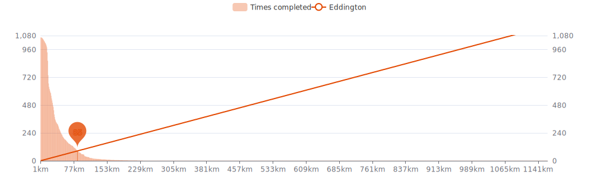

    

Since I began cycling `10 years and 11 months` ago on `02-11-2014`,
I had `1045 cycling days`. 
I recorded a total distance of `39 473 km`
(`0.98` trips around the world 🌍 and
`0.103` trips to the moon 🌕),
an elevation of `446 668 m`
(`50.5` times Mount Everest 🏔)
and a total time of `2mos 2w 7h 4m` 🎉

That's a daily average of `11 km`,
a weekly average of `75 km` and a
monthly average of `326 km` 🐣

I burned `958858 calories` doing so, that's about `3 551` pizza slices 🍕

---

<kbd><a href="#weekly-distances">Weekly distances</a></kbd> |
<kbd><a href="#activities">Activities</a></kbd> |
<kbd><a href="#monthly-stats">Monthly stats</a></kbd> |
<kbd><a href="#activity-intensity">Activity intensity</a></kbd> |
<kbd><a href="#stats-per-weekday">Stats per weekday</a></kbd> |
<kbd><a href="#daytime-stats">Daytime stats</a></kbd> |
<kbd><a href="#stats-per-bike">Stats per bike</a></kbd> |
<kbd><a href="#best-power-outputs-over-time">Power outputs</a></kbd> |
<kbd><a href="#eddington-chart">Eddington</a></kbd> |
<kbd><a href="#yearly-distances">Yearly distances</a></kbd> |
<kbd><a href="#distance-breakdown">Distance breakdown</a></kbd> |
<kbd><a href="#challenge-consistency">Challenge consistency</a></kbd> |

## Weekly distances

## Activities

<table>
    <tr>
        <th></th>
        <th></th>
        <th align="center"></th>
        <th align="center"></th>
        <th align="center"></th>
        <th align="center"></th>
        <th align="center"></th>
        <th align="center"></th>
    </tr>
            <tr>
            <td>29-11-24</td>
            <td>
                
<a href="https://www.strava.com/activities/13010348090" title="Kcal: 473 | Gear: Velotaf ">Sortie vélo le matin</a>
            </td>
            <td align="center">19 km</td>
            <td align="center">60 m</td>
            <td align="center">56:46</td>
            <td align="center">117 w</td>
            <td align="center">19.9 km/h</td>
            <td align="center">112</td>
        </tr>
            <tr>
            <td>28-11-24</td>
            <td>
                
<a href="https://www.strava.com/activities/13004280206" title="Kcal: 491 | Gear: Velotaf ">Sortie vélo le matin</a>
            </td>
            <td align="center">19 km</td>
            <td align="center">58 m</td>
            <td align="center">55:22</td>
            <td align="center">120 w</td>
            <td align="center">20.1 km/h</td>
            <td align="center">116</td>
        </tr>
            <tr>
            <td>27-11-24</td>
            <td>
                
<a href="https://www.strava.com/activities/12996553574" title="Kcal: 553 | Gear: Velotaf ">Sortie vélo le matin</a>
            </td>
            <td align="center">19 km</td>
            <td align="center">71 m</td>
            <td align="center">59:00</td>
            <td align="center">112 w</td>
            <td align="center">19 km/h</td>
            <td align="center">119</td>
        </tr>
            <tr>
            <td>26-11-24</td>
            <td>
                
<a href="https://www.strava.com/activities/12989143054" title="Kcal: 544 | Gear: Velotaf ">Sortie vélo le matin</a>
            </td>
            <td align="center">19 km</td>
            <td align="center">60 m</td>
            <td align="center">58:41</td>
            <td align="center">113 w</td>
            <td align="center">19.2 km/h</td>
            <td align="center">121</td>
        </tr>
            <tr>
            <td>25-11-24</td>
            <td>
                
<a href="https://www.strava.com/activities/12981589468" title="Kcal: 549 | Gear: Velotaf ">Sortie vélo le matin</a>
            </td>
            <td align="center">19 km</td>
            <td align="center">60 m</td>
            <td align="center">1:00:40</td>
            <td align="center">110 w</td>
            <td align="center">18.7 km/h</td>
            <td align="center">117</td>
        </tr>
        </table>

    
Older activities

    <table>
        <tr>
            <th></th>
            <th></th>
            <th align="center"></th>
            <th align="center"></th>
            <th align="center"></th>
            <th align="center"></th>
            <th align="center"></th>
            <th align="center"></th>
        </tr>
                    <tr>
                <td>21-11-24</td>
                <td>
                    
<a href="https://www.strava.com/activities/12953141685" title="Kcal: 482 | Gear: Velotaf ">Sortie vélo le matin</a>
                </td>
                <td align="center">19 km</td>
                <td align="center">67 m</td>
                <td align="center">57:37</td>
                <td align="center">118 w</td>
                <td align="center">19.7 km/h</td>
                <td align="center">114</td>
            </tr>
                    <tr>
                <td>20-11-24</td>
                <td>
                    
<a href="https://www.strava.com/activities/12944745265" title="Kcal: 531 | Gear: Velotaf ">Sortie vélo le matin</a>
                </td>
                <td align="center">18 km</td>
                <td align="center">61 m</td>
                <td align="center">55:21</td>
                <td align="center">122 w</td>
                <td align="center">19.8 km/h</td>
                <td align="center">120</td>
            </tr>
                    <tr>
                <td>19-11-24</td>
                <td>
                    
<a href="https://www.strava.com/activities/12938324883" title="Kcal: 501 | Gear: Velotaf ">Sortie vélo le matin</a>
                </td>
                <td align="center">19 km</td>
                <td align="center">67 m</td>
                <td align="center">1:02:15</td>
                <td align="center">107 w</td>
                <td align="center">18.1 km/h</td>
                <td align="center">113</td>
            </tr>
                    <tr>
                <td>18-11-24</td>
                <td>
                    
<a href="https://www.strava.com/activities/12930911712" title="Kcal: 603 | Gear: Velotaf ">Sortie vélo le matin</a>
                </td>
                <td align="center">26 km</td>
                <td align="center">110 m</td>
                <td align="center">1:24:52</td>
                <td align="center">108 w</td>
                <td align="center">18.3 km/h</td>
                <td align="center">105</td>
            </tr>
                    <tr>
                <td>15-11-24</td>
                <td>
                    
<a href="https://www.strava.com/activities/12907714186" title="Kcal: 551 | Gear: Velotaf ">Sortie vélo le matin</a>
                </td>
                <td align="center">19 km</td>
                <td align="center">61 m</td>
                <td align="center">56:32</td>
                <td align="center">120 w</td>
                <td align="center">20 km/h</td>
                <td align="center">121</td>
            </tr>
                    <tr>
                <td>14-11-24</td>
                <td>
                    
<a href="https://www.strava.com/activities/12900855843" title="Kcal: 461 | Gear: Velotaf ">Sortie vélo le matin</a>
                </td>
                <td align="center">19 km</td>
                <td align="center">61 m</td>
                <td align="center">57:47</td>
                <td align="center">115 w</td>
                <td align="center">19.4 km/h</td>
                <td align="center">111</td>
            </tr>
                    <tr>
                <td>13-11-24</td>
                <td>
                    
<a href="https://www.strava.com/activities/12893494485" title="Kcal: 506 | Gear: Velotaf ">Sortie vélo le matin</a>
                </td>
                <td align="center">19 km</td>
                <td align="center">59 m</td>
                <td align="center">58:58</td>
                <td align="center">117 w</td>
                <td align="center">18.9 km/h</td>
                <td align="center">115</td>
            </tr>
                    <tr>
                <td>12-11-24</td>
                <td>
                    
<a href="https://www.strava.com/activities/12885201654" title="Kcal: 468 | Gear: Velotaf ">Sortie vélo le matin</a>
                </td>
                <td align="center">19 km</td>
                <td align="center">64 m</td>
                <td align="center">1:03:13</td>
                <td align="center">109 w</td>
                <td align="center">18.3 km/h</td>
                <td align="center">108</td>
            </tr>
                    <tr>
                <td>08-11-24</td>
                <td>
                    
<a href="https://www.strava.com/activities/12853789952" title="Kcal: 238 | Gear: Velotaf ">Sortie vélo en soirée</a>
                </td>
                <td align="center">9 km</td>
                <td align="center">19 m</td>
                <td align="center">25:46</td>
                <td align="center">125 w</td>
                <td align="center">21.6 km/h</td>
                <td align="center">117</td>
            </tr>
                    <tr>
                <td>08-11-24</td>
                <td>
                    
<a href="https://www.strava.com/activities/12850163383" title="Kcal: 266 | Gear: Velotaf ">Sortie vélo le matin</a>
                </td>
                <td align="center">10 km</td>
                <td align="center">51 m</td>
                <td align="center">31:59</td>
                <td align="center">119 w</td>
                <td align="center">18.5 km/h</td>
                <td align="center">114</td>
            </tr>
                    <tr>
                <td>07-11-24</td>
                <td>
                    
<a href="https://www.strava.com/activities/12846674524" title="Kcal: 451 | Gear: Velotaf ">Sortie vélo le matin</a>
                </td>
                <td align="center">18 km</td>
                <td align="center">99 m</td>
                <td align="center">58:20</td>
                <td align="center">111 w</td>
                <td align="center">18.4 km/h</td>
                <td align="center">110</td>
            </tr>
                    <tr>
                <td>06-11-24</td>
                <td>
                    
<a href="https://www.strava.com/activities/12838942450" title="Kcal: 221 | Gear: Velotaf ">Sortie vélo en soirée</a>
                </td>
                <td align="center">8 km</td>
                <td align="center">42 m</td>
                <td align="center">25:04</td>
                <td align="center">126 w</td>
                <td align="center">19.8 km/h</td>
                <td align="center">115</td>
            </tr>
                    <tr>
                <td>06-11-24</td>
                <td>
                    
<a href="https://www.strava.com/activities/12835622885" title="Kcal: 355 | Gear: Velotaf ">Velotaf</a>
                </td>
                <td align="center">9 km</td>
                <td align="center">53 m</td>
                <td align="center">28:42</td>
                <td align="center">119 w</td>
                <td align="center">18.8 km/h</td>
                <td align="center">133</td>
            </tr>
                    <tr>
                <td>05-11-24</td>
                <td>
                    
<a href="https://www.strava.com/activities/12830637798" title="Kcal: 550 | Gear: Velotaf ">Sortie vélo le matin</a>
                </td>
                <td align="center">18 km</td>
                <td align="center">88 m</td>
                <td align="center">59:21</td>
                <td align="center">108 w</td>
                <td align="center">18.3 km/h</td>
                <td align="center">119</td>
            </tr>
                    <tr>
                <td>04-11-24</td>
                <td>
                    
<a href="https://www.strava.com/activities/12822578028" title="Kcal: 464 | Gear: Velotaf ">Sortie vélo le matin</a>
                </td>
                <td align="center">18 km</td>
                <td align="center">86 m</td>
                <td align="center">1:00:37</td>
                <td align="center">108 w</td>
                <td align="center">17.8 km/h</td>
                <td align="center">110</td>
            </tr>
                    <tr>
                <td>24-10-24</td>
                <td>
                    
<a href="https://www.strava.com/activities/12731757546" title="Kcal: 96 | Gear: Endurace ">Sortie vélo le matin</a>
                </td>
                <td align="center">5 km</td>
                <td align="center">111 m</td>
                <td align="center">16:00</td>
                <td align="center">123 w</td>
                <td align="center">20.3 km/h</td>
                <td align="center">97</td>
            </tr>
                    <tr>
                <td>23-10-24</td>
                <td>
                    
<a href="https://www.strava.com/activities/12725593743" title="Kcal: 741 | Gear: Lapierre ">Montagne avec Tim</a>
                </td>
                <td align="center">33 km</td>
                <td align="center">504 m</td>
                <td align="center">1:50:17</td>
                <td align="center">94 w</td>
                <td align="center">17.8 km/h</td>
                <td align="center">111</td>
            </tr>
                    <tr>
                <td>18-10-24</td>
                <td>
                    
<a href="https://www.strava.com/activities/12684586906" title="Kcal: 410 | Gear: Velotaf ">Sortie vélo le midi</a>
                </td>
                <td align="center">17 km</td>
                <td align="center">81 m</td>
                <td align="center">52:05</td>
                <td align="center">122 w</td>
                <td align="center">19.4 km/h</td>
                <td align="center">114</td>
            </tr>
                    <tr>
                <td>16-10-24</td>
                <td>
                    
<a href="https://www.strava.com/activities/12672474087" title="Kcal: 929 | Gear: Velotaf ">Sortie vélo le matin</a>
                </td>
                <td align="center">41 km</td>
                <td align="center">224 m</td>
                <td align="center">2:11:49</td>
                <td align="center">119 w</td>
                <td align="center">18.8 km/h</td>
                <td align="center">109</td>
            </tr>
                    <tr>
                <td>14-10-24</td>
                <td>
                    
<a href="https://www.strava.com/activities/12656240368" title="Kcal: 278 | Gear: Velotaf ">Sortie vélo en soirée</a>
                </td>
                <td align="center">14 km</td>
                <td align="center">95 m</td>
                <td align="center">44:14</td>
                <td align="center">123 w</td>
                <td align="center">18.9 km/h</td>
                <td align="center">101</td>
            </tr>
                    <tr>
                <td>09-10-24</td>
                <td>
                    
<a href="https://www.strava.com/activities/12616782308" title="Kcal: 678 | Gear: Velotaf ">Sortie vélo le midi</a>
                </td>
                <td align="center">32 km</td>
                <td align="center">116 m</td>
                <td align="center">1:44:57</td>
                <td align="center">105 w</td>
                <td align="center">18.2 km/h</td>
                <td align="center">103</td>
            </tr>
                    <tr>
                <td>07-10-24</td>
                <td>
                    
<a href="https://www.strava.com/activities/12597151286" title="Kcal: 432 | Gear: Velotaf ">Sortie vélo le midi</a>
                </td>
                <td align="center">20 km</td>
                <td align="center">78 m</td>
                <td align="center">1:04:10</td>
                <td align="center">110 w</td>
                <td align="center">18.5 km/h</td>
                <td align="center">108</td>
            </tr>
                    <tr>
                <td>04-10-24</td>
                <td>
                    
<a href="https://www.strava.com/activities/12572353560" title="Kcal: 394 | Gear: Velotaf ">Sortie vélo le midi</a>
                </td>
                <td align="center">17 km</td>
                <td align="center">85 m</td>
                <td align="center">56:50</td>
                <td align="center">113 w</td>
                <td align="center">18.3 km/h</td>
                <td align="center">105</td>
            </tr>
                    <tr>
                <td>02-10-24</td>
                <td>
                    
<a href="https://www.strava.com/activities/12559479559" title="Kcal: 374 | Gear: Velotaf ">Sortie vélo dans l&#039;après-m...</a>
                </td>
                <td align="center">18 km</td>
                <td align="center">61 m</td>
                <td align="center">1:03:55</td>
                <td align="center">103 w</td>
                <td align="center">17 km/h</td>
                <td align="center">100</td>
            </tr>
                    <tr>
                <td>30-09-24</td>
                <td>
                    
<a href="https://www.strava.com/activities/12539370789" title="Kcal: 114 | Gear: Velotaf ">Sortie vélo dans l&#039;après-m...</a>
                </td>
                <td align="center">6 km</td>
                <td align="center">37 m</td>
                <td align="center">18:01</td>
                <td align="center">125 w</td>
                <td align="center">18.7 km/h</td>
                <td align="center">101</td>
            </tr>
                    <tr>
                <td>30-09-24</td>
                <td>
                    
<a href="https://www.strava.com/activities/12538715397" title="Kcal: 313 | Gear: Velotaf ">Sortie vélo le matin</a>
                </td>
                <td align="center">13 km</td>
                <td align="center">75 m</td>
                <td align="center">43:25</td>
                <td align="center">115 w</td>
                <td align="center">18.6 km/h</td>
                <td align="center">109</td>
            </tr>
                    <tr>
                <td>28-09-24</td>
                <td>
                    
<a href="https://www.strava.com/activities/12527606792" title="Kcal: 170 | Gear: Velotaf ">Rallye Véllo Asnierois 🥂🎆...</a>
                </td>
                <td align="center">10 km</td>
                <td align="center">33 m</td>
                <td align="center">34:56</td>
                <td align="center">100 w</td>
                <td align="center">16.8 km/h</td>
                <td align="center">91</td>
            </tr>
                    <tr>
                <td>26-09-24</td>
                <td>
                    
<a href="https://www.strava.com/activities/12509170268" title="Kcal: 331 | Gear: Velotaf ">Sortie vélo le matin</a>
                </td>
                <td align="center">18 km</td>
                <td align="center">68 m</td>
                <td align="center">57:08</td>
                <td align="center">112 w</td>
                <td align="center">18.5 km/h</td>
                <td align="center">97</td>
            </tr>
                    <tr>
                <td>19-09-24</td>
                <td>
                    
<a href="https://www.strava.com/activities/12452665366" title="Kcal: 424 | Gear: Velotaf ">Sortie vélo dans l&#039;après-m...</a>
                </td>
                <td align="center">18 km</td>
                <td align="center">115 m</td>
                <td align="center">58:35</td>
                <td align="center">127 w</td>
                <td align="center">18.2 km/h</td>
                <td align="center">110</td>
            </tr>
                    <tr>
                <td>18-09-24</td>
                <td>
                    
<a href="https://www.strava.com/activities/12441841755" title="Kcal: 285 | Gear: Velotaf ">Sortie vélo dans l&#039;après-m...</a>
                </td>
                <td align="center">14 km</td>
                <td align="center">90 m</td>
                <td align="center">45:53</td>
                <td align="center">122 w</td>
                <td align="center">18.3 km/h</td>
                <td align="center">100</td>
            </tr>
                    <tr>
                <td>17-09-24</td>
                <td>
                    
<a href="https://www.strava.com/activities/12434486446" title="Kcal: 215 | Gear: Velotaf ">Sortie vélo dans l&#039;après-m...</a>
                </td>
                <td align="center">7 km</td>
                <td align="center">26 m</td>
                <td align="center">23:20</td>
                <td align="center">120 w</td>
                <td align="center">18.5 km/h</td>
                <td align="center">123</td>
            </tr>
                    <tr>
                <td>16-09-24</td>
                <td>
                    
<a href="https://www.strava.com/activities/12423853780" title="Kcal: 464 | Gear: Velotaf ">Sortie vélo le matin</a>
                </td>
                <td align="center">18 km</td>
                <td align="center">95 m</td>
                <td align="center">56:59</td>
                <td align="center">119 w</td>
                <td align="center">19 km/h</td>
                <td align="center">116</td>
            </tr>
                    <tr>
                <td>13-09-24</td>
                <td>
                    
<a href="https://www.strava.com/activities/12402615839" title="Kcal: 148 | Gear: Velotaf ">Sortie vélo en soirée</a>
                </td>
                <td align="center">9 km</td>
                <td align="center">38 m</td>
                <td align="center">25:59</td>
                <td align="center">124 w</td>
                <td align="center">19.8 km/h</td>
                <td align="center">95</td>
            </tr>
                    <tr>
                <td>11-09-24</td>
                <td>
                    
<a href="https://www.strava.com/activities/12382743831" title="Kcal: 86 | Gear: Velotaf ">Sortie vélo dans l&#039;après-m...</a>
                </td>
                <td align="center">5 km</td>
                <td align="center">31 m</td>
                <td align="center">17:37</td>
                <td align="center">115 w</td>
                <td align="center">18.7 km/h</td>
                <td align="center">90</td>
            </tr>
                    <tr>
                <td>11-09-24</td>
                <td>
                    
<a href="https://www.strava.com/activities/12382287895" title="Kcal: 121 | Gear: Velotaf ">Sortie vélo le midi</a>
                </td>
                <td align="center">6 km</td>
                <td align="center">31 m</td>
                <td align="center">19:42</td>
                <td align="center">120 w</td>
                <td align="center">18.2 km/h</td>
                <td align="center">100</td>
            </tr>
                    <tr>
                <td>09-09-24</td>
                <td>
                    
<a href="https://www.strava.com/activities/12365518249" title="Kcal: 276 | Gear: Velotaf ">Sortie vélo le midi</a>
                </td>
                <td align="center">12 km</td>
                <td align="center">87 m</td>
                <td align="center">40:42</td>
                <td align="center">123 w</td>
                <td align="center">18.2 km/h</td>
                <td align="center">106</td>
            </tr>
                    <tr>
                <td>05-09-24</td>
                <td>
                    
<a href="https://www.strava.com/activities/12334165503" title="Kcal: 403 | Gear: Velotaf ">Sortie vélo le matin</a>
                </td>
                <td align="center">20 km</td>
                <td align="center">109 m</td>
                <td align="center">1:07:37</td>
                <td align="center">112 w</td>
                <td align="center">17.7 km/h</td>
                <td align="center">98</td>
            </tr>
                    <tr>
                <td>04-09-24</td>
                <td>
                    
<a href="https://www.strava.com/activities/12324612904" title="Kcal: 422 | Gear: Velotaf ">Sortie vélo le matin</a>
                </td>
                <td align="center">20 km</td>
                <td align="center">120 m</td>
                <td align="center">1:06:34</td>
                <td align="center">116 w</td>
                <td align="center">17.8 km/h</td>
                <td align="center">103</td>
            </tr>
                    <tr>
                <td>25-08-24</td>
                <td>
                    
<a href="https://www.strava.com/activities/12237488381" title="Kcal: 940 | Gear: Endurace ">Détox en famille</a>
                </td>
                <td align="center">39 km</td>
                <td align="center">586 m</td>
                <td align="center">2:07:16</td>
                <td align="center">99 w</td>
                <td align="center">18.4 km/h</td>
                <td align="center">101</td>
            </tr>
                    <tr>
                <td>24-08-24</td>
                <td>
                    
<a href="https://www.strava.com/activities/12231730375" title="Kcal: 3904 | Gear: Endurace ">Vercorsman Ride</a>
                </td>
                <td align="center">119 km</td>
                <td align="center">3 045 m</td>
                <td align="center">5:41:41</td>
                <td align="center">166 w</td>
                <td align="center">21 km/h</td>
                <td align="center">142</td>
            </tr>
                    <tr>
                <td>20-08-24</td>
                <td>
                    
<a href="https://www.strava.com/activities/12196052110" title="Kcal: 1192 | Gear: Endurace ">Montagne par les Sablières</a>
                </td>
                <td align="center">42 km</td>
                <td align="center">607 m</td>
                <td align="center">1:37:08</td>
                <td align="center">182 w</td>
                <td align="center">25.9 km/h</td>
                <td align="center">144</td>
            </tr>
                    <tr>
                <td>18-08-24</td>
                <td>
                    
<a href="https://www.strava.com/activities/12177896440" title="Kcal: 2648 | Gear: Endurace ">Col de l&#039;Herbouilly</a>
                </td>
                <td align="center">93 km</td>
                <td align="center">1 454 m</td>
                <td align="center">3:51:08</td>
                <td align="center">161 w</td>
                <td align="center">24.2 km/h</td>
                <td align="center">141</td>
            </tr>
                    <tr>
                <td>15-08-24</td>
                <td>
                    
<a href="https://www.strava.com/activities/12152301493" title="Kcal: 1577 | Gear: Endurace ">La Faz par Presles</a>
                </td>
                <td align="center">55 km</td>
                <td align="center">1 062 m</td>
                <td align="center">3:19:36</td>
                <td align="center">106 w</td>
                <td align="center">16.4 km/h</td>
                <td align="center">106</td>
            </tr>
                    <tr>
                <td>13-08-24</td>
                <td>
                    
<a href="https://www.strava.com/activities/12134834247" title="Kcal: 1027 | Gear: Endurace ">Sortie vélo le matin</a>
                </td>
                <td align="center">46 km</td>
                <td align="center">568 m</td>
                <td align="center">2:28:23</td>
                <td align="center">89 w</td>
                <td align="center">18.7 km/h</td>
                <td align="center">109</td>
            </tr>
                    <tr>
                <td>20-07-24</td>
                <td>
                    
<a href="https://www.strava.com/activities/11939290795" title="Kcal: 260 | Gear: Velotaf ">Sortie vélo en soirée</a>
                </td>
                <td align="center">12 km</td>
                <td align="center">62 m</td>
                <td align="center">47:21</td>
                <td align="center">98 w</td>
                <td align="center">15.3 km/h</td>
                <td align="center">98</td>
            </tr>
                    <tr>
                <td>18-07-24</td>
                <td>
                    
<a href="https://www.strava.com/activities/11918878666" title="Kcal: 3009 | Gear: Endurace ">Sortie vélo le matin</a>
                </td>
                <td align="center">121 km</td>
                <td align="center">1 070 m</td>
                <td align="center">4:38:18</td>
                <td align="center">156 w</td>
                <td align="center">26.1 km/h</td>
                <td align="center">134</td>
            </tr>
                    <tr>
                <td>17-07-24</td>
                <td>
                    
<a href="https://www.strava.com/activities/11908714423" title="Kcal: 165 | Gear: Velotaf ">Sortie vélo le midi</a>
                </td>
                <td align="center">7 km</td>
                <td align="center">30 m</td>
                <td align="center">21:53</td>
                <td align="center">123 w</td>
                <td align="center">20.4 km/h</td>
                <td align="center">111</td>
            </tr>
                    <tr>
                <td>17-07-24</td>
                <td>
                    
<a href="https://www.strava.com/activities/11908352200" title="Kcal: 208 | Gear: Velotaf ">Sortie vélo le matin</a>
                </td>
                <td align="center">8 km</td>
                <td align="center">42 m</td>
                <td align="center">25:01</td>
                <td align="center">120 w</td>
                <td align="center">18.3 km/h</td>
                <td align="center">115</td>
            </tr>
                    <tr>
                <td>16-07-24</td>
                <td>
                    
<a href="https://www.strava.com/activities/11900549094" title="Kcal: 143 | Gear: Velotaf ">Sortie vélo le midi</a>
                </td>
                <td align="center">6 km</td>
                <td align="center">34 m</td>
                <td align="center">19:34</td>
                <td align="center">123 w</td>
                <td align="center">18 km/h</td>
                <td align="center">110</td>
            </tr>
                    <tr>
                <td>15-07-24</td>
                <td>
                    
<a href="https://www.strava.com/activities/11894625703" title="Kcal: 398 | Gear: Velotaf ">Sortie vélo le midi</a>
                </td>
                <td align="center">20 km</td>
                <td align="center">103 m</td>
                <td align="center">1:02:26</td>
                <td align="center">124 w</td>
                <td align="center">19.4 km/h</td>
                <td align="center">104</td>
            </tr>
            </table>

## Monthly stats

<table>
    <thead>
    <tr>
        <th>&nbsp;&nbsp;&nbsp;&nbsp;&nbsp;</th>
        <th># of rides</th>
        <th align="center"></th>
        <th align="center"></th>
        <th align="center"></th>
        <th align="center"></th>
    </tr>
    </thead>
    <tbody>
            <tr>
            <td align="center">November 2024</td>
            <td align="center">20</td>
            <td align="center">341 km</td>
            <td align="center">1 297 m</td>
            <td align="center">17h 56m</td>
            <td align="center">0</td>
        </tr>
            <tr>
            <td align="center">October 2024</td>
            <td align="center">9</td>
            <td align="center">197 km</td>
            <td align="center">1 355 m</td>
            <td align="center">10h 44m</td>
            <td align="center">0</td>
        </tr>
            <tr>
            <td align="center">September 2024</td>
            <td align="center">14</td>
            <td align="center">176 km</td>
            <td align="center">955 m</td>
            <td align="center">9h 36m</td>
            <td align="center">0</td>
        </tr>
            <tr>
            <td align="center">August 2024</td>
            <td align="center">6</td>
            <td align="center">394 km</td>
            <td align="center">7 322 m</td>
            <td align="center">19h 5m</td>
            <td align="center">0</td>
        </tr>
            <tr>
            <td align="center">July 2024</td>
            <td align="center">15</td>
            <td align="center">297 km</td>
            <td align="center">2 086 m</td>
            <td align="center">14h 18m</td>
            <td align="center">0</td>
        </tr>
            <tr>
            <td align="center">June 2024</td>
            <td align="center">18</td>
            <td align="center">1 766 km</td>
            <td align="center">21 469 m</td>
            <td align="center">3d 8h 37m</td>
            <td align="center">0</td>
        </tr>
            <tr>
            <td align="center">May 2024</td>
            <td align="center">28</td>
            <td align="center">1 210 km</td>
            <td align="center">13 896 m</td>
            <td align="center">2d 5h 54m</td>
            <td align="center">0</td>
        </tr>
            <tr>
            <td align="center">April 2024</td>
            <td align="center">29</td>
            <td align="center">1 135 km</td>
            <td align="center">14 462 m</td>
            <td align="center">1d 22h 35m</td>
            <td align="center">0</td>
        </tr>
            <tr>
            <td align="center">March 2024</td>
            <td align="center">31</td>
            <td align="center">1 187 km</td>
            <td align="center">10 558 m</td>
            <td align="center">1d 22h 17m</td>
            <td align="center">0</td>
        </tr>
            <tr>
            <td align="center">February 2024</td>
            <td align="center">19</td>
            <td align="center">727 km</td>
            <td align="center">7 016 m</td>
            <td align="center">1d 4h 45m</td>
            <td align="center">0</td>
        </tr>
            <tr>
            <td align="center">January 2024</td>
            <td align="center">26</td>
            <td align="center">665 km</td>
            <td align="center">5 480 m</td>
            <td align="center">1d 4h 5m</td>
            <td align="center">0</td>
        </tr>
            <tr>
            <td align="center">December 2023</td>
            <td align="center">18</td>
            <td align="center">446 km</td>
            <td align="center">3 957 m</td>
            <td align="center">18h 55m</td>
            <td align="center">0</td>
        </tr>
            <tr>
            <td align="center">November 2023</td>
            <td align="center">25</td>
            <td align="center">612 km</td>
            <td align="center">4 096 m</td>
            <td align="center">1d 3h 40m</td>
            <td align="center">0</td>
        </tr>
            <tr>
            <td align="center">October 2023</td>
            <td align="center">16</td>
            <td align="center">319 km</td>
            <td align="center">3 148 m</td>
            <td align="center">15h 27m</td>
            <td align="center">0</td>
        </tr>
            <tr>
            <td align="center">September 2023</td>
            <td align="center">15</td>
            <td align="center">666 km</td>
            <td align="center">5 253 m</td>
            <td align="center">1d 2h 32m</td>
            <td align="center">0</td>
        </tr>
            <tr>
            <td align="center">August 2023</td>
            <td align="center">9</td>
            <td align="center">393 km</td>
            <td align="center">5 780 m</td>
            <td align="center">18h 27m</td>
            <td align="center">0</td>
        </tr>
            <tr>
            <td align="center">July 2023</td>
            <td align="center">7</td>
            <td align="center">118 km</td>
            <td align="center">1 526 m</td>
            <td align="center">5h 59m</td>
            <td align="center">0</td>
        </tr>
            <tr>
            <td align="center">June 2023</td>
            <td align="center">17</td>
            <td align="center">549 km</td>
            <td align="center">5 994 m</td>
            <td align="center">1d 1h 25m</td>
            <td align="center">0</td>
        </tr>
            <tr>
            <td align="center">May 2023</td>
            <td align="center">29</td>
            <td align="center">1 169 km</td>
            <td align="center">13 083 m</td>
            <td align="center">1d 21h 13m</td>
            <td align="center">0</td>
        </tr>
            <tr>
            <td align="center">April 2023</td>
            <td align="center">27</td>
            <td align="center">984 km</td>
            <td align="center">11 384 m</td>
            <td align="center">1d 14h 26m</td>
            <td align="center">0</td>
        </tr>
            <tr>
            <td align="center">March 2023</td>
            <td align="center">35</td>
            <td align="center">960 km</td>
            <td align="center">8 546 m</td>
            <td align="center">1d 14h 20m</td>
            <td align="center">0</td>
        </tr>
            <tr>
            <td align="center">February 2023</td>
            <td align="center">21</td>
            <td align="center">427 km</td>
            <td align="center">3 676 m</td>
            <td align="center">17h 23m</td>
            <td align="center">0</td>
        </tr>
            <tr>
            <td align="center">January 2023</td>
            <td align="center">33</td>
            <td align="center">642 km</td>
            <td align="center">5 554 m</td>
            <td align="center">1d 3h 51m</td>
            <td align="center">0</td>
        </tr>
            <tr>
            <td align="center">December 2022</td>
            <td align="center">13</td>
            <td align="center">339 km</td>
            <td align="center">3 504 m</td>
            <td align="center">13h 51m</td>
            <td align="center">0</td>
        </tr>
            <tr>
            <td align="center">November 2022</td>
            <td align="center">13</td>
            <td align="center">214 km</td>
            <td align="center">996 m</td>
            <td align="center">11h 34m</td>
            <td align="center">0</td>
        </tr>
            <tr>
            <td align="center">October 2022</td>
            <td align="center">20</td>
            <td align="center">228 km</td>
            <td align="center">1 009 m</td>
            <td align="center">13h 41m</td>
            <td align="center">0</td>
        </tr>
            <tr>
            <td align="center">September 2022</td>
            <td align="center">29</td>
            <td align="center">617 km</td>
            <td align="center">5 685 m</td>
            <td align="center">1d 3h 49m</td>
            <td align="center">0</td>
        </tr>
            <tr>
            <td align="center">August 2022</td>
            <td align="center">15</td>
            <td align="center">682 km</td>
            <td align="center">13 658 m</td>
            <td align="center">1d 9h 9m</td>
            <td align="center">0</td>
        </tr>
            <tr>
            <td align="center">July 2022</td>
            <td align="center">24</td>
            <td align="center">455 km</td>
            <td align="center">4 330 m</td>
            <td align="center">19h 37m</td>
            <td align="center">0</td>
        </tr>
            <tr>
            <td align="center">June 2022</td>
            <td align="center">31</td>
            <td align="center">769 km</td>
            <td align="center">9 475 m</td>
            <td align="center">1d 8h 39m</td>
            <td align="center">0</td>
        </tr>
            <tr>
            <td align="center">May 2022</td>
            <td align="center">30</td>
            <td align="center">939 km</td>
            <td align="center">12 022 m</td>
            <td align="center">1d 15h 49m</td>
            <td align="center">0</td>
        </tr>
            <tr>
            <td align="center">April 2022</td>
            <td align="center">31</td>
            <td align="center">630 km</td>
            <td align="center">5 119 m</td>
            <td align="center">1d 1h 6m</td>
            <td align="center">0</td>
        </tr>
            <tr>
            <td align="center">March 2022</td>
            <td align="center">19</td>
            <td align="center">525 km</td>
            <td align="center">3 879 m</td>
            <td align="center">20h 48m</td>
            <td align="center">0</td>
        </tr>
            <tr>
            <td align="center">February 2022</td>
            <td align="center">24</td>
            <td align="center">347 km</td>
            <td align="center">2 177 m</td>
            <td align="center">14h 45m</td>
            <td align="center">0</td>
        </tr>
            <tr>
            <td align="center">January 2022</td>
            <td align="center">22</td>
            <td align="center">503 km</td>
            <td align="center">5 067 m</td>
            <td align="center">18h 36m</td>
            <td align="center">0</td>
        </tr>
            <tr>
            <td align="center">December 2021</td>
            <td align="center">12</td>
            <td align="center">286 km</td>
            <td align="center">3 745 m</td>
            <td align="center">12h 28m</td>
            <td align="center">0</td>
        </tr>
            <tr>
            <td align="center">November 2021</td>
            <td align="center">30</td>
            <td align="center">453 km</td>
            <td align="center">3 225 m</td>
            <td align="center">19h 45m</td>
            <td align="center">0</td>
        </tr>
            <tr>
            <td align="center">October 2021</td>
            <td align="center">20</td>
            <td align="center">302 km</td>
            <td align="center">2 311 m</td>
            <td align="center">12h 57m</td>
            <td align="center">0</td>
        </tr>
            <tr>
            <td align="center">September 2021</td>
            <td align="center">27</td>
            <td align="center">341 km</td>
            <td align="center">2 418 m</td>
            <td align="center">15h 17m</td>
            <td align="center">0</td>
        </tr>
            <tr>
            <td align="center">August 2021</td>
            <td align="center">17</td>
            <td align="center">568 km</td>
            <td align="center">8 996 m</td>
            <td align="center">1d 40m</td>
            <td align="center">0</td>
        </tr>
            <tr>
            <td align="center">July 2021</td>
            <td align="center">19</td>
            <td align="center">283 km</td>
            <td align="center">2 129 m</td>
            <td align="center">12h 28m</td>
            <td align="center">0</td>
        </tr>
            <tr>
            <td align="center">June 2021</td>
            <td align="center">18</td>
            <td align="center">240 km</td>
            <td align="center">1 804 m</td>
            <td align="center">10h 36m</td>
            <td align="center">0</td>
        </tr>
            <tr>
            <td align="center">May 2021</td>
            <td align="center">18</td>
            <td align="center">308 km</td>
            <td align="center">2 189 m</td>
            <td align="center">13h 54m</td>
            <td align="center">0</td>
        </tr>
            <tr>
            <td align="center">April 2021</td>
            <td align="center">12</td>
            <td align="center">491 km</td>
            <td align="center">6 215 m</td>
            <td align="center">20h 44m</td>
            <td align="center">0</td>
        </tr>
            <tr>
            <td align="center">March 2021</td>
            <td align="center">20</td>
            <td align="center">702 km</td>
            <td align="center">9 279 m</td>
            <td align="center">1d 1h 46m</td>
            <td align="center">0</td>
        </tr>
            <tr>
            <td align="center">February 2021</td>
            <td align="center">3</td>
            <td align="center">95 km</td>
            <td align="center">896 m</td>
            <td align="center">3h 33m</td>
            <td align="center">0</td>
        </tr>
            <tr>
            <td align="center">January 2021</td>
            <td align="center">6</td>
            <td align="center">137 km</td>
            <td align="center">1 027 m</td>
            <td align="center">5h 36m</td>
            <td align="center">0</td>
        </tr>
            <tr>
            <td align="center">December 2020</td>
            <td align="center">17</td>
            <td align="center">525 km</td>
            <td align="center">5 789 m</td>
            <td align="center">21h 48m</td>
            <td align="center">0</td>
        </tr>
            <tr>
            <td align="center">November 2020</td>
            <td align="center">16</td>
            <td align="center">543 km</td>
            <td align="center">6 243 m</td>
            <td align="center">18h 46m</td>
            <td align="center">0</td>
        </tr>
            <tr>
            <td align="center">October 2020</td>
            <td align="center">25</td>
            <td align="center">527 km</td>
            <td align="center">5 059 m</td>
            <td align="center">22h 32m</td>
            <td align="center">0</td>
        </tr>
            <tr>
            <td align="center">September 2020</td>
            <td align="center">27</td>
            <td align="center">253 km</td>
            <td align="center">911 m</td>
            <td align="center">12h 24m</td>
            <td align="center">0</td>
        </tr>
            <tr>
            <td align="center">August 2020</td>
            <td align="center">13</td>
            <td align="center">778 km</td>
            <td align="center">15 577 m</td>
            <td align="center">1d 10h 19m</td>
            <td align="center">0</td>
        </tr>
            <tr>
            <td align="center">July 2020</td>
            <td align="center">17</td>
            <td align="center">629 km</td>
            <td align="center">8 098 m</td>
            <td align="center">1d 3h 34m</td>
            <td align="center">0</td>
        </tr>
            <tr>
            <td align="center">June 2020</td>
            <td align="center">22</td>
            <td align="center">539 km</td>
            <td align="center">5 518 m</td>
            <td align="center">20h 23m</td>
            <td align="center">0</td>
        </tr>
            <tr>
            <td align="center">May 2020</td>
            <td align="center">23</td>
            <td align="center">868 km</td>
            <td align="center">9 688 m</td>
            <td align="center">1d 7h 6m</td>
            <td align="center">0</td>
        </tr>
            <tr>
            <td align="center">April 2020</td>
            <td align="center">24</td>
            <td align="center">707 km</td>
            <td align="center">9 457 m</td>
            <td align="center">1d 26m</td>
            <td align="center">0</td>
        </tr>
            <tr>
            <td align="center">March 2020</td>
            <td align="center">31</td>
            <td align="center">593 km</td>
            <td align="center">5 743 m</td>
            <td align="center">1d 10m</td>
            <td align="center">0</td>
        </tr>
            <tr>
            <td align="center">February 2020</td>
            <td align="center">35</td>
            <td align="center">442 km</td>
            <td align="center">3 573 m</td>
            <td align="center">20h 43m</td>
            <td align="center">0</td>
        </tr>
            <tr>
            <td align="center">January 2020</td>
            <td align="center">36</td>
            <td align="center">276 km</td>
            <td align="center">1 330 m</td>
            <td align="center">16h 18m</td>
            <td align="center">0</td>
        </tr>
            <tr>
            <td align="center">December 2019</td>
            <td align="center">22</td>
            <td align="center">170 km</td>
            <td align="center">775 m</td>
            <td align="center">10h 40m</td>
            <td align="center">0</td>
        </tr>
            <tr>
            <td align="center">November 2019</td>
            <td align="center">1</td>
            <td align="center">59 km</td>
            <td align="center">957 m</td>
            <td align="center">2h 24m</td>
            <td align="center">0</td>
        </tr>
            <tr>
            <td align="center">October 2019</td>
            <td align="center">1</td>
            <td align="center">87 km</td>
            <td align="center">1 629 m</td>
            <td align="center">3h 38m</td>
            <td align="center">0</td>
        </tr>
            <tr>
            <td align="center">August 2019</td>
            <td align="center">6</td>
            <td align="center">344 km</td>
            <td align="center">5 337 m</td>
            <td align="center">16h 1m</td>
            <td align="center">0</td>
        </tr>
            <tr>
            <td align="center">July 2019</td>
            <td align="center">9</td>
            <td align="center">632 km</td>
            <td align="center">13 438 m</td>
            <td align="center">1d 5h 35m</td>
            <td align="center">0</td>
        </tr>
            <tr>
            <td align="center">June 2019</td>
            <td align="center">5</td>
            <td align="center">455 km</td>
            <td align="center">7 307 m</td>
            <td align="center">18h 51m</td>
            <td align="center">0</td>
        </tr>
            <tr>
            <td align="center">May 2019</td>
            <td align="center">5</td>
            <td align="center">365 km</td>
            <td align="center">3 565 m</td>
            <td align="center">13h 43m</td>
            <td align="center">0</td>
        </tr>
            <tr>
            <td align="center">April 2019</td>
            <td align="center">2</td>
            <td align="center">180 km</td>
            <td align="center">2 216 m</td>
            <td align="center">7h 22m</td>
            <td align="center">0</td>
        </tr>
            <tr>
            <td align="center">March 2019</td>
            <td align="center">2</td>
            <td align="center">135 km</td>
            <td align="center">982 m</td>
            <td align="center">5h 9m</td>
            <td align="center">0</td>
        </tr>
            <tr>
            <td align="center">February 2019</td>
            <td align="center">3</td>
            <td align="center">210 km</td>
            <td align="center">2 031 m</td>
            <td align="center">8h 11m</td>
            <td align="center">0</td>
        </tr>
            <tr>
            <td align="center">January 2019</td>
            <td align="center">2</td>
            <td align="center">95 km</td>
            <td align="center">421 m</td>
            <td align="center">3h 10m</td>
            <td align="center">0</td>
        </tr>
            <tr>
            <td align="center">December 2018</td>
            <td align="center">3</td>
            <td align="center">78 km</td>
            <td align="center">1 211 m</td>
            <td align="center">3h 18m</td>
            <td align="center">0</td>
        </tr>
            <tr>
            <td align="center">November 2018</td>
            <td align="center">2</td>
            <td align="center">132 km</td>
            <td align="center">407 m</td>
            <td align="center">5h 1m</td>
            <td align="center">0</td>
        </tr>
            <tr>
            <td align="center">October 2018</td>
            <td align="center">4</td>
            <td align="center">195 km</td>
            <td align="center">1 673 m</td>
            <td align="center">8h 28m</td>
            <td align="center">0</td>
        </tr>
            <tr>
            <td align="center">September 2018</td>
            <td align="center">3</td>
            <td align="center">148 km</td>
            <td align="center">1 917 m</td>
            <td align="center">5h 47m</td>
            <td align="center">0</td>
        </tr>
            <tr>
            <td align="center">August 2018</td>
            <td align="center">8</td>
            <td align="center">445 km</td>
            <td align="center">7 563 m</td>
            <td align="center">18h 49m</td>
            <td align="center">0</td>
        </tr>
            <tr>
            <td align="center">July 2018</td>
            <td align="center">5</td>
            <td align="center">226 km</td>
            <td align="center">1 534 m</td>
            <td align="center">7h 53m</td>
            <td align="center">0</td>
        </tr>
            <tr>
            <td align="center">June 2018</td>
            <td align="center">6</td>
            <td align="center">329 km</td>
            <td align="center">4 271 m</td>
            <td align="center">13h 18m</td>
            <td align="center">0</td>
        </tr>
            <tr>
            <td align="center">May 2018</td>
            <td align="center">7</td>
            <td align="center">465 km</td>
            <td align="center">6 524 m</td>
            <td align="center">17h 40m</td>
            <td align="center">0</td>
        </tr>
            <tr>
            <td align="center">April 2018</td>
            <td align="center">8</td>
            <td align="center">361 km</td>
            <td align="center">5 347 m</td>
            <td align="center">17h 26m</td>
            <td align="center">0</td>
        </tr>
            <tr>
            <td align="center">March 2018</td>
            <td align="center">3</td>
            <td align="center">120 km</td>
            <td align="center">669 m</td>
            <td align="center">4h 34m</td>
            <td align="center">0</td>
        </tr>
            <tr>
            <td align="center">February 2018</td>
            <td align="center">1</td>
            <td align="center">44 km</td>
            <td align="center">235 m</td>
            <td align="center">1h 30m</td>
            <td align="center">0</td>
        </tr>
            <tr>
            <td align="center">January 2018</td>
            <td align="center">3</td>
            <td align="center">106 km</td>
            <td align="center">413 m</td>
            <td align="center">3h 42m</td>
            <td align="center">0</td>
        </tr>
            <tr>
            <td align="center">December 2017</td>
            <td align="center">3</td>
            <td align="center">72 km</td>
            <td align="center">425 m</td>
            <td align="center">2h 54m</td>
            <td align="center">0</td>
        </tr>
            <tr>
            <td align="center">October 2017</td>
            <td align="center">5</td>
            <td align="center">123 km</td>
            <td align="center">707 m</td>
            <td align="center">4h 49m</td>
            <td align="center">0</td>
        </tr>
            <tr>
            <td align="center">September 2017</td>
            <td align="center">1</td>
            <td align="center">33 km</td>
            <td align="center">441 m</td>
            <td align="center">1h 55m</td>
            <td align="center">0</td>
        </tr>
            <tr>
            <td align="center">August 2017</td>
            <td align="center">3</td>
            <td align="center">169 km</td>
            <td align="center">3 724 m</td>
            <td align="center">7h 55m</td>
            <td align="center">0</td>
        </tr>
            <tr>
            <td align="center">July 2017</td>
            <td align="center">2</td>
            <td align="center">44 km</td>
            <td align="center">388 m</td>
            <td align="center">1h 35m</td>
            <td align="center">0</td>
        </tr>
            <tr>
            <td align="center">June 2017</td>
            <td align="center">2</td>
            <td align="center">28 km</td>
            <td align="center">360 m</td>
            <td align="center">1h 25m</td>
            <td align="center">0</td>
        </tr>
            <tr>
            <td align="center">April 2017</td>
            <td align="center">3</td>
            <td align="center">143 km</td>
            <td align="center">3 424 m</td>
            <td align="center">7h 10m</td>
            <td align="center">0</td>
        </tr>
            <tr>
            <td align="center">March 2017</td>
            <td align="center">1</td>
            <td align="center">7 km</td>
            <td align="center">85 m</td>
            <td align="center">48m</td>
            <td align="center">0</td>
        </tr>
            <tr>
            <td align="center">October 2016</td>
            <td align="center">2</td>
            <td align="center">69 km</td>
            <td align="center">1 038 m</td>
            <td align="center">3h 33m</td>
            <td align="center">0</td>
        </tr>
            <tr>
            <td align="center">September 2016</td>
            <td align="center">5</td>
            <td align="center">35 km</td>
            <td align="center">1 012 m</td>
            <td align="center">2h 1m</td>
            <td align="center">0</td>
        </tr>
            <tr>
            <td align="center">August 2016</td>
            <td align="center">5</td>
            <td align="center">190 km</td>
            <td align="center">3 638 m</td>
            <td align="center">9h 5m</td>
            <td align="center">0</td>
        </tr>
            <tr>
            <td align="center">May 2016</td>
            <td align="center">3</td>
            <td align="center">125 km</td>
            <td align="center">2 419 m</td>
            <td align="center">5h 56m</td>
            <td align="center">0</td>
        </tr>
            <tr>
            <td align="center">March 2016</td>
            <td align="center">2</td>
            <td align="center">103 km</td>
            <td align="center">2 159 m</td>
            <td align="center">5h 1m</td>
            <td align="center">0</td>
        </tr>
            <tr>
            <td align="center">November 2015</td>
            <td align="center">1</td>
            <td align="center">82 km</td>
            <td align="center">2 308 m</td>
            <td align="center">3h 54m</td>
            <td align="center">0</td>
        </tr>
            <tr>
            <td align="center">September 2015</td>
            <td align="center">1</td>
            <td align="center">31 km</td>
            <td align="center">559 m</td>
            <td align="center">1h 17m</td>
            <td align="center">0</td>
        </tr>
            <tr>
            <td align="center">August 2015</td>
            <td align="center">3</td>
            <td align="center">171 km</td>
            <td align="center">4 207 m</td>
            <td align="center">8h 37m</td>
            <td align="center">0</td>
        </tr>
            <tr>
            <td align="center">May 2015</td>
            <td align="center">1</td>
            <td align="center">62 km</td>
            <td align="center">1 276 m</td>
            <td align="center">2h 49m</td>
            <td align="center">0</td>
        </tr>
            <tr>
            <td align="center">April 2015</td>
            <td align="center">1</td>
            <td align="center">32 km</td>
            <td align="center">573 m</td>
            <td align="center">1h 23m</td>
            <td align="center">0</td>
        </tr>
            <tr>
            <td align="center">November 2014</td>
            <td align="center">1</td>
            <td align="center">58 km</td>
            <td align="center">1 477 m</td>
            <td align="center">2h 55m</td>
            <td align="center">0</td>
        </tr>
        <tr>
        <td align="center"><b>Virtual/Indoor</b></td>
        <td align="center"><b>329</td>
        <td align="center"><b>10 137 km</b></td>
        <td align="center"><b>114 129 m</b></td>
        <td align="center"><b>2w 4h 14m</b></td>
        <td align="center"></td>
    </tr>
    <tr>
        <td align="center"><b>Outside</b></td>
        <td align="center"><b>1053</td>
        <td align="center"><b>29 336 km</b></td>
        <td align="center"><b>332 539 m</b></td>
        <td align="center"><b>2mos 2h 50m</b></td>
        <td align="center"></td>
    </tr>
    <tr>
        <td align="center"><b>Total</b></td>
        <td align="center"><b>1382</td>
        <td align="center"><b>39 473 km</b></td>
        <td align="center"><b>446 668 m</b></td>
        <td align="center"><b>2mos 2w 7h 4m</b></td>
        <td align="center"></td>
    </tr>
    </tbody>
</table>

## Activity intensity

## Stats per weekday

<table>
    <thead>
    <tr>
        <th></th>
        <th># of rides</th>
        <th align="center"></th>
        <th align="center"></th>
        <th align="center"></th>
        <th align="center"></th>
    </tr>
    </thead>
    <tbody>
            <tr>
            <td align="center">Monday</td>
            <td align="center">181</td>
            <td align="center">
                                    23 km avg /
                    4 168 km total
                            </td>
            <td align="center">38 193 m</td>
            <td align="center">1w 5h 28m</td>
            <td align="center">24.0 km/h</td>
        </tr>
            <tr>
            <td align="center">Tuesday</td>
            <td align="center">260</td>
            <td align="center">
                                    22 km avg /
                    5 597 km total
                            </td>
            <td align="center">57 564 m</td>
            <td align="center">1w 3d 17h 14m</td>
            <td align="center">21.8 km/h</td>
        </tr>
            <tr>
            <td align="center">Wednesday</td>
            <td align="center">234</td>
            <td align="center">
                                    22 km avg /
                    5 053 km total
                            </td>
            <td align="center">54 076 m</td>
            <td align="center">1w 2d 5h 16m</td>
            <td align="center">22.8 km/h</td>
        </tr>
            <tr>
            <td align="center">Thursday</td>
            <td align="center">184</td>
            <td align="center">
                                    29 km avg /
                    5 246 km total
                            </td>
            <td align="center">59 234 m</td>
            <td align="center">1w 2d 5h 11m</td>
            <td align="center">23.7 km/h</td>
        </tr>
            <tr>
            <td align="center">Friday</td>
            <td align="center">245</td>
            <td align="center">
                                    23 km avg /
                    5 745 km total
                            </td>
            <td align="center">59 719 m</td>
            <td align="center">1w 3d 15h 9m</td>
            <td align="center">22.5 km/h</td>
        </tr>
            <tr>
            <td align="center">Saturday</td>
            <td align="center">141</td>
            <td align="center">
                                    49 km avg /
                    6 847 km total
                            </td>
            <td align="center">83 837 m</td>
            <td align="center">1w 4d 13h 18m</td>
            <td align="center">24.7 km/h</td>
        </tr>
            <tr>
            <td align="center">Sunday</td>
            <td align="center">137</td>
            <td align="center">
                                    50 km avg /
                    6 817 km total
                            </td>
            <td align="center">94 045 m</td>
            <td align="center">1w 4d 17h 24m</td>
            <td align="center">24.2 km/h</td>
        </tr>
        </tbody>
</table>

## Daytime stats

<table>
    <thead>
    <tr>
        <th></th>
        <th># of rides</th>
        <th align="center"></th>
        <th align="center"></th>
        <th align="center"></th>
        <th align="center"></th>
    </tr>
    </thead>
    <tbody>
            <tr>
            <td align="center">Morning (6h - 12h)</td>
            <td align="center">757</td>
            <td align="center">
                                    35 km avg /
                    26 440 km total
                            </td>
            <td align="center">319 344 m</td>
            <td align="center">1mo 2w 5d 13h 11m</td>
            <td align="center">23.2 km/h</td>
        </tr>
            <tr>
            <td align="center">Afternoon (12h - 17h)</td>
            <td align="center">245</td>
            <td align="center">
                                    25 km avg /
                    6 030 km total
                            </td>
            <td align="center">64 393 m</td>
            <td align="center">1w 3d 9h 21m</td>
            <td align="center">24.2 km/h</td>
        </tr>
            <tr>
            <td align="center">Evening (17h - 23h)</td>
            <td align="center">365</td>
            <td align="center">
                                    16 km avg /
                    5 738 km total
                            </td>
            <td align="center">45 224 m</td>
            <td align="center">1w 2d 19h 15m</td>
            <td align="center">24.4 km/h</td>
        </tr>
            <tr>
            <td align="center">Night (23h - 6h)</td>
            <td align="center">15</td>
            <td align="center">
                                    84 km avg /
                    1 264 km total
                            </td>
            <td align="center">17 706 m</td>
            <td align="center">2d 13h 16m</td>
            <td align="center">20.6 km/h</td>
        </tr>
        </tbody>
</table>

## Stats per bike

<table>
    <thead>
    <tr>
        <th></th>
        <th># of rides</th>
        <th align="center"></th>
        <th align="center"></th>
        <th align="center"></th>
        <th align="center"></th>
    </tr>
    </thead>
    <tbody>
            <tr>
            <td align="center">Endurace</td>
            <td align="center">107</td>
            <td align="center">
                                    92 km avg /
                    9 860 km total
                            </td>
            <td align="center">130 832 m</td>
            <td align="center">2w 3d 2h 20m</td>
            <td align="center">24.0 km/h</td>
        </tr>
            <tr>
            <td align="center">Home Trainer</td>
            <td align="center">313</td>
            <td align="center">
                                    31 km avg /
                    9 628 km total
                            </td>
            <td align="center">108 530 m</td>
            <td align="center">1w 6d 11h 27m</td>
            <td align="center">29.8 km/h</td>
        </tr>
            <tr>
            <td align="center">Velotaf</td>
            <td align="center">719</td>
            <td align="center">
                                    12 km avg /
                    8 405 km total
                            </td>
            <td align="center">38 377 m</td>
            <td align="center">2w 4d 7h 54m</td>
            <td align="center">19.1 km/h</td>
        </tr>
            <tr>
            <td align="center">Lapierre</td>
            <td align="center">73</td>
            <td align="center">
                                    45 km avg /
                    3 314 km total
                            </td>
            <td align="center">65 113 m</td>
            <td align="center">6d 11h 58m</td>
            <td align="center">21.2 km/h</td>
        </tr>
            <tr>
            <td align="center">Other</td>
            <td align="center">40</td>
            <td align="center">
                                    33 km avg /
                    1 306 km total
                            </td>
            <td align="center">20 421 m</td>
            <td align="center">2d 20h 55m</td>
            <td align="center">18.9 km/h</td>
        </tr>
            <tr>
            <td align="center">Canyon ☠️</td>
            <td align="center">129</td>
            <td align="center">
                                    54 km avg /
                    7 006 km total
                            </td>
            <td align="center">83 394 m</td>
            <td align="center">1w 5d 26m</td>
            <td align="center">24.3 km/h</td>
        </tr>
            <tr>
            <td align="center">Other</td>
            <td align="center">1</td>
            <td align="center">
                                    0 km avg /
                    0 km total
                            </td>
            <td align="center">0 m</td>
            <td align="center">1m</td>
            <td align="center">4.5 km/h</td>
        </tr>
        </tbody>
</table>

## Best power outputs over time

<table>
    <tr>
        <th align="center"></th>
        <th align="center" colspan="2"></th>
        <th></th>
    </tr>
                                <tr>
            <td align="center">5 s</td>
            <td align="center">1669 w</td>
            <td align="center">24.4 w/kg</td>
            <td>
                
<a href="https://www.strava.com/activities/11587268387" title="Kcal: 1003 | Gear: None ">Sortie vélo le matin</a>
            </td>
        </tr>
                            <tr>
            <td align="center">10 s</td>
            <td align="center">989 w</td>
            <td align="center">14.46 w/kg</td>
            <td>
                
<a href="https://www.strava.com/activities/11587268387" title="Kcal: 1003 | Gear: None ">Sortie vélo le matin</a>
            </td>
        </tr>
                            <tr>
            <td align="center">30 s</td>
            <td align="center">505 w</td>
            <td align="center">7.38 w/kg</td>
            <td>
                
<a href="https://www.strava.com/activities/8899063584" title="Kcal: 2489 | Gear: None ">Sortie vélo le matin</a>
            </td>
        </tr>
                            <tr>
            <td align="center">1 m</td>
            <td align="center">440 w</td>
            <td align="center">6.43 w/kg</td>
            <td>
                
<a href="https://www.strava.com/activities/6958223568" title="Kcal: 1820 | Gear: None ">Vélo du matin</a>
            </td>
        </tr>
                            <tr>
            <td align="center">5 m</td>
            <td align="center">316 w</td>
            <td align="center">4.62 w/kg</td>
            <td>
                                
<a href="https://www.strava.com/activities/8833187609" title="Kcal: 788 | Gear: None ">Uphill Battle and Ramp Test in Scotland</a>
            </td>
        </tr>
                            <tr>
            <td align="center">8 m</td>
            <td align="center">287 w</td>
            <td align="center">4.2 w/kg</td>
            <td>
                                
<a href="https://www.strava.com/activities/8833187609" title="Kcal: 788 | Gear: None ">Uphill Battle and Ramp Test in Scotland</a>
            </td>
        </tr>
                            <tr>
            <td align="center">20 m</td>
            <td align="center">265 w</td>
            <td align="center">3.84 w/kg</td>
            <td>
                
<a href="https://www.strava.com/activities/11128641494" title="Kcal: 948 | Gear: None ">Watopia IRL</a>
            </td>
        </tr>
                            <tr>
            <td align="center">1 h</td>
            <td align="center">248 w</td>
            <td align="center">3.57 w/kg</td>
            <td>
                                
<a href="https://www.strava.com/activities/3471536927" title="Kcal: 908 | Gear: None ">Tour for All 2020: Stage 4 Longer Race A/B - New PR sur l&#039;AdZ 52&#039;</a>
            </td>
        </tr>
    </table>

## Eddington chart

> The Eddington number in the context of cycling is defined as the maximum number E such that the cyclist has cycled at least E km on at least E days.
>
> For example, an Eddington number of 70 would imply that the cyclist has cycled at least 70 km in a day on at least 70 occasions.
> Achieving a high Eddington number is difficult, since moving from, say, 70 to 75 will (probably) require more than five new long-distance rides, since any rides shorter than 75 km will no longer be included in the reckoning.

<table align="center">
    <tr>
        <th align="center">Eddington</th>
            <th align="center">86 km</th>
            <th align="center">87 km</th>
            <th align="center">88 km</th>
            <th align="center">89 km</th>
            <th align="center">90 km</th>
            <th align="center">91 km</th>
            <th align="center">92 km</th>
            <th align="center">93 km</th>
            <th align="center">94 km</th>
            <th align="center">95 km</th>
            <th align="center">96 km</th>
        </tr>
    <tr>
        <td align="center">Days needed</td>
            <td align="center">3</td>
            <td align="center">7</td>
            <td align="center">12</td>
            <td align="center">15</td>
            <td align="center">18</td>
            <td align="center">21</td>
            <td align="center">24</td>
            <td align="center">29</td>
            <td align="center">34</td>
            <td align="center">38</td>
            <td align="center">39</td>
        </tr>
</table>

## Yearly distances

<table>
    <thead>
    <tr>
        <th>Year</th>
        <th align="center"></th>
        <th>Δ prev year</th>
        <th align="center"></th>
        <th align="center"></th>
    </tr>
    </thead>
    <tbody>
            <tr>
            <td align="center">2024</td>
            <td align="center">8 095 km</td>
            <td align="center">
                                    811 km
                            </td>
            <td align="center">85 895 m</td>
            <td align="center">2w 19h 56m</td>
        </tr>
            <tr>
            <td align="center">2023</td>
            <td align="center">7 284 km</td>
            <td align="center">
                                    1 035 km
                            </td>
            <td align="center">71 997 m</td>
            <td align="center">1w 5d 17h 44m</td>
        </tr>
            <tr>
            <td align="center">2022</td>
            <td align="center">6 249 km</td>
            <td align="center">
                                    2 043 km
                            </td>
            <td align="center">66 922 m</td>
            <td align="center">1w 4d 7h 29m</td>
        </tr>
            <tr>
            <td align="center">2021</td>
            <td align="center">4 206 km</td>
            <td align="center">
                                    -2 475 km
                            </td>
            <td align="center">44 233 m</td>
            <td align="center">1w 9h 48m</td>
        </tr>
            <tr>
            <td align="center">2020</td>
            <td align="center">6 681 km</td>
            <td align="center">
                                    3 947 km
                            </td>
            <td align="center">76 984 m</td>
            <td align="center">1w 4d 10h 35m</td>
        </tr>
            <tr>
            <td align="center">2019</td>
            <td align="center">2 733 km</td>
            <td align="center">
                                    85 km
                            </td>
            <td align="center">38 656 m</td>
            <td align="center">4d 22h 48m</td>
        </tr>
            <tr>
            <td align="center">2018</td>
            <td align="center">2 648 km</td>
            <td align="center">
                                    2 030 km
                            </td>
            <td align="center">31 763 m</td>
            <td align="center">4d 11h 29m</td>
        </tr>
            <tr>
            <td align="center">2017</td>
            <td align="center">618 km</td>
            <td align="center">
                                    96 km
                            </td>
            <td align="center">9 553 m</td>
            <td align="center">1d 4h 34m</td>
        </tr>
            <tr>
            <td align="center">2016</td>
            <td align="center">522 km</td>
            <td align="center">
                                    144 km
                            </td>
            <td align="center">10 266 m</td>
            <td align="center">1d 1h 38m</td>
        </tr>
            <tr>
            <td align="center">2015</td>
            <td align="center">378 km</td>
            <td align="center">
                                    320 km
                            </td>
            <td align="center">8 923 m</td>
            <td align="center">18h 2m</td>
        </tr>
            <tr>
            <td align="center">2014</td>
            <td align="center">58 km</td>
            <td align="center">
                            </td>
            <td align="center">1 477 m</td>
            <td align="center">2h 55m</td>
        </tr>
        </tbody>
</table>

## Distance breakdown

<table>
    <thead>
    <tr>
        <th></th>
        <th># of rides</th>
        <th align="center"></th>
        <th align="center"></th>
        <th align="center"></th>
        <th align="center"></th>
    </tr>
    </thead>
    <tbody>
            <tr>
            <td align="center">0 - 110 km</td>
            <td align="center">1350</td>
            <td align="center">
                                     25 km avg /
                     34 157 km total
                            </td>
            <td align="center">370 792 m</td>
            <td align="center">2mos 4d 18h 59m</td>
            <td align="center">23.4 km/h</td>
        </tr>
            <tr>
            <td align="center">110 - 220 km</td>
            <td align="center">27</td>
            <td align="center">
                                     137 km avg /
                     3 698 km total
                            </td>
            <td align="center">54 766 m</td>
            <td align="center">6d 9h 21m</td>
            <td align="center">24.1 km/h</td>
        </tr>
            <tr>
            <td align="center">220 - 330 km</td>
            <td align="center">2</td>
            <td align="center">
                                     228 km avg /
                     456 km total
                            </td>
            <td align="center">3 747 m</td>
            <td align="center">16h 35m</td>
            <td align="center">27.5 km/h</td>
        </tr>
            <tr>
            <td align="center">330 - 440 km</td>
            <td align="center">0</td>
            <td align="center">
                                    0 km
                            </td>
            <td align="center">0 m</td>
            <td align="center"></td>
            <td align="center">0.0 km/h</td>
        </tr>
            <tr>
            <td align="center">440 - 550 km</td>
            <td align="center">0</td>
            <td align="center">
                                    0 km
                            </td>
            <td align="center">0 m</td>
            <td align="center"></td>
            <td align="center">0.0 km/h</td>
        </tr>
            <tr>
            <td align="center">550 - 660 km</td>
            <td align="center">0</td>
            <td align="center">
                                    0 km
                            </td>
            <td align="center">0 m</td>
            <td align="center"></td>
            <td align="center">0.0 km/h</td>
        </tr>
            <tr>
            <td align="center">660 - 770 km</td>
            <td align="center">0</td>
            <td align="center">
                                    0 km
                            </td>
            <td align="center">0 m</td>
            <td align="center"></td>
            <td align="center">0.0 km/h</td>
        </tr>
            <tr>
            <td align="center">770 - 880 km</td>
            <td align="center">0</td>
            <td align="center">
                                    0 km
                            </td>
            <td align="center">0 m</td>
            <td align="center"></td>
            <td align="center">0.0 km/h</td>
        </tr>
            <tr>
            <td align="center">880 - 990 km</td>
            <td align="center">0</td>
            <td align="center">
                                    0 km
                            </td>
            <td align="center">0 m</td>
            <td align="center"></td>
            <td align="center">0.0 km/h</td>
        </tr>
            <tr>
            <td align="center">990 - 1100 km</td>
            <td align="center">0</td>
            <td align="center">
                                    0 km
                            </td>
            <td align="center">0 m</td>
            <td align="center"></td>
            <td align="center">0.0 km/h</td>
        </tr>
            <tr>
            <td align="center">1100 - 1210 km</td>
            <td align="center">1</td>
            <td align="center">
                                     1 162 km avg /
                     1 162 km total
                            </td>
            <td align="center">17 363 m</td>
            <td align="center">2d 8h 45m</td>
            <td align="center">20.5 km/h</td>
        </tr>
        </tbody>
</table>

## Challenge consistency

<table>
    <thead>
    <tr>
        <th></th>
                <th align="center">Nov 2024</th>
                <th align="center">Oct 2024</th>
                <th align="center">Sep 2024</th>
                <th align="center">Aug 2024</th>
                <th align="center">Jul 2024</th>
                <th align="center">Jun 2024</th>
                <th align="center">May 2024</th>
                <th align="center">Apr 2024</th>
                <th align="center">Mar 2024</th>
                <th align="center">Feb 2024</th>
                <th align="center">Jan 2024</th>
                <th align="center">Dec 2023</th>
                <th align="center">Nov 2023</th>
                <th align="center">Oct 2023</th>
                <th align="center">Sep 2023</th>
                <th align="center">Aug 2023</th>
                <th align="center">Jul 2023</th>
                <th align="center">Jun 2023</th>
                <th align="center">May 2023</th>
                <th align="center">Apr 2023</th>
                <th align="center">Mar 2023</th>
                <th align="center">Feb 2023</th>
                <th align="center">Jan 2023</th>
                <th align="center">Dec 2022</th>
                <th align="center">Nov 2022</th>
                <th align="center">Oct 2022</th>
                <th align="center">Sep 2022</th>
                <th align="center">Aug 2022</th>
                <th align="center">Jul 2022</th>
                <th align="center">Jun 2022</th>
                <th align="center">May 2022</th>
                <th align="center">Apr 2022</th>
                <th align="center">Mar 2022</th>
                <th align="center">Feb 2022</th>
                <th align="center">Jan 2022</th>
                <th align="center">Dec 2021</th>
                <th align="center">Nov 2021</th>
                <th align="center">Oct 2021</th>
                <th align="center">Sep 2021</th>
                <th align="center">Aug 2021</th>
                <th align="center">Jul 2021</th>
                <th align="center">Jun 2021</th>
                <th align="center">May 2021</th>
                <th align="center">Apr 2021</th>
                <th align="center">Mar 2021</th>
                <th align="center">Feb 2021</th>
                <th align="center">Jan 2021</th>
                <th align="center">Dec 2020</th>
                <th align="center">Nov 2020</th>
                <th align="center">Oct 2020</th>
                <th align="center">Sep 2020</th>
                <th align="center">Aug 2020</th>
                <th align="center">Jul 2020</th>
                <th align="center">Jun 2020</th>
                <th align="center">May 2020</th>
                <th align="center">Apr 2020</th>
                <th align="center">Mar 2020</th>
                <th align="center">Feb 2020</th>
                <th align="center">Jan 2020</th>
                <th align="center">Dec 2019</th>
                <th align="center">Nov 2019</th>
                <th align="center">Oct 2019</th>
                <th align="center">Sep 2019</th>
                <th align="center">Aug 2019</th>
                <th align="center">Jul 2019</th>
                <th align="center">Jun 2019</th>
                <th align="center">May 2019</th>
                <th align="center">Apr 2019</th>
                <th align="center">Mar 2019</th>
                <th align="center">Feb 2019</th>
                <th align="center">Jan 2019</th>
                <th align="center">Dec 2018</th>
                <th align="center">Nov 2018</th>
                <th align="center">Oct 2018</th>
                <th align="center">Sep 2018</th>
                <th align="center">Aug 2018</th>
                <th align="center">Jul 2018</th>
                <th align="center">Jun 2018</th>
                <th align="center">May 2018</th>
                <th align="center">Apr 2018</th>
                <th align="center">Mar 2018</th>
                <th align="center">Feb 2018</th>
                <th align="center">Jan 2018</th>
                <th align="center">Dec 2017</th>
                <th align="center">Nov 2017</th>
                <th align="center">Oct 2017</th>
                <th align="center">Sep 2017</th>
                <th align="center">Aug 2017</th>
                <th align="center">Jul 2017</th>
                <th align="center">Jun 2017</th>
                <th align="center">May 2017</th>
                <th align="center">Apr 2017</th>
                <th align="center">Mar 2017</th>
                <th align="center">Feb 2017</th>
                <th align="center">Jan 2017</th>
                <th align="center">Dec 2016</th>
                <th align="center">Nov 2016</th>
                <th align="center">Oct 2016</th>
                <th align="center">Sep 2016</th>
                <th align="center">Aug 2016</th>
                <th align="center">Jul 2016</th>
                <th align="center">Jun 2016</th>
                <th align="center">May 2016</th>
                <th align="center">Apr 2016</th>
                <th align="center">Mar 2016</th>
                <th align="center">Feb 2016</th>
                <th align="center">Jan 2016</th>
                <th align="center">Dec 2015</th>
                <th align="center">Nov 2015</th>
                <th align="center">Oct 2015</th>
                <th align="center">Sep 2015</th>
                <th align="center">Aug 2015</th>
                <th align="center">Jul 2015</th>
                <th align="center">Jun 2015</th>
                <th align="center">May 2015</th>
                <th align="center">Apr 2015</th>
                <th align="center">Mar 2015</th>
                <th align="center">Feb 2015</th>
                <th align="center">Jan 2015</th>
                <th align="center">Dec 2014</th>
                <th align="center">Nov 2014</th>
            </tr>
    </thead>
    <tbody>
            <tr>
            <td align="center">Ride a total of 200km</td>
                        <td align="center">
                                    
                            </td>
                        <td align="center">
                            </td>
                        <td align="center">
                            </td>
                        <td align="center">
                                    
                            </td>
                        <td align="center">
                                    
                            </td>
                        <td align="center">
                                    
                            </td>
                        <td align="center">
                                    
                            </td>
                        <td align="center">
                                    
                            </td>
                        <td align="center">
                                    
                            </td>
                        <td align="center">
                                    
                            </td>
                        <td align="center">
                                    
                            </td>
                        <td align="center">
                                    
                            </td>
                        <td align="center">
                                    
                            </td>
                        <td align="center">
                                    
                            </td>
                        <td align="center">
                                    
                            </td>
                        <td align="center">
                                    
                            </td>
                        <td align="center">
                            </td>
                        <td align="center">
                                    
                            </td>
                        <td align="center">
                                    
                            </td>
                        <td align="center">
                                    
                            </td>
                        <td align="center">
                                    
                            </td>
                        <td align="center">
                                    
                            </td>
                        <td align="center">
                                    
                            </td>
                        <td align="center">
                                    
                            </td>
                        <td align="center">
                                    
                            </td>
                        <td align="center">
                                    
                            </td>
                        <td align="center">
                                    
                            </td>
                        <td align="center">
                                    
                            </td>
                        <td align="center">
                                    
                            </td>
                        <td align="center">
                                    
                            </td>
                        <td align="center">
                                    
                            </td>
                        <td align="center">
                                    
                            </td>
                        <td align="center">
                                    
                            </td>
                        <td align="center">
                                    
                            </td>
                        <td align="center">
                                    
                            </td>
                        <td align="center">
                                    
                            </td>
                        <td align="center">
                                    
                            </td>
                        <td align="center">
                                    
                            </td>
                        <td align="center">
                                    
                            </td>
                        <td align="center">
                                    
                            </td>
                        <td align="center">
                                    
                            </td>
                        <td align="center">
                                    
                            </td>
                        <td align="center">
                                    
                            </td>
                        <td align="center">
                                    
                            </td>
                        <td align="center">
                                    
                            </td>
                        <td align="center">
                            </td>
                        <td align="center">
                            </td>
                        <td align="center">
                                    
                            </td>
                        <td align="center">
                                    
                            </td>
                        <td align="center">
                                    
                            </td>
                        <td align="center">
                                    
                            </td>
                        <td align="center">
                                    
                            </td>
                        <td align="center">
                                    
                            </td>
                        <td align="center">
                                    
                            </td>
                        <td align="center">
                                    
                            </td>
                        <td align="center">
                                    
                            </td>
                        <td align="center">
                                    
                            </td>
                        <td align="center">
                                    
                            </td>
                        <td align="center">
                                    
                            </td>
                        <td align="center">
                            </td>
                        <td align="center">
                            </td>
                        <td align="center">
                            </td>
                        <td align="center">
                            </td>
                        <td align="center">
                                    
                            </td>
                        <td align="center">
                                    
                            </td>
                        <td align="center">
                                    
                            </td>
                        <td align="center">
                                    
                            </td>
                        <td align="center">
                            </td>
                        <td align="center">
                            </td>
                        <td align="center">
                                    
                            </td>
                        <td align="center">
                            </td>
                        <td align="center">
                            </td>
                        <td align="center">
                            </td>
                        <td align="center">
                            </td>
                        <td align="center">
                            </td>
                        <td align="center">
                                    
                            </td>
                        <td align="center">
                                    
                            </td>
                        <td align="center">
                                    
                            </td>
                        <td align="center">
                                    
                            </td>
                        <td align="center">
                                    
                            </td>
                        <td align="center">
                            </td>
                        <td align="center">
                            </td>
                        <td align="center">
                            </td>
                        <td align="center">
                            </td>
                        <td align="center">
                            </td>
                        <td align="center">
                            </td>
                        <td align="center">
                            </td>
                        <td align="center">
                            </td>
                        <td align="center">
                            </td>
                        <td align="center">
                            </td>
                        <td align="center">
                            </td>
                        <td align="center">
                            </td>
                        <td align="center">
                            </td>
                        <td align="center">
                            </td>
                        <td align="center">
                            </td>
                        <td align="center">
                            </td>
                        <td align="center">
                            </td>
                        <td align="center">
                            </td>
                        <td align="center">
                            </td>
                        <td align="center">
                            </td>
                        <td align="center">
                            </td>
                        <td align="center">
                            </td>
                        <td align="center">
                            </td>
                        <td align="center">
                            </td>
                        <td align="center">
                            </td>
                        <td align="center">
                            </td>
                        <td align="center">
                            </td>
                        <td align="center">
                            </td>
                        <td align="center">
                            </td>
                        <td align="center">
                            </td>
                        <td align="center">
                            </td>
                        <td align="center">
                            </td>
                        <td align="center">
                            </td>
                        <td align="center">
                            </td>
                        <td align="center">
                            </td>
                        <td align="center">
                            </td>
                        <td align="center">
                            </td>
                        <td align="center">
                            </td>
                        <td align="center">
                            </td>
                        <td align="center">
                            </td>
                        <td align="center">
                            </td>
                    </tr>
            <tr>
            <td align="center">Ride a total of 600km</td>
                        <td align="center">
                            </td>
                        <td align="center">
                            </td>
                        <td align="center">
                            </td>
                        <td align="center">
                            </td>
                        <td align="center">
                            </td>
                        <td align="center">
                                    
                            </td>
                        <td align="center">
                                    
                            </td>
                        <td align="center">
                                    
                            </td>
                        <td align="center">
                                    
                            </td>
                        <td align="center">
                                    
                            </td>
                        <td align="center">
                                    
                            </td>
                        <td align="center">
                            </td>
                        <td align="center">
                                    
                            </td>
                        <td align="center">
                            </td>
                        <td align="center">
                                    
                            </td>
                        <td align="center">
                            </td>
                        <td align="center">
                            </td>
                        <td align="center">
                            </td>
                        <td align="center">
                                    
                            </td>
                        <td align="center">
                                    
                            </td>
                        <td align="center">
                                    
                            </td>
                        <td align="center">
                            </td>
                        <td align="center">
                                    
                            </td>
                        <td align="center">
                            </td>
                        <td align="center">
                            </td>
                        <td align="center">
                            </td>
                        <td align="center">
                                    
                            </td>
                        <td align="center">
                                    
                            </td>
                        <td align="center">
                            </td>
                        <td align="center">
                                    
                            </td>
                        <td align="center">
                                    
                            </td>
                        <td align="center">
                                    
                            </td>
                        <td align="center">
                            </td>
                        <td align="center">
                            </td>
                        <td align="center">
                            </td>
                        <td align="center">
                            </td>
                        <td align="center">
                            </td>
                        <td align="center">
                            </td>
                        <td align="center">
                            </td>
                        <td align="center">
                            </td>
                        <td align="center">
                            </td>
                        <td align="center">
                            </td>
                        <td align="center">
                            </td>
                        <td align="center">
                            </td>
                        <td align="center">
                                    
                            </td>
                        <td align="center">
                            </td>
                        <td align="center">
                            </td>
                        <td align="center">
                            </td>
                        <td align="center">
                            </td>
                        <td align="center">
                            </td>
                        <td align="center">
                            </td>
                        <td align="center">
                                    
                            </td>
                        <td align="center">
                                    
                            </td>
                        <td align="center">
                            </td>
                        <td align="center">
                                    
                            </td>
                        <td align="center">
                                    
                            </td>
                        <td align="center">
                            </td>
                        <td align="center">
                            </td>
                        <td align="center">
                            </td>
                        <td align="center">
                            </td>
                        <td align="center">
                            </td>
                        <td align="center">
                            </td>
                        <td align="center">
                            </td>
                        <td align="center">
                            </td>
                        <td align="center">
                                    
                            </td>
                        <td align="center">
                            </td>
                        <td align="center">
                            </td>
                        <td align="center">
                            </td>
                        <td align="center">
                            </td>
                        <td align="center">
                            </td>
                        <td align="center">
                            </td>
                        <td align="center">
                            </td>
                        <td align="center">
                            </td>
                        <td align="center">
                            </td>
                        <td align="center">
                            </td>
                        <td align="center">
                            </td>
                        <td align="center">
                            </td>
                        <td align="center">
                            </td>
                        <td align="center">
                            </td>
                        <td align="center">
                            </td>
                        <td align="center">
                            </td>
                        <td align="center">
                            </td>
                        <td align="center">
                            </td>
                        <td align="center">
                            </td>
                        <td align="center">
                            </td>
                        <td align="center">
                            </td>
                        <td align="center">
                            </td>
                        <td align="center">
                            </td>
                        <td align="center">
                            </td>
                        <td align="center">
                            </td>
                        <td align="center">
                            </td>
                        <td align="center">
                            </td>
                        <td align="center">
                            </td>
                        <td align="center">
                            </td>
                        <td align="center">
                            </td>
                        <td align="center">
                            </td>
                        <td align="center">
                            </td>
                        <td align="center">
                            </td>
                        <td align="center">
                            </td>
                        <td align="center">
                            </td>
                        <td align="center">
                            </td>
                        <td align="center">
                            </td>
                        <td align="center">
                            </td>
                        <td align="center">
                            </td>
                        <td align="center">
                            </td>
                        <td align="center">
                            </td>
                        <td align="center">
                            </td>
                        <td align="center">
                            </td>
                        <td align="center">
                            </td>
                        <td align="center">
                            </td>
                        <td align="center">
                            </td>
                        <td align="center">
                            </td>
                        <td align="center">
                            </td>
                        <td align="center">
                            </td>
                        <td align="center">
                            </td>
                        <td align="center">
                            </td>
                        <td align="center">
                            </td>
                        <td align="center">
                            </td>
                        <td align="center">
                            </td>
                        <td align="center">
                            </td>
                        <td align="center">
                            </td>
                    </tr>
            <tr>
            <td align="center">Ride a total of 1250km</td>
                        <td align="center">
                            </td>
                        <td align="center">
                            </td>
                        <td align="center">
                            </td>
                        <td align="center">
                            </td>
                        <td align="center">
                            </td>
                        <td align="center">
                                    
                            </td>
                        <td align="center">
                            </td>
                        <td align="center">
                            </td>
                        <td align="center">
                            </td>
                        <td align="center">
                            </td>
                        <td align="center">
                            </td>
                        <td align="center">
                            </td>
                        <td align="center">
                            </td>
                        <td align="center">
                            </td>
                        <td align="center">
                            </td>
                        <td align="center">
                            </td>
                        <td align="center">
                            </td>
                        <td align="center">
                            </td>
                        <td align="center">
                            </td>
                        <td align="center">
                            </td>
                        <td align="center">
                            </td>
                        <td align="center">
                            </td>
                        <td align="center">
                            </td>
                        <td align="center">
                            </td>
                        <td align="center">
                            </td>
                        <td align="center">
                            </td>
                        <td align="center">
                            </td>
                        <td align="center">
                            </td>
                        <td align="center">
                            </td>
                        <td align="center">
                            </td>
                        <td align="center">
                            </td>
                        <td align="center">
                            </td>
                        <td align="center">
                            </td>
                        <td align="center">
                            </td>
                        <td align="center">
                            </td>
                        <td align="center">
                            </td>
                        <td align="center">
                            </td>
                        <td align="center">
                            </td>
                        <td align="center">
                            </td>
                        <td align="center">
                            </td>
                        <td align="center">
                            </td>
                        <td align="center">
                            </td>
                        <td align="center">
                            </td>
                        <td align="center">
                            </td>
                        <td align="center">
                            </td>
                        <td align="center">
                            </td>
                        <td align="center">
                            </td>
                        <td align="center">
                            </td>
                        <td align="center">
                            </td>
                        <td align="center">
                            </td>
                        <td align="center">
                            </td>
                        <td align="center">
                            </td>
                        <td align="center">
                            </td>
                        <td align="center">
                            </td>
                        <td align="center">
                            </td>
                        <td align="center">
                            </td>
                        <td align="center">
                            </td>
                        <td align="center">
                            </td>
                        <td align="center">
                            </td>
                        <td align="center">
                            </td>
                        <td align="center">
                            </td>
                        <td align="center">
                            </td>
                        <td align="center">
                            </td>
                        <td align="center">
                            </td>
                        <td align="center">
                            </td>
                        <td align="center">
                            </td>
                        <td align="center">
                            </td>
                        <td align="center">
                            </td>
                        <td align="center">
                            </td>
                        <td align="center">
                            </td>
                        <td align="center">
                            </td>
                        <td align="center">
                            </td>
                        <td align="center">
                            </td>
                        <td align="center">
                            </td>
                        <td align="center">
                            </td>
                        <td align="center">
                            </td>
                        <td align="center">
                            </td>
                        <td align="center">
                            </td>
                        <td align="center">
                            </td>
                        <td align="center">
                            </td>
                        <td align="center">
                            </td>
                        <td align="center">
                            </td>
                        <td align="center">
                            </td>
                        <td align="center">
                            </td>
                        <td align="center">
                            </td>
                        <td align="center">
                            </td>
                        <td align="center">
                            </td>
                        <td align="center">
                            </td>
                        <td align="center">
                            </td>
                        <td align="center">
                            </td>
                        <td align="center">
                            </td>
                        <td align="center">
                            </td>
                        <td align="center">
                            </td>
                        <td align="center">
                            </td>
                        <td align="center">
                            </td>
                        <td align="center">
                            </td>
                        <td align="center">
                            </td>
                        <td align="center">
                            </td>
                        <td align="center">
                            </td>
                        <td align="center">
                            </td>
                        <td align="center">
                            </td>
                        <td align="center">
                            </td>
                        <td align="center">
                            </td>
                        <td align="center">
                            </td>
                        <td align="center">
                            </td>
                        <td align="center">
                            </td>
                        <td align="center">
                            </td>
                        <td align="center">
                            </td>
                        <td align="center">
                            </td>
                        <td align="center">
                            </td>
                        <td align="center">
                            </td>
                        <td align="center">
                            </td>
                        <td align="center">
                            </td>
                        <td align="center">
                            </td>
                        <td align="center">
                            </td>
                        <td align="center">
                            </td>
                        <td align="center">
                            </td>
                        <td align="center">
                            </td>
                        <td align="center">
                            </td>
                        <td align="center">
                            </td>
                        <td align="center">
                            </td>
                    </tr>
            <tr>
            <td align="center">Climb a total of 7500m</td>
                        <td align="center">
                            </td>
                        <td align="center">
                            </td>
                        <td align="center">
                            </td>
                        <td align="center">
                            </td>
                        <td align="center">
                            </td>
                        <td align="center">
                                    
                            </td>
                        <td align="center">
                                    
                            </td>
                        <td align="center">
                                    
                            </td>
                        <td align="center">
                                    
                            </td>
                        <td align="center">
                            </td>
                        <td align="center">
                            </td>
                        <td align="center">
                            </td>
                        <td align="center">
                            </td>
                        <td align="center">
                            </td>
                        <td align="center">
                            </td>
                        <td align="center">
                            </td>
                        <td align="center">
                            </td>
                        <td align="center">
                            </td>
                        <td align="center">
                                    
                            </td>
                        <td align="center">
                                    
                            </td>
                        <td align="center">
                                    
                            </td>
                        <td align="center">
                            </td>
                        <td align="center">
                            </td>
                        <td align="center">
                            </td>
                        <td align="center">
                            </td>
                        <td align="center">
                            </td>
                        <td align="center">
                            </td>
                        <td align="center">
                                    
                            </td>
                        <td align="center">
                            </td>
                        <td align="center">
                                    
                            </td>
                        <td align="center">
                                    
                            </td>
                        <td align="center">
                            </td>
                        <td align="center">
                            </td>
                        <td align="center">
                            </td>
                        <td align="center">
                            </td>
                        <td align="center">
                            </td>
                        <td align="center">
                            </td>
                        <td align="center">
                            </td>
                        <td align="center">
                            </td>
                        <td align="center">
                                    
                            </td>
                        <td align="center">
                            </td>
                        <td align="center">
                            </td>
                        <td align="center">
                            </td>
                        <td align="center">
                            </td>
                        <td align="center">
                                    
                            </td>
                        <td align="center">
                            </td>
                        <td align="center">
                            </td>
                        <td align="center">
                            </td>
                        <td align="center">
                            </td>
                        <td align="center">
                            </td>
                        <td align="center">
                            </td>
                        <td align="center">
                                    
                            </td>
                        <td align="center">
                                    
                            </td>
                        <td align="center">
                            </td>
                        <td align="center">
                                    
                            </td>
                        <td align="center">
                                    
                            </td>
                        <td align="center">
                            </td>
                        <td align="center">
                            </td>
                        <td align="center">
                            </td>
                        <td align="center">
                            </td>
                        <td align="center">
                            </td>
                        <td align="center">
                            </td>
                        <td align="center">
                            </td>
                        <td align="center">
                            </td>
                        <td align="center">
                                    
                            </td>
                        <td align="center">
                            </td>
                        <td align="center">
                            </td>
                        <td align="center">
                            </td>
                        <td align="center">
                            </td>
                        <td align="center">
                            </td>
                        <td align="center">
                            </td>
                        <td align="center">
                            </td>
                        <td align="center">
                            </td>
                        <td align="center">
                            </td>
                        <td align="center">
                            </td>
                        <td align="center">
                                    
                            </td>
                        <td align="center">
                            </td>
                        <td align="center">
                            </td>
                        <td align="center">
                            </td>
                        <td align="center">
                            </td>
                        <td align="center">
                            </td>
                        <td align="center">
                            </td>
                        <td align="center">
                            </td>
                        <td align="center">
                            </td>
                        <td align="center">
                            </td>
                        <td align="center">
                            </td>
                        <td align="center">
                            </td>
                        <td align="center">
                            </td>
                        <td align="center">
                            </td>
                        <td align="center">
                            </td>
                        <td align="center">
                            </td>
                        <td align="center">
                            </td>
                        <td align="center">
                            </td>
                        <td align="center">
                            </td>
                        <td align="center">
                            </td>
                        <td align="center">
                            </td>
                        <td align="center">
                            </td>
                        <td align="center">
                            </td>
                        <td align="center">
                            </td>
                        <td align="center">
                            </td>
                        <td align="center">
                            </td>
                        <td align="center">
                            </td>
                        <td align="center">
                            </td>
                        <td align="center">
                            </td>
                        <td align="center">
                            </td>
                        <td align="center">
                            </td>
                        <td align="center">
                            </td>
                        <td align="center">
                            </td>
                        <td align="center">
                            </td>
                        <td align="center">
                            </td>
                        <td align="center">
                            </td>
                        <td align="center">
                            </td>
                        <td align="center">
                            </td>
                        <td align="center">
                            </td>
                        <td align="center">
                            </td>
                        <td align="center">
                            </td>
                        <td align="center">
                            </td>
                        <td align="center">
                            </td>
                        <td align="center">
                            </td>
                        <td align="center">
                            </td>
                        <td align="center">
                            </td>
                    </tr>
            <tr>
            <td align="center">Complete a 100km ride</td>
                        <td align="center">
                            </td>
                        <td align="center">
                            </td>
                        <td align="center">
                            </td>
                        <td align="center">
                                    
                            </td>
                        <td align="center">
                                    
                            </td>
                        <td align="center">
                                    
                            </td>
                        <td align="center">
                                    
                            </td>
                        <td align="center">
                                    
                            </td>
                        <td align="center">
                                    
                            </td>
                        <td align="center">
                                    
                            </td>
                        <td align="center">
                            </td>
                        <td align="center">
                                    
                            </td>
                        <td align="center">
                            </td>
                        <td align="center">
                            </td>
                        <td align="center">
                                    
                            </td>
                        <td align="center">
                            </td>
                        <td align="center">
                            </td>
                        <td align="center">
                                    
                            </td>
                        <td align="center">
                                    
                            </td>
                        <td align="center">
                                    
                            </td>
                        <td align="center">
                                    
                            </td>
                        <td align="center">
                            </td>
                        <td align="center">
                            </td>
                        <td align="center">
                            </td>
                        <td align="center">
                            </td>
                        <td align="center">
                            </td>
                        <td align="center">
                                    
                            </td>
                        <td align="center">
                                    
                            </td>
                        <td align="center">
                            </td>
                        <td align="center">
                                    
                            </td>
                        <td align="center">
                                    
                            </td>
                        <td align="center">
                                    
                            </td>
                        <td align="center">
                                    
                            </td>
                        <td align="center">
                            </td>
                        <td align="center">
                                    
                            </td>
                        <td align="center">
                            </td>
                        <td align="center">
                            </td>
                        <td align="center">
                            </td>
                        <td align="center">
                            </td>
                        <td align="center">
                                    
                            </td>
                        <td align="center">
                            </td>
                        <td align="center">
                            </td>
                        <td align="center">
                            </td>
                        <td align="center">
                            </td>
                        <td align="center">
                                    
                            </td>
                        <td align="center">
                            </td>
                        <td align="center">
                            </td>
                        <td align="center">
                                    
                            </td>
                        <td align="center">
                            </td>
                        <td align="center">
                            </td>
                        <td align="center">
                            </td>
                        <td align="center">
                                    
                            </td>
                        <td align="center">
                                    
                            </td>
                        <td align="center">
                            </td>
                        <td align="center">
                                    
                            </td>
                        <td align="center">
                            </td>
                        <td align="center">
                            </td>
                        <td align="center">
                            </td>
                        <td align="center">
                            </td>
                        <td align="center">
                            </td>
                        <td align="center">
                            </td>
                        <td align="center">
                            </td>
                        <td align="center">
                            </td>
                        <td align="center">
                            </td>
                        <td align="center">
                                    
                            </td>
                        <td align="center">
                                    
                            </td>
                        <td align="center">
                                    
                            </td>
                        <td align="center">
                            </td>
                        <td align="center">
                            </td>
                        <td align="center">
                            </td>
                        <td align="center">
                            </td>
                        <td align="center">
                            </td>
                        <td align="center">
                            </td>
                        <td align="center">
                                    
                            </td>
                        <td align="center">
                            </td>
                        <td align="center">
                                    
                            </td>
                        <td align="center">
                            </td>
                        <td align="center">
                                    
                            </td>
                        <td align="center">
                                    
                            </td>
                        <td align="center">
                            </td>
                        <td align="center">
                            </td>
                        <td align="center">
                            </td>
                        <td align="center">
                            </td>
                        <td align="center">
                            </td>
                        <td align="center">
                            </td>
                        <td align="center">
                            </td>
                        <td align="center">
                            </td>
                        <td align="center">
                            </td>
                        <td align="center">
                            </td>
                        <td align="center">
                            </td>
                        <td align="center">
                            </td>
                        <td align="center">
                            </td>
                        <td align="center">
                            </td>
                        <td align="center">
                            </td>
                        <td align="center">
                            </td>
                        <td align="center">
                            </td>
                        <td align="center">
                            </td>
                        <td align="center">
                            </td>
                        <td align="center">
                            </td>
                        <td align="center">
                            </td>
                        <td align="center">
                            </td>
                        <td align="center">
                            </td>
                        <td align="center">
                            </td>
                        <td align="center">
                            </td>
                        <td align="center">
                            </td>
                        <td align="center">
                            </td>
                        <td align="center">
                            </td>
                        <td align="center">
                            </td>
                        <td align="center">
                            </td>
                        <td align="center">
                            </td>
                        <td align="center">
                            </td>
                        <td align="center">
                                    
                            </td>
                        <td align="center">
                            </td>
                        <td align="center">
                            </td>
                        <td align="center">
                            </td>
                        <td align="center">
                            </td>
                        <td align="center">
                            </td>
                        <td align="center">
                            </td>
                        <td align="center">
                            </td>
                        <td align="center">
                            </td>
                        <td align="center">
                            </td>
                    </tr>
            <tr>
            <td align="center">2 days of activity for 4 weeks</td>
                        <td align="center">
                                    
                            </td>
                        <td align="center">
                            </td>
                        <td align="center">
                                    
                            </td>
                        <td align="center">
                            </td>
                        <td align="center">
                            </td>
                        <td align="center">
                            </td>
                        <td align="center">
                                    
                            </td>
                        <td align="center">
                                    
                            </td>
                        <td align="center">
                                    
                            </td>
                        <td align="center">
                            </td>
                        <td align="center">
                                    
                            </td>
                        <td align="center">
                            </td>
                        <td align="center">
                                    
                            </td>
                        <td align="center">
                                    
                            </td>
                        <td align="center">
                            </td>
                        <td align="center">
                            </td>
                        <td align="center">
                            </td>
                        <td align="center">
                            </td>
                        <td align="center">
                                    
                            </td>
                        <td align="center">
                                    
                            </td>
                        <td align="center">
                                    
                            </td>
                        <td align="center">
                            </td>
                        <td align="center">
                                    
                            </td>
                        <td align="center">
                                    
                            </td>
                        <td align="center">
                                    
                            </td>
                        <td align="center">
                                    
                            </td>
                        <td align="center">
                                    
                            </td>
                        <td align="center">
                                    
                            </td>
                        <td align="center">
                            </td>
                        <td align="center">
                                    
                            </td>
                        <td align="center">
                                    
                            </td>
                        <td align="center">
                                    
                            </td>
                        <td align="center">
                                    
                            </td>
                        <td align="center">
                            </td>
                        <td align="center">
                                    
                            </td>
                        <td align="center">
                            </td>
                        <td align="center">
                                    
                            </td>
                        <td align="center">
                            </td>
                        <td align="center">
                                    
                            </td>
                        <td align="center">
                                    
                            </td>
                        <td align="center">
                            </td>
                        <td align="center">
                                    
                            </td>
                        <td align="center">
                                    
                            </td>
                        <td align="center">
                            </td>
                        <td align="center">
                                    
                            </td>
                        <td align="center">
                            </td>
                        <td align="center">
                            </td>
                        <td align="center">
                            </td>
                        <td align="center">
                                    
                            </td>
                        <td align="center">
                                    
                            </td>
                        <td align="center">
                                    
                            </td>
                        <td align="center">
                                    
                            </td>
                        <td align="center">
                                    
                            </td>
                        <td align="center">
                                    
                            </td>
                        <td align="center">
                                    
                            </td>
                        <td align="center">
                                    
                            </td>
                        <td align="center">
                                    
                            </td>
                        <td align="center">
                            </td>
                        <td align="center">
                                    
                            </td>
                        <td align="center">
                            </td>
                        <td align="center">
                            </td>
                        <td align="center">
                            </td>
                        <td align="center">
                            </td>
                        <td align="center">
                            </td>
                        <td align="center">
                            </td>
                        <td align="center">
                            </td>
                        <td align="center">
                            </td>
                        <td align="center">
                            </td>
                        <td align="center">
                            </td>
                        <td align="center">
                            </td>
                        <td align="center">
                            </td>
                        <td align="center">
                            </td>
                        <td align="center">
                            </td>
                        <td align="center">
                            </td>
                        <td align="center">
                            </td>
                        <td align="center">
                            </td>
                        <td align="center">
                            </td>
                        <td align="center">
                            </td>
                        <td align="center">
                            </td>
                        <td align="center">
                            </td>
                        <td align="center">
                            </td>
                        <td align="center">
                            </td>
                        <td align="center">
                            </td>
                        <td align="center">
                            </td>
                        <td align="center">
                            </td>
                        <td align="center">
                            </td>
                        <td align="center">
                            </td>
                        <td align="center">
                            </td>
                        <td align="center">
                            </td>
                        <td align="center">
                            </td>
                        <td align="center">
                            </td>
                        <td align="center">
                            </td>
                        <td align="center">
                            </td>
                        <td align="center">
                            </td>
                        <td align="center">
                            </td>
                        <td align="center">
                            </td>
                        <td align="center">
                            </td>
                        <td align="center">
                            </td>
                        <td align="center">
                            </td>
                        <td align="center">
                            </td>
                        <td align="center">
                            </td>
                        <td align="center">
                            </td>
                        <td align="center">
                            </td>
                        <td align="center">
                            </td>
                        <td align="center">
                            </td>
                        <td align="center">
                            </td>
                        <td align="center">
                            </td>
                        <td align="center">
                            </td>
                        <td align="center">
                            </td>
                        <td align="center">
                            </td>
                        <td align="center">
                            </td>
                        <td align="center">
                            </td>
                        <td align="center">
                            </td>
                        <td align="center">
                            </td>
                        <td align="center">
                            </td>
                        <td align="center">
                            </td>
                        <td align="center">
                            </td>
                        <td align="center">
                            </td>
                        <td align="center">
                            </td>
                        <td align="center">
                            </td>
                        <td align="center">
                            </td>
                    </tr>
        </tbody>
</table>

## Want to have these statistics for yourself?

Follow [this tutorial](https://github.com/robiningelbrecht/strava-activities-template)
