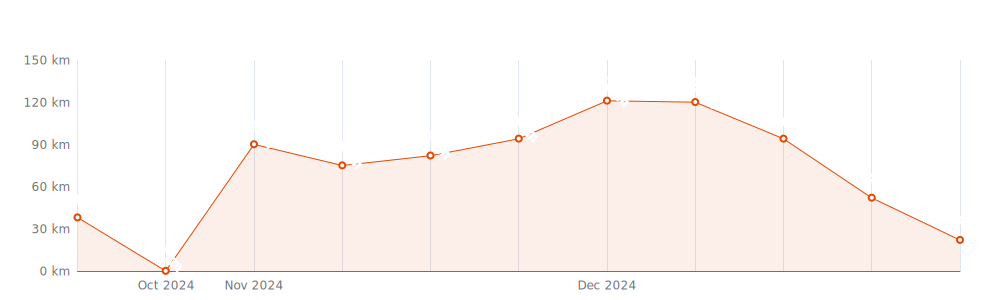
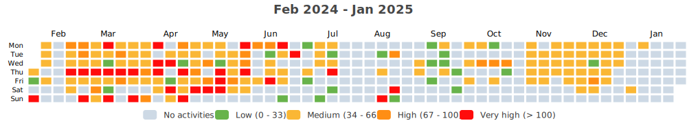
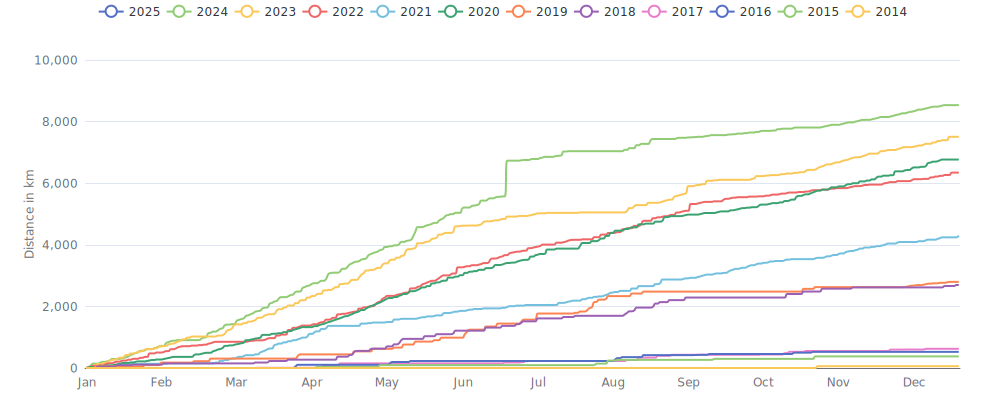

    

Since I began cycling `10 years and 1 month` ago on `02-11-2014`,
I had `892 cycling days`. 
I recorded a total distance of `32 523 km`
(`0.81` trips around the world 🌍 and
`0.085` trips to the moon 🌕),
an elevation of `371 104 m`
(`41.9` times Mount Everest 🏔)
and a total time of `2mos 1d 10h 39m` 🎉

That's a daily average of `10 km`,
a weekly average of `67 km` and a
monthly average of `290 km` 🐣

I burned `788233 calories` doing so, that's about `2 919` pizza slices 🍕

---

<kbd><a href="#weekly-distances">Weekly distances</a></kbd> |
<kbd><a href="#activities">Activities</a></kbd> |
<kbd><a href="#monthly-stats">Monthly stats</a></kbd> |
<kbd><a href="#activity-intensity">Activity intensity</a></kbd> |
<kbd><a href="#stats-per-weekday">Stats per weekday</a></kbd> |
<kbd><a href="#daytime-stats">Daytime stats</a></kbd> |
<kbd><a href="#stats-per-bike">Stats per bike</a></kbd> |
<kbd><a href="#best-power-outputs-over-time">Power outputs</a></kbd> |
<kbd><a href="#eddington-chart">Eddington</a></kbd> |
<kbd><a href="#yearly-distances">Yearly distances</a></kbd> |
<kbd><a href="#distance-breakdown">Distance breakdown</a></kbd> |
<kbd><a href="#challenge-consistency">Challenge consistency</a></kbd> |

## Weekly distances

## Activities

<table>
    <tr>
        <th></th>
        <th></th>
        <th align="center"></th>
        <th align="center"></th>
        <th align="center"></th>
        <th align="center"></th>
        <th align="center"></th>
        <th align="center"></th>
    </tr>
            <tr>
            <td>23-02-24</td>
            <td>
                
<a href="https://www.strava.com/activities/10820440079" title="Kcal: 386 | Gear: Velotaf ">Vélotaf #13</a>
            </td>
            <td align="center">16 km</td>
            <td align="center">71 m</td>
            <td align="center">49:58</td>
            <td align="center">119 w</td>
            <td align="center">18.8 km/h</td>
            <td align="center">113</td>
        </tr>
            <tr>
            <td>22-02-24</td>
            <td>
                
<a href="https://www.strava.com/activities/10814079269" title="Kcal: 3356 | Gear: Endurace ">🌬️🌬️🌬️🌧️🌧️🌧️🎂🎂🎂...</a>
            </td>
            <td align="center">128 km</td>
            <td align="center">1 396 m</td>
            <td align="center">5:36:04</td>
            <td align="center">140 w</td>
            <td align="center">22.9 km/h</td>
            <td align="center">135</td>
        </tr>
            <tr>
            <td>21-02-24</td>
            <td>
                
<a href="https://www.strava.com/activities/10810022247" title="Kcal: 403 | Gear: Velotaf ">Vélotaf #12</a>
            </td>
            <td align="center">17 km</td>
            <td align="center">66 m</td>
            <td align="center">51:32</td>
            <td align="center">123 w</td>
            <td align="center">19.5 km/h</td>
            <td align="center">115</td>
        </tr>
            <tr>
            <td>20-02-24</td>
            <td>
                                
<a href="https://www.strava.com/activities/10800491172" title="Kcal: 621 | Gear: Home Trainer ">6x2 VO2 Max in Makuri Islands</a>
            </td>
            <td align="center">34 km</td>
            <td align="center">170 m</td>
            <td align="center">1:02:22</td>
            <td align="center">174 w</td>
            <td align="center">32.9 km/h</td>
            <td align="center">138</td>
        </tr>
            <tr>
            <td>19-02-24</td>
            <td>
                                
<a href="https://www.strava.com/activities/10793875800" title="Kcal: 1119 | Gear: Home Trainer ">Yellow Unicorn in Watopia</a>
            </td>
            <td align="center">46 km</td>
            <td align="center">1 019 m</td>
            <td align="center">1:45:22</td>
            <td align="center">185 w</td>
            <td align="center">26.2 km/h</td>
            <td align="center">153</td>
        </tr>
        </table>

    
Older activities

    <table>
        <tr>
            <th></th>
            <th></th>
            <th align="center"></th>
            <th align="center"></th>
            <th align="center"></th>
            <th align="center"></th>
            <th align="center"></th>
            <th align="center"></th>
        </tr>
                    <tr>
                <td>09-02-24</td>
                <td>
                    
<a href="https://www.strava.com/activities/10727677563" title="Kcal: 603 | Gear: Velotaf ">Vélotaf #11</a>
                </td>
                <td align="center">19 km</td>
                <td align="center">76 m</td>
                <td align="center">1:00:16</td>
                <td align="center">119 w</td>
                <td align="center">18.5 km/h</td>
                <td align="center">129</td>
            </tr>
                    <tr>
                <td>07-02-24</td>
                <td>
                    
<a href="https://www.strava.com/activities/10717446345" title="Kcal: 384 | Gear: Velotaf ">Vélotaf #10</a>
                </td>
                <td align="center">17 km</td>
                <td align="center">81 m</td>
                <td align="center">52:50</td>
                <td align="center">115 w</td>
                <td align="center">18.8 km/h</td>
                <td align="center">110</td>
            </tr>
                    <tr>
                <td>06-02-24</td>
                <td>
                                    
<a href="https://www.strava.com/activities/10707567138" title="Kcal: 636 | Gear: Home Trainer ">Circus in Watopia</a>
                </td>
                <td align="center">31 km</td>
                <td align="center">374 m</td>
                <td align="center">1:00:16</td>
                <td align="center">184 w</td>
                <td align="center">30.5 km/h</td>
                <td align="center">148</td>
            </tr>
                    <tr>
                <td>05-02-24</td>
                <td>
                                    
<a href="https://www.strava.com/activities/10700824200" title="Kcal: 585 | Gear: Home Trainer ">2x(5x2min) Threshold Fun i...</a>
                </td>
                <td align="center">32 km</td>
                <td align="center">171 m</td>
                <td align="center">1:00:16</td>
                <td align="center">170 w</td>
                <td align="center">31.5 km/h</td>
                <td align="center">139</td>
            </tr>
                    <tr>
                <td>04-02-24</td>
                <td>
                    
<a href="https://www.strava.com/activities/10693009850" title="Kcal: 2447 | Gear: Endurace ">Sortie vélo le matin</a>
                </td>
                <td align="center">92 km</td>
                <td align="center">1 099 m</td>
                <td align="center">3:49:39</td>
                <td align="center">154 w</td>
                <td align="center">24 km/h</td>
                <td align="center">131</td>
            </tr>
                    <tr>
                <td>02-02-24</td>
                <td>
                    
<a href="https://www.strava.com/activities/10681148691" title="Kcal: 121 | Gear: Velotaf ">Sortie vélo dans l&#039;après-m...</a>
                </td>
                <td align="center">6 km</td>
                <td align="center">13 m</td>
                <td align="center">2:20</td>
                <td align="center">91 w</td>
                <td align="center">141.7 km/h</td>
                <td align="center">88</td>
            </tr>
                    <tr>
                <td>02-02-24</td>
                <td>
                    
<a href="https://www.strava.com/activities/10680951432" title="Kcal: 218 | Gear: Velotaf ">Vélotaf #9</a>
                </td>
                <td align="center">9 km</td>
                <td align="center">34 m</td>
                <td align="center">31:24</td>
                <td align="center">105 w</td>
                <td align="center">17.7 km/h</td>
                <td align="center">106</td>
            </tr>
                    <tr>
                <td>01-02-24</td>
                <td>
                                    
<a href="https://www.strava.com/activities/10673937254" title="Kcal: 704 | Gear: Home Trainer ">Threshold #6 in Watopia</a>
                </td>
                <td align="center">36 km</td>
                <td align="center">282 m</td>
                <td align="center">1:04:11</td>
                <td align="center">192 w</td>
                <td align="center">33.5 km/h</td>
                <td align="center">147</td>
            </tr>
                    <tr>
                <td>31-01-24</td>
                <td>
                    
<a href="https://www.strava.com/activities/10670190677" title="Kcal: 647 | Gear: Velotaf ">Vélotaf #8</a>
                </td>
                <td align="center">25 km</td>
                <td align="center">116 m</td>
                <td align="center">1:18:15</td>
                <td align="center">121 w</td>
                <td align="center">19.3 km/h</td>
                <td align="center">114</td>
            </tr>
                    <tr>
                <td>30-01-24</td>
                <td>
                                    
<a href="https://www.strava.com/activities/10663501926" title="Kcal: 546 | Gear: Home Trainer ">Pyramid Cadence Efforts in...</a>
                </td>
                <td align="center">25 km</td>
                <td align="center">434 m</td>
                <td align="center">57:27</td>
                <td align="center">166 w</td>
                <td align="center">25.9 km/h</td>
                <td align="center">9</td>
            </tr>
                    <tr>
                <td>27-01-24</td>
                <td>
                                    
<a href="https://www.strava.com/activities/10641865903" title="Kcal: 776 | Gear: Home Trainer ">SweetSpot w/ Bursts in Wat...</a>
                </td>
                <td align="center">40 km</td>
                <td align="center">230 m</td>
                <td align="center">1:10:19</td>
                <td align="center">193 w</td>
                <td align="center">34.1 km/h</td>
                <td align="center">136</td>
            </tr>
                    <tr>
                <td>26-01-24</td>
                <td>
                    
<a href="https://www.strava.com/activities/10633238039" title="Kcal: 473 | Gear: Velotaf ">Vélotaf #7</a>
                </td>
                <td align="center">17 km</td>
                <td align="center">73 m</td>
                <td align="center">59:04</td>
                <td align="center">99 w</td>
                <td align="center">16.9 km/h</td>
                <td align="center">115</td>
            </tr>
                    <tr>
                <td>24-01-24</td>
                <td>
                                    
<a href="https://www.strava.com/activities/10621480167" title="Kcal: 589 | Gear: Home Trainer ">Base Builder Ladder in Wat...</a>
                </td>
                <td align="center">34 km</td>
                <td align="center">266 m</td>
                <td align="center">1:03:28</td>
                <td align="center">163 w</td>
                <td align="center">32.4 km/h</td>
                <td align="center">132</td>
            </tr>
                    <tr>
                <td>24-01-24</td>
                <td>
                    
<a href="https://www.strava.com/activities/10620484154" title="Kcal: 488 | Gear: Velotaf ">Vélotaf</a>
                </td>
                <td align="center">18 km</td>
                <td align="center">84 m</td>
                <td align="center">57:38</td>
                <td align="center">116 w</td>
                <td align="center">18.5 km/h</td>
                <td align="center">116</td>
            </tr>
                    <tr>
                <td>23-01-24</td>
                <td>
                    
<a href="https://www.strava.com/activities/10616762715" title="Kcal: 496 | Gear: Velotaf ">Vélotaf</a>
                </td>
                <td align="center">21 km</td>
                <td align="center">90 m</td>
                <td align="center">1:17:40</td>
                <td align="center">98 w</td>
                <td align="center">16.6 km/h</td>
                <td align="center">104</td>
            </tr>
                    <tr>
                <td>22-01-24</td>
                <td>
                                    
<a href="https://www.strava.com/activities/10607194448" title="Kcal: 552 | Gear: Home Trainer ">Anaerobic Capacity 1min &amp; ...</a>
                </td>
                <td align="center">29 km</td>
                <td align="center">192 m</td>
                <td align="center">54:12</td>
                <td align="center">178 w</td>
                <td align="center">32.6 km/h</td>
                <td align="center">139</td>
            </tr>
                    <tr>
                <td>21-01-24</td>
                <td>
                                    
<a href="https://www.strava.com/activities/10599941284" title="Kcal: 569 | Gear: Home Trainer ">Garmin UNBOUND Gravel Trai...</a>
                </td>
                <td align="center">33 km</td>
                <td align="center">150 m</td>
                <td align="center">58:16</td>
                <td align="center">171 w</td>
                <td align="center">33.6 km/h</td>
                <td align="center">124</td>
            </tr>
                    <tr>
                <td>20-01-24</td>
                <td>
                                    
<a href="https://www.strava.com/activities/10596327823" title="Kcal: 866 | Gear: Home Trainer ">Workout 16 in Watopia</a>
                </td>
                <td align="center">46 km</td>
                <td align="center">292 m</td>
                <td align="center">1:22:24</td>
                <td align="center">184 w</td>
                <td align="center">33.2 km/h</td>
                <td align="center">137</td>
            </tr>
                    <tr>
                <td>19-01-24</td>
                <td>
                                    
<a href="https://www.strava.com/activities/10588470519" title="Kcal: 602 | Gear: Home Trainer ">Garmin UNBOUND Gravel Trai...</a>
                </td>
                <td align="center">30 km</td>
                <td align="center">268 m</td>
                <td align="center">1:00:31</td>
                <td align="center">174 w</td>
                <td align="center">30.2 km/h</td>
                <td align="center">1</td>
            </tr>
                    <tr>
                <td>18-01-24</td>
                <td>
                    
<a href="https://www.strava.com/activities/10681148698" title="Kcal: 129 | Gear: Velotaf ">Sortie vélo de nuit</a>
                </td>
                <td align="center">9 km</td>
                <td align="center">7 m</td>
                <td align="center">5:07</td>
                <td align="center">134 w</td>
                <td align="center">101.1 km/h</td>
                <td align="center">89</td>
            </tr>
                    <tr>
                <td>18-01-24</td>
                <td>
                    
<a href="https://www.strava.com/activities/10585254878" title="Kcal: 214 | Gear: Velotaf ">Vélotaf</a>
                </td>
                <td align="center">11 km</td>
                <td align="center">36 m</td>
                <td align="center">36:03</td>
                <td align="center">110 w</td>
                <td align="center">17.8 km/h</td>
                <td align="center">99</td>
            </tr>
                    <tr>
                <td>17-01-24</td>
                <td>
                    
<a href="https://www.strava.com/activities/10577445710" title="Kcal: 373 | Gear: Velotaf ">Vélotaf</a>
                </td>
                <td align="center">17 km</td>
                <td align="center">63 m</td>
                <td align="center">1:02:33</td>
                <td align="center">97 w</td>
                <td align="center">16.5 km/h</td>
                <td align="center">106</td>
            </tr>
                    <tr>
                <td>16-01-24</td>
                <td>
                    
<a href="https://www.strava.com/activities/10571273291" title="Kcal: 407 | Gear: Velotaf ">Vélotaf</a>
                </td>
                <td align="center">17 km</td>
                <td align="center">63 m</td>
                <td align="center">1:00:31</td>
                <td align="center">102 w</td>
                <td align="center">17 km/h</td>
                <td align="center">110</td>
            </tr>
                    <tr>
                <td>12-01-24</td>
                <td>
                                    
<a href="https://www.strava.com/activities/10544916929" title="Kcal: 549 | Gear: Home Trainer ">Zwift Pro Training Camp: J...</a>
                </td>
                <td align="center">31 km</td>
                <td align="center">387 m</td>
                <td align="center">1:00:44</td>
                <td align="center">158 w</td>
                <td align="center">30.2 km/h</td>
                <td align="center">135</td>
            </tr>
                    <tr>
                <td>12-01-24</td>
                <td>
                    
<a href="https://www.strava.com/activities/10544209876" title="Kcal: 380 | Gear: Velotaf ">Vélotaf</a>
                </td>
                <td align="center">18 km</td>
                <td align="center">70 m</td>
                <td align="center">59:23</td>
                <td align="center">113 w</td>
                <td align="center">18.4 km/h</td>
                <td align="center">107</td>
            </tr>
                    <tr>
                <td>11-01-24</td>
                <td>
                                    
<a href="https://www.strava.com/activities/10538878858" title="Kcal: 583 | Gear: Home Trainer ">Pure Strength #1 in London</a>
                </td>
                <td align="center">28 km</td>
                <td align="center">379 m</td>
                <td align="center">1:02:34</td>
                <td align="center">163 w</td>
                <td align="center">27.2 km/h</td>
                <td align="center">139</td>
            </tr>
                    <tr>
                <td>10-01-24</td>
                <td>
                    
<a href="https://www.strava.com/activities/10532822922" title="Kcal: 336 | Gear: Velotaf ">Vélotaf</a>
                </td>
                <td align="center">17 km</td>
                <td align="center">63 m</td>
                <td align="center">55:44</td>
                <td align="center">112 w</td>
                <td align="center">18 km/h</td>
                <td align="center">103</td>
            </tr>
                    <tr>
                <td>08-01-24</td>
                <td>
                                    
<a href="https://www.strava.com/activities/10520449825" title="Kcal: 435 | Gear: Home Trainer ">Workout of the Week | Hair...</a>
                </td>
                <td align="center">26 km</td>
                <td align="center">39 m</td>
                <td align="center">45:08</td>
                <td align="center">168 w</td>
                <td align="center">34.7 km/h</td>
                <td align="center">138</td>
            </tr>
                    <tr>
                <td>07-01-24</td>
                <td>
                                    
<a href="https://www.strava.com/activities/10513880149" title="Kcal: 579 | Gear: Home Trainer ">Endurance #2 in Watopia</a>
                </td>
                <td align="center">33 km</td>
                <td align="center">229 m</td>
                <td align="center">1:02:52</td>
                <td align="center">161 w</td>
                <td align="center">31.1 km/h</td>
                <td align="center">124</td>
            </tr>
                    <tr>
                <td>04-01-24</td>
                <td>
                    
<a href="https://www.strava.com/activities/10493031449" title="Kcal: 1224 | Gear: Other ">Sortie Ustaritz</a>
                </td>
                <td align="center">58 km</td>
                <td align="center">670 m</td>
                <td align="center">2:24:51</td>
                <td align="center">130 w</td>
                <td align="center">24.1 km/h</td>
                <td align="center">136</td>
            </tr>
                    <tr>
                <td>03-01-24</td>
                <td>
                    
<a href="https://www.strava.com/activities/10486356889" title="Kcal: 1243 | Gear: Other ">Col de Lizarieta</a>
                </td>
                <td align="center">51 km</td>
                <td align="center">749 m</td>
                <td align="center">2:13:17</td>
                <td align="center">131 w</td>
                <td align="center">23 km/h</td>
                <td align="center">138</td>
            </tr>
                    <tr>
                <td>03-01-24</td>
                <td>
                    
<a href="https://www.strava.com/activities/10485443521" title="Kcal: 457 | Gear: Other ">Dej à Guéthary</a>
                </td>
                <td align="center">13 km</td>
                <td align="center">286 m</td>
                <td align="center">1:20:41</td>
                <td align="center">75 w</td>
                <td align="center">9.9 km/h</td>
                <td align="center">95</td>
            </tr>
                    <tr>
                <td>02-01-24</td>
                <td>
                    
<a href="https://www.strava.com/activities/10478335735" title="Kcal: 281 | Gear: Other ">Socoa</a>
                </td>
                <td align="center">11 km</td>
                <td align="center">121 m</td>
                <td align="center">52:04</td>
                <td align="center">73 w</td>
                <td align="center">12.2 km/h</td>
                <td align="center">100</td>
            </tr>
                    <tr>
                <td>01-01-24</td>
                <td>
                    
<a href="https://www.strava.com/activities/10474630761" title="Kcal: 229 | Gear: Other ">Erromardie</a>
                </td>
                <td align="center">8 km</td>
                <td align="center">123 m</td>
                <td align="center">44:19</td>
                <td align="center">61 w</td>
                <td align="center">10.3 km/h</td>
                <td align="center">96</td>
            </tr>
                    <tr>
                <td>27-12-23</td>
                <td>
                    
<a href="https://www.strava.com/activities/10444427515" title="Kcal: 2535 | Gear: Endurace ">Asnières Vernon 🌬️</a>
                </td>
                <td align="center">110 km</td>
                <td align="center">1 113 m</td>
                <td align="center">4:16:52</td>
                <td align="center">124 w</td>
                <td align="center">25.7 km/h</td>
                <td align="center">149</td>
            </tr>
                    <tr>
                <td>24-12-23</td>
                <td>
                                    
<a href="https://www.strava.com/activities/10428676435" title="Kcal: 569 | Gear: Home Trainer ">Endurance #1 in New York</a>
                </td>
                <td align="center">26 km</td>
                <td align="center">452 m</td>
                <td align="center">1:00:04</td>
                <td align="center">166 w</td>
                <td align="center">25.6 km/h</td>
                <td align="center">136</td>
            </tr>
                    <tr>
                <td>22-12-23</td>
                <td>
                                    
<a href="https://www.strava.com/activities/10420705951" title="Kcal: 880 | Gear: Home Trainer ">Aerobic Builds in Watopia</a>
                </td>
                <td align="center">48 km</td>
                <td align="center">287 m</td>
                <td align="center">1:30:17</td>
                <td align="center">170 w</td>
                <td align="center">31.9 km/h</td>
                <td align="center">145</td>
            </tr>
                    <tr>
                <td>20-12-23</td>
                <td>
                                    
<a href="https://www.strava.com/activities/10411884859" title="Kcal: 522 | Gear: Home Trainer ">Taper Steady in Watopia</a>
                </td>
                <td align="center">28 km</td>
                <td align="center">147 m</td>
                <td align="center">50:06</td>
                <td align="center">182 w</td>
                <td align="center">33.8 km/h</td>
                <td align="center">148</td>
            </tr>
                    <tr>
                <td>20-12-23</td>
                <td>
                    
<a href="https://www.strava.com/activities/10409993258" title="Kcal: 511 | Gear: Velotaf ">Vélotaf</a>
                </td>
                <td align="center">16 km</td>
                <td align="center">76 m</td>
                <td align="center">57:04</td>
                <td align="center">105 w</td>
                <td align="center">17.1 km/h</td>
                <td align="center">120</td>
            </tr>
                    <tr>
                <td>17-12-23</td>
                <td>
                                    
<a href="https://www.strava.com/activities/10397048514" title="Kcal: 738 | Gear: Home Trainer ">Pacing #2 in Watopia</a>
                </td>
                <td align="center">30 km</td>
                <td align="center">682 m</td>
                <td align="center">1:15:37</td>
                <td align="center">171 w</td>
                <td align="center">24 km/h</td>
                <td align="center">137</td>
            </tr>
                    <tr>
                <td>16-12-23</td>
                <td>
                                    
<a href="https://www.strava.com/activities/10390515149" title="Kcal: 476 | Gear: Home Trainer ">Workout of the Week | Wout...</a>
                </td>
                <td align="center">25 km</td>
                <td align="center">256 m</td>
                <td align="center">47:58</td>
                <td align="center">174 w</td>
                <td align="center">31.7 km/h</td>
                <td align="center">130</td>
            </tr>
                    <tr>
                <td>14-12-23</td>
                <td>
                    
<a href="https://www.strava.com/activities/10381326980" title="Kcal: 572 | Gear: Velotaf ">Vélotaf</a>
                </td>
                <td align="center">24 km</td>
                <td align="center">92 m</td>
                <td align="center">1:21:57</td>
                <td align="center">107 w</td>
                <td align="center">17.6 km/h</td>
                <td align="center">114</td>
            </tr>
                    <tr>
                <td>13-12-23</td>
                <td>
                    
<a href="https://www.strava.com/activities/10374211025" title="Kcal: 208 | Gear: Velotaf ">Vélotaf</a>
                </td>
                <td align="center">9 km</td>
                <td align="center">33 m</td>
                <td align="center">29:57</td>
                <td align="center">104 w</td>
                <td align="center">17.8 km/h</td>
                <td align="center">109</td>
            </tr>
                    <tr>
                <td>12-12-23</td>
                <td>
                    
<a href="https://www.strava.com/activities/10370101556" title="Kcal: 337 | Gear: Velotaf ">Vélotaf</a>
                </td>
                <td align="center">17 km</td>
                <td align="center">70 m</td>
                <td align="center">1:03:21</td>
                <td align="center">97 w</td>
                <td align="center">16.3 km/h</td>
                <td align="center">98</td>
            </tr>
                    <tr>
                <td>08-12-23</td>
                <td>
                    
<a href="https://www.strava.com/activities/10348171091" title="Kcal: 417 | Gear: Velotaf ">Vélotaf</a>
                </td>
                <td align="center">18 km</td>
                <td align="center">66 m</td>
                <td align="center">1:02:05</td>
                <td align="center">107 w</td>
                <td align="center">17.5 km/h</td>
                <td align="center">110</td>
            </tr>
                    <tr>
                <td>07-12-23</td>
                <td>
                                    
<a href="https://www.strava.com/activities/10343999620" title="Kcal: 590 | Gear: Home Trainer ">Race: Full Gas Experience ...</a>
                </td>
                <td align="center">24 km</td>
                <td align="center">283 m</td>
                <td align="center">40:48</td>
                <td align="center">224 w</td>
                <td align="center">35.6 km/h</td>
                <td align="center">153</td>
            </tr>
                    <tr>
                <td>06-12-23</td>
                <td>
                    
<a href="https://www.strava.com/activities/10338996304" title="Kcal: 248 | Gear: Velotaf ">Vélo en soirée</a>
                </td>
                <td align="center">9 km</td>
                <td align="center">27 m</td>
                <td align="center">41:09</td>
                <td align="center">90 w</td>
                <td align="center">13.7 km/h</td>
                <td align="center">n/a</td>
            </tr>
                    <tr>
                <td>06-12-23</td>
                <td>
                    
<a href="https://www.strava.com/activities/10341404674" title="Kcal: 144 | Gear: Velotaf ">Vélotaf</a>
                </td>
                <td align="center">6 km</td>
                <td align="center">25 m</td>
                <td align="center">20:31</td>
                <td align="center">99 w</td>
                <td align="center">16.3 km/h</td>
                <td align="center">110</td>
            </tr>
                    <tr>
                <td>06-12-23</td>
                <td>
                    
<a href="https://www.strava.com/activities/10337754366" title="Kcal: 195 | Gear: Velotaf ">Sortie vélo le midi</a>
                </td>
                <td align="center">10 km</td>
                <td align="center">31 m</td>
                <td align="center">33:51</td>
                <td align="center">89 w</td>
                <td align="center">16.9 km/h</td>
                <td align="center">n/a</td>
            </tr>
                    <tr>
                <td>05-12-23</td>
                <td>
                                    
<a href="https://www.strava.com/activities/10331880653" title="Kcal: 604 | Gear: Home Trainer ">Spin up #2 in Watopia</a>
                </td>
                <td align="center">28 km</td>
                <td align="center">264 m</td>
                <td align="center">1:00:19</td>
                <td align="center">175 w</td>
                <td align="center">28.4 km/h</td>
                <td align="center">155</td>
            </tr>
            </table>

## Monthly stats

<table>
    <thead>
    <tr>
        <th>&nbsp;&nbsp;&nbsp;&nbsp;&nbsp;</th>
        <th># of rides</th>
        <th align="center"></th>
        <th align="center"></th>
        <th align="center"></th>
        <th align="center"></th>
    </tr>
    </thead>
    <tbody>
            <tr>
            <td align="center">February 2024</td>
            <td align="center">13</td>
            <td align="center">481 km</td>
            <td align="center">4 852 m</td>
            <td align="center">19h 26m</td>
            <td align="center">0</td>
        </tr>
            <tr>
            <td align="center">January 2024</td>
            <td align="center">26</td>
            <td align="center">665 km</td>
            <td align="center">5 480 m</td>
            <td align="center">1d 4h 5m</td>
            <td align="center">0</td>
        </tr>
            <tr>
            <td align="center">December 2023</td>
            <td align="center">18</td>
            <td align="center">446 km</td>
            <td align="center">3 957 m</td>
            <td align="center">18h 55m</td>
            <td align="center">0</td>
        </tr>
            <tr>
            <td align="center">November 2023</td>
            <td align="center">25</td>
            <td align="center">612 km</td>
            <td align="center">4 096 m</td>
            <td align="center">1d 3h 40m</td>
            <td align="center">0</td>
        </tr>
            <tr>
            <td align="center">October 2023</td>
            <td align="center">16</td>
            <td align="center">319 km</td>
            <td align="center">3 148 m</td>
            <td align="center">15h 27m</td>
            <td align="center">0</td>
        </tr>
            <tr>
            <td align="center">September 2023</td>
            <td align="center">15</td>
            <td align="center">666 km</td>
            <td align="center">5 253 m</td>
            <td align="center">1d 2h 32m</td>
            <td align="center">0</td>
        </tr>
            <tr>
            <td align="center">August 2023</td>
            <td align="center">9</td>
            <td align="center">393 km</td>
            <td align="center">5 780 m</td>
            <td align="center">18h 27m</td>
            <td align="center">0</td>
        </tr>
            <tr>
            <td align="center">July 2023</td>
            <td align="center">7</td>
            <td align="center">118 km</td>
            <td align="center">1 526 m</td>
            <td align="center">5h 59m</td>
            <td align="center">0</td>
        </tr>
            <tr>
            <td align="center">June 2023</td>
            <td align="center">17</td>
            <td align="center">549 km</td>
            <td align="center">5 994 m</td>
            <td align="center">1d 1h 25m</td>
            <td align="center">0</td>
        </tr>
            <tr>
            <td align="center">May 2023</td>
            <td align="center">29</td>
            <td align="center">1 169 km</td>
            <td align="center">13 083 m</td>
            <td align="center">1d 21h 13m</td>
            <td align="center">0</td>
        </tr>
            <tr>
            <td align="center">April 2023</td>
            <td align="center">27</td>
            <td align="center">984 km</td>
            <td align="center">11 384 m</td>
            <td align="center">1d 14h 26m</td>
            <td align="center">0</td>
        </tr>
            <tr>
            <td align="center">March 2023</td>
            <td align="center">35</td>
            <td align="center">960 km</td>
            <td align="center">8 546 m</td>
            <td align="center">1d 14h 20m</td>
            <td align="center">0</td>
        </tr>
            <tr>
            <td align="center">February 2023</td>
            <td align="center">21</td>
            <td align="center">427 km</td>
            <td align="center">3 676 m</td>
            <td align="center">17h 23m</td>
            <td align="center">0</td>
        </tr>
            <tr>
            <td align="center">January 2023</td>
            <td align="center">33</td>
            <td align="center">642 km</td>
            <td align="center">5 554 m</td>
            <td align="center">1d 3h 51m</td>
            <td align="center">0</td>
        </tr>
            <tr>
            <td align="center">December 2022</td>
            <td align="center">13</td>
            <td align="center">339 km</td>
            <td align="center">3 504 m</td>
            <td align="center">13h 51m</td>
            <td align="center">0</td>
        </tr>
            <tr>
            <td align="center">November 2022</td>
            <td align="center">13</td>
            <td align="center">214 km</td>
            <td align="center">996 m</td>
            <td align="center">11h 34m</td>
            <td align="center">0</td>
        </tr>
            <tr>
            <td align="center">October 2022</td>
            <td align="center">20</td>
            <td align="center">228 km</td>
            <td align="center">1 009 m</td>
            <td align="center">13h 41m</td>
            <td align="center">0</td>
        </tr>
            <tr>
            <td align="center">September 2022</td>
            <td align="center">29</td>
            <td align="center">617 km</td>
            <td align="center">5 685 m</td>
            <td align="center">1d 3h 49m</td>
            <td align="center">0</td>
        </tr>
            <tr>
            <td align="center">August 2022</td>
            <td align="center">15</td>
            <td align="center">682 km</td>
            <td align="center">13 658 m</td>
            <td align="center">1d 9h 9m</td>
            <td align="center">0</td>
        </tr>
            <tr>
            <td align="center">July 2022</td>
            <td align="center">24</td>
            <td align="center">455 km</td>
            <td align="center">4 330 m</td>
            <td align="center">19h 37m</td>
            <td align="center">0</td>
        </tr>
            <tr>
            <td align="center">June 2022</td>
            <td align="center">31</td>
            <td align="center">769 km</td>
            <td align="center">9 475 m</td>
            <td align="center">1d 8h 39m</td>
            <td align="center">0</td>
        </tr>
            <tr>
            <td align="center">May 2022</td>
            <td align="center">30</td>
            <td align="center">939 km</td>
            <td align="center">12 022 m</td>
            <td align="center">1d 15h 49m</td>
            <td align="center">0</td>
        </tr>
            <tr>
            <td align="center">April 2022</td>
            <td align="center">31</td>
            <td align="center">630 km</td>
            <td align="center">5 119 m</td>
            <td align="center">1d 1h 6m</td>
            <td align="center">0</td>
        </tr>
            <tr>
            <td align="center">March 2022</td>
            <td align="center">19</td>
            <td align="center">525 km</td>
            <td align="center">3 879 m</td>
            <td align="center">20h 48m</td>
            <td align="center">0</td>
        </tr>
            <tr>
            <td align="center">February 2022</td>
            <td align="center">24</td>
            <td align="center">347 km</td>
            <td align="center">2 177 m</td>
            <td align="center">14h 45m</td>
            <td align="center">0</td>
        </tr>
            <tr>
            <td align="center">January 2022</td>
            <td align="center">22</td>
            <td align="center">503 km</td>
            <td align="center">5 067 m</td>
            <td align="center">18h 36m</td>
            <td align="center">0</td>
        </tr>
            <tr>
            <td align="center">December 2021</td>
            <td align="center">12</td>
            <td align="center">286 km</td>
            <td align="center">3 745 m</td>
            <td align="center">12h 28m</td>
            <td align="center">0</td>
        </tr>
            <tr>
            <td align="center">November 2021</td>
            <td align="center">30</td>
            <td align="center">453 km</td>
            <td align="center">3 225 m</td>
            <td align="center">19h 45m</td>
            <td align="center">0</td>
        </tr>
            <tr>
            <td align="center">October 2021</td>
            <td align="center">20</td>
            <td align="center">302 km</td>
            <td align="center">2 311 m</td>
            <td align="center">12h 57m</td>
            <td align="center">0</td>
        </tr>
            <tr>
            <td align="center">September 2021</td>
            <td align="center">27</td>
            <td align="center">341 km</td>
            <td align="center">2 418 m</td>
            <td align="center">15h 17m</td>
            <td align="center">0</td>
        </tr>
            <tr>
            <td align="center">August 2021</td>
            <td align="center">17</td>
            <td align="center">568 km</td>
            <td align="center">8 996 m</td>
            <td align="center">1d 40m</td>
            <td align="center">0</td>
        </tr>
            <tr>
            <td align="center">July 2021</td>
            <td align="center">19</td>
            <td align="center">283 km</td>
            <td align="center">2 129 m</td>
            <td align="center">12h 28m</td>
            <td align="center">0</td>
        </tr>
            <tr>
            <td align="center">June 2021</td>
            <td align="center">18</td>
            <td align="center">240 km</td>
            <td align="center">1 804 m</td>
            <td align="center">10h 36m</td>
            <td align="center">0</td>
        </tr>
            <tr>
            <td align="center">May 2021</td>
            <td align="center">18</td>
            <td align="center">308 km</td>
            <td align="center">2 189 m</td>
            <td align="center">13h 54m</td>
            <td align="center">0</td>
        </tr>
            <tr>
            <td align="center">April 2021</td>
            <td align="center">12</td>
            <td align="center">491 km</td>
            <td align="center">6 215 m</td>
            <td align="center">20h 44m</td>
            <td align="center">0</td>
        </tr>
            <tr>
            <td align="center">March 2021</td>
            <td align="center">20</td>
            <td align="center">702 km</td>
            <td align="center">9 279 m</td>
            <td align="center">1d 1h 46m</td>
            <td align="center">0</td>
        </tr>
            <tr>
            <td align="center">February 2021</td>
            <td align="center">3</td>
            <td align="center">95 km</td>
            <td align="center">896 m</td>
            <td align="center">3h 33m</td>
            <td align="center">0</td>
        </tr>
            <tr>
            <td align="center">January 2021</td>
            <td align="center">6</td>
            <td align="center">137 km</td>
            <td align="center">1 027 m</td>
            <td align="center">5h 36m</td>
            <td align="center">0</td>
        </tr>
            <tr>
            <td align="center">December 2020</td>
            <td align="center">17</td>
            <td align="center">525 km</td>
            <td align="center">5 789 m</td>
            <td align="center">21h 48m</td>
            <td align="center">0</td>
        </tr>
            <tr>
            <td align="center">November 2020</td>
            <td align="center">16</td>
            <td align="center">543 km</td>
            <td align="center">6 243 m</td>
            <td align="center">18h 46m</td>
            <td align="center">0</td>
        </tr>
            <tr>
            <td align="center">October 2020</td>
            <td align="center">25</td>
            <td align="center">527 km</td>
            <td align="center">5 059 m</td>
            <td align="center">22h 32m</td>
            <td align="center">0</td>
        </tr>
            <tr>
            <td align="center">September 2020</td>
            <td align="center">27</td>
            <td align="center">253 km</td>
            <td align="center">911 m</td>
            <td align="center">12h 24m</td>
            <td align="center">0</td>
        </tr>
            <tr>
            <td align="center">August 2020</td>
            <td align="center">13</td>
            <td align="center">778 km</td>
            <td align="center">15 577 m</td>
            <td align="center">1d 10h 19m</td>
            <td align="center">0</td>
        </tr>
            <tr>
            <td align="center">July 2020</td>
            <td align="center">17</td>
            <td align="center">629 km</td>
            <td align="center">8 098 m</td>
            <td align="center">1d 3h 34m</td>
            <td align="center">0</td>
        </tr>
            <tr>
            <td align="center">June 2020</td>
            <td align="center">22</td>
            <td align="center">539 km</td>
            <td align="center">5 518 m</td>
            <td align="center">20h 23m</td>
            <td align="center">0</td>
        </tr>
            <tr>
            <td align="center">May 2020</td>
            <td align="center">23</td>
            <td align="center">868 km</td>
            <td align="center">9 688 m</td>
            <td align="center">1d 7h 6m</td>
            <td align="center">0</td>
        </tr>
            <tr>
            <td align="center">April 2020</td>
            <td align="center">24</td>
            <td align="center">707 km</td>
            <td align="center">9 457 m</td>
            <td align="center">1d 26m</td>
            <td align="center">0</td>
        </tr>
            <tr>
            <td align="center">March 2020</td>
            <td align="center">31</td>
            <td align="center">593 km</td>
            <td align="center">5 743 m</td>
            <td align="center">1d 10m</td>
            <td align="center">0</td>
        </tr>
            <tr>
            <td align="center">February 2020</td>
            <td align="center">35</td>
            <td align="center">442 km</td>
            <td align="center">3 573 m</td>
            <td align="center">20h 43m</td>
            <td align="center">0</td>
        </tr>
            <tr>
            <td align="center">January 2020</td>
            <td align="center">36</td>
            <td align="center">276 km</td>
            <td align="center">1 330 m</td>
            <td align="center">16h 18m</td>
            <td align="center">0</td>
        </tr>
            <tr>
            <td align="center">December 2019</td>
            <td align="center">22</td>
            <td align="center">170 km</td>
            <td align="center">775 m</td>
            <td align="center">10h 40m</td>
            <td align="center">0</td>
        </tr>
            <tr>
            <td align="center">November 2019</td>
            <td align="center">1</td>
            <td align="center">59 km</td>
            <td align="center">957 m</td>
            <td align="center">2h 24m</td>
            <td align="center">0</td>
        </tr>
            <tr>
            <td align="center">October 2019</td>
            <td align="center">1</td>
            <td align="center">87 km</td>
            <td align="center">1 629 m</td>
            <td align="center">3h 38m</td>
            <td align="center">0</td>
        </tr>
            <tr>
            <td align="center">August 2019</td>
            <td align="center">6</td>
            <td align="center">344 km</td>
            <td align="center">5 337 m</td>
            <td align="center">16h 1m</td>
            <td align="center">0</td>
        </tr>
            <tr>
            <td align="center">July 2019</td>
            <td align="center">9</td>
            <td align="center">632 km</td>
            <td align="center">13 438 m</td>
            <td align="center">1d 5h 35m</td>
            <td align="center">0</td>
        </tr>
            <tr>
            <td align="center">June 2019</td>
            <td align="center">5</td>
            <td align="center">455 km</td>
            <td align="center">7 307 m</td>
            <td align="center">18h 51m</td>
            <td align="center">0</td>
        </tr>
            <tr>
            <td align="center">May 2019</td>
            <td align="center">5</td>
            <td align="center">365 km</td>
            <td align="center">3 565 m</td>
            <td align="center">13h 43m</td>
            <td align="center">0</td>
        </tr>
            <tr>
            <td align="center">April 2019</td>
            <td align="center">2</td>
            <td align="center">180 km</td>
            <td align="center">2 216 m</td>
            <td align="center">7h 22m</td>
            <td align="center">0</td>
        </tr>
            <tr>
            <td align="center">March 2019</td>
            <td align="center">2</td>
            <td align="center">135 km</td>
            <td align="center">982 m</td>
            <td align="center">5h 9m</td>
            <td align="center">0</td>
        </tr>
            <tr>
            <td align="center">February 2019</td>
            <td align="center">3</td>
            <td align="center">210 km</td>
            <td align="center">2 031 m</td>
            <td align="center">8h 11m</td>
            <td align="center">0</td>
        </tr>
            <tr>
            <td align="center">January 2019</td>
            <td align="center">2</td>
            <td align="center">95 km</td>
            <td align="center">421 m</td>
            <td align="center">3h 10m</td>
            <td align="center">0</td>
        </tr>
            <tr>
            <td align="center">December 2018</td>
            <td align="center">3</td>
            <td align="center">78 km</td>
            <td align="center">1 211 m</td>
            <td align="center">3h 18m</td>
            <td align="center">0</td>
        </tr>
            <tr>
            <td align="center">November 2018</td>
            <td align="center">2</td>
            <td align="center">132 km</td>
            <td align="center">407 m</td>
            <td align="center">5h 1m</td>
            <td align="center">0</td>
        </tr>
            <tr>
            <td align="center">October 2018</td>
            <td align="center">4</td>
            <td align="center">195 km</td>
            <td align="center">1 673 m</td>
            <td align="center">8h 28m</td>
            <td align="center">0</td>
        </tr>
            <tr>
            <td align="center">September 2018</td>
            <td align="center">3</td>
            <td align="center">148 km</td>
            <td align="center">1 917 m</td>
            <td align="center">5h 47m</td>
            <td align="center">0</td>
        </tr>
            <tr>
            <td align="center">August 2018</td>
            <td align="center">8</td>
            <td align="center">445 km</td>
            <td align="center">7 563 m</td>
            <td align="center">18h 49m</td>
            <td align="center">0</td>
        </tr>
            <tr>
            <td align="center">July 2018</td>
            <td align="center">5</td>
            <td align="center">226 km</td>
            <td align="center">1 534 m</td>
            <td align="center">7h 53m</td>
            <td align="center">0</td>
        </tr>
            <tr>
            <td align="center">June 2018</td>
            <td align="center">6</td>
            <td align="center">329 km</td>
            <td align="center">4 271 m</td>
            <td align="center">13h 18m</td>
            <td align="center">0</td>
        </tr>
            <tr>
            <td align="center">May 2018</td>
            <td align="center">7</td>
            <td align="center">465 km</td>
            <td align="center">6 524 m</td>
            <td align="center">17h 40m</td>
            <td align="center">0</td>
        </tr>
            <tr>
            <td align="center">April 2018</td>
            <td align="center">8</td>
            <td align="center">361 km</td>
            <td align="center">5 347 m</td>
            <td align="center">17h 26m</td>
            <td align="center">0</td>
        </tr>
            <tr>
            <td align="center">March 2018</td>
            <td align="center">3</td>
            <td align="center">120 km</td>
            <td align="center">669 m</td>
            <td align="center">4h 34m</td>
            <td align="center">0</td>
        </tr>
            <tr>
            <td align="center">February 2018</td>
            <td align="center">1</td>
            <td align="center">44 km</td>
            <td align="center">235 m</td>
            <td align="center">1h 30m</td>
            <td align="center">0</td>
        </tr>
            <tr>
            <td align="center">January 2018</td>
            <td align="center">3</td>
            <td align="center">106 km</td>
            <td align="center">413 m</td>
            <td align="center">3h 42m</td>
            <td align="center">0</td>
        </tr>
            <tr>
            <td align="center">December 2017</td>
            <td align="center">3</td>
            <td align="center">72 km</td>
            <td align="center">425 m</td>
            <td align="center">2h 54m</td>
            <td align="center">0</td>
        </tr>
            <tr>
            <td align="center">October 2017</td>
            <td align="center">5</td>
            <td align="center">123 km</td>
            <td align="center">707 m</td>
            <td align="center">4h 49m</td>
            <td align="center">0</td>
        </tr>
            <tr>
            <td align="center">September 2017</td>
            <td align="center">1</td>
            <td align="center">33 km</td>
            <td align="center">441 m</td>
            <td align="center">1h 55m</td>
            <td align="center">0</td>
        </tr>
            <tr>
            <td align="center">August 2017</td>
            <td align="center">3</td>
            <td align="center">169 km</td>
            <td align="center">3 724 m</td>
            <td align="center">7h 55m</td>
            <td align="center">0</td>
        </tr>
            <tr>
            <td align="center">July 2017</td>
            <td align="center">2</td>
            <td align="center">44 km</td>
            <td align="center">388 m</td>
            <td align="center">1h 35m</td>
            <td align="center">0</td>
        </tr>
            <tr>
            <td align="center">June 2017</td>
            <td align="center">2</td>
            <td align="center">28 km</td>
            <td align="center">360 m</td>
            <td align="center">1h 25m</td>
            <td align="center">0</td>
        </tr>
            <tr>
            <td align="center">April 2017</td>
            <td align="center">3</td>
            <td align="center">143 km</td>
            <td align="center">3 424 m</td>
            <td align="center">7h 10m</td>
            <td align="center">0</td>
        </tr>
            <tr>
            <td align="center">March 2017</td>
            <td align="center">1</td>
            <td align="center">7 km</td>
            <td align="center">85 m</td>
            <td align="center">48m</td>
            <td align="center">0</td>
        </tr>
            <tr>
            <td align="center">October 2016</td>
            <td align="center">2</td>
            <td align="center">69 km</td>
            <td align="center">1 038 m</td>
            <td align="center">3h 33m</td>
            <td align="center">0</td>
        </tr>
            <tr>
            <td align="center">September 2016</td>
            <td align="center">5</td>
            <td align="center">35 km</td>
            <td align="center">1 012 m</td>
            <td align="center">2h 1m</td>
            <td align="center">0</td>
        </tr>
            <tr>
            <td align="center">August 2016</td>
            <td align="center">5</td>
            <td align="center">190 km</td>
            <td align="center">3 638 m</td>
            <td align="center">9h 5m</td>
            <td align="center">0</td>
        </tr>
            <tr>
            <td align="center">May 2016</td>
            <td align="center">3</td>
            <td align="center">125 km</td>
            <td align="center">2 419 m</td>
            <td align="center">5h 56m</td>
            <td align="center">0</td>
        </tr>
            <tr>
            <td align="center">March 2016</td>
            <td align="center">2</td>
            <td align="center">103 km</td>
            <td align="center">2 159 m</td>
            <td align="center">5h 1m</td>
            <td align="center">0</td>
        </tr>
            <tr>
            <td align="center">November 2015</td>
            <td align="center">1</td>
            <td align="center">82 km</td>
            <td align="center">2 308 m</td>
            <td align="center">3h 54m</td>
            <td align="center">0</td>
        </tr>
            <tr>
            <td align="center">September 2015</td>
            <td align="center">1</td>
            <td align="center">31 km</td>
            <td align="center">559 m</td>
            <td align="center">1h 17m</td>
            <td align="center">0</td>
        </tr>
            <tr>
            <td align="center">August 2015</td>
            <td align="center">3</td>
            <td align="center">171 km</td>
            <td align="center">4 207 m</td>
            <td align="center">8h 37m</td>
            <td align="center">0</td>
        </tr>
            <tr>
            <td align="center">May 2015</td>
            <td align="center">1</td>
            <td align="center">62 km</td>
            <td align="center">1 276 m</td>
            <td align="center">2h 49m</td>
            <td align="center">0</td>
        </tr>
            <tr>
            <td align="center">April 2015</td>
            <td align="center">1</td>
            <td align="center">32 km</td>
            <td align="center">573 m</td>
            <td align="center">1h 23m</td>
            <td align="center">0</td>
        </tr>
            <tr>
            <td align="center">November 2014</td>
            <td align="center">1</td>
            <td align="center">58 km</td>
            <td align="center">1 477 m</td>
            <td align="center">2h 55m</td>
            <td align="center">0</td>
        </tr>
        <tr>
        <td align="center"><b>Virtual/Indoor</b></td>
        <td align="center"><b>292</td>
        <td align="center"><b>8 885 km</b></td>
        <td align="center"><b>103 540 m</b></td>
        <td align="center"><b>1w 5d 12h 8m</b></td>
        <td align="center"></td>
    </tr>
    <tr>
        <td align="center"><b>Outside</b></td>
        <td align="center"><b>914</td>
        <td align="center"><b>23 638 km</b></td>
        <td align="center"><b>267 564 m</b></td>
        <td align="center"><b>1mo 2w 2d 22h 30m</b></td>
        <td align="center"></td>
    </tr>
    <tr>
        <td align="center"><b>Total</b></td>
        <td align="center"><b>1206</td>
        <td align="center"><b>32 523 km</b></td>
        <td align="center"><b>371 104 m</b></td>
        <td align="center"><b>2mos 1d 10h 39m</b></td>
        <td align="center"></td>
    </tr>
    </tbody>
</table>

## Activity intensity

## Stats per weekday

<table>
    <thead>
    <tr>
        <th></th>
        <th># of rides</th>
        <th align="center"></th>
        <th align="center"></th>
        <th align="center"></th>
        <th align="center"></th>
    </tr>
    </thead>
    <tbody>
            <tr>
            <td align="center">Monday</td>
            <td align="center">149</td>
            <td align="center">
                                    22 km avg /
                    3 337 km total
                            </td>
            <td align="center">32 327 m</td>
            <td align="center">5d 20h 11m</td>
            <td align="center">23.8 km/h</td>
        </tr>
            <tr>
            <td align="center">Tuesday</td>
            <td align="center">232</td>
            <td align="center">
                                    16 km avg /
                    3 817 km total
                            </td>
            <td align="center">35 126 m</td>
            <td align="center">1w 5h 44m</td>
            <td align="center">22.0 km/h</td>
        </tr>
            <tr>
            <td align="center">Wednesday</td>
            <td align="center">199</td>
            <td align="center">
                                    22 km avg /
                    4 360 km total
                            </td>
            <td align="center">48 286 m</td>
            <td align="center">1w 18h 8m</td>
            <td align="center">23.4 km/h</td>
        </tr>
            <tr>
            <td align="center">Thursday</td>
            <td align="center">155</td>
            <td align="center">
                                    24 km avg /
                    3 753 km total
                            </td>
            <td align="center">42 885 m</td>
            <td align="center">6d 14h 52m</td>
            <td align="center">23.6 km/h</td>
        </tr>
            <tr>
            <td align="center">Friday</td>
            <td align="center">219</td>
            <td align="center">
                                    23 km avg /
                    4 981 km total
                            </td>
            <td align="center">52 463 m</td>
            <td align="center">1w 2d 1h 32m</td>
            <td align="center">22.9 km/h</td>
        </tr>
            <tr>
            <td align="center">Saturday</td>
            <td align="center">126</td>
            <td align="center">
                                    49 km avg /
                    6 145 km total
                            </td>
            <td align="center">73 256 m</td>
            <td align="center">1w 3d 7h 38m</td>
            <td align="center">24.8 km/h</td>
        </tr>
            <tr>
            <td align="center">Sunday</td>
            <td align="center">126</td>
            <td align="center">
                                    49 km avg /
                    6 129 km total
                            </td>
            <td align="center">86 761 m</td>
            <td align="center">1w 3d 14h 31m</td>
            <td align="center">24.1 km/h</td>
        </tr>
        </tbody>
</table>

## Daytime stats

<table>
    <thead>
    <tr>
        <th></th>
        <th># of rides</th>
        <th align="center"></th>
        <th align="center"></th>
        <th align="center"></th>
        <th align="center"></th>
    </tr>
    </thead>
    <tbody>
            <tr>
            <td align="center">Morning (6h - 12h)</td>
            <td align="center">648</td>
            <td align="center">
                                    34 km avg /
                    22 195 km total
                            </td>
            <td align="center">274 137 m</td>
            <td align="center">1mo 1w 4d 18h 28m</td>
            <td align="center">23.3 km/h</td>
        </tr>
            <tr>
            <td align="center">Afternoon (12h - 17h)</td>
            <td align="center">203</td>
            <td align="center">
                                    24 km avg /
                    4 972 km total
                            </td>
            <td align="center">55 558 m</td>
            <td align="center">1w 1d 12h 29m</td>
            <td align="center">24.3 km/h</td>
        </tr>
            <tr>
            <td align="center">Evening (17h - 23h)</td>
            <td align="center">345</td>
            <td align="center">
                                    15 km avg /
                    5 279 km total
                            </td>
            <td align="center">41 135 m</td>
            <td align="center">1w 2d 22m</td>
            <td align="center">24.4 km/h</td>
        </tr>
            <tr>
            <td align="center">Night (23h - 6h)</td>
            <td align="center">10</td>
            <td align="center">
                                    8 km avg /
                    77 km total
                            </td>
            <td align="center">274 m</td>
            <td align="center">3h 19m</td>
            <td align="center">23.3 km/h</td>
        </tr>
        </tbody>
</table>

## Stats per bike

<table>
    <thead>
    <tr>
        <th></th>
        <th># of rides</th>
        <th align="center"></th>
        <th align="center"></th>
        <th align="center"></th>
        <th align="center"></th>
    </tr>
    </thead>
    <tbody>
            <tr>
            <td align="center">Home Trainer</td>
            <td align="center">276</td>
            <td align="center">
                                    30 km avg /
                    8 375 km total
                            </td>
            <td align="center">97 941 m</td>
            <td align="center">1w 4d 19h 22m</td>
            <td align="center">29.6 km/h</td>
        </tr>
            <tr>
            <td align="center">Canyon ☠️</td>
            <td align="center">129</td>
            <td align="center">
                                    54 km avg /
                    7 006 km total
                            </td>
            <td align="center">83 394 m</td>
            <td align="center">1w 5d 26m</td>
            <td align="center">24.3 km/h</td>
        </tr>
            <tr>
            <td align="center">Velotaf</td>
            <td align="center">622</td>
            <td align="center">
                                    11 km avg /
                    6 885 km total
                            </td>
            <td align="center">31 649 m</td>
            <td align="center">2w 21h 52m</td>
            <td align="center">19.2 km/h</td>
        </tr>
            <tr>
            <td align="center">Endurace</td>
            <td align="center">70</td>
            <td align="center">
                                    84 km avg /
                    5 869 km total
                            </td>
            <td align="center">75 578 m</td>
            <td align="center">1w 2d 18h 18m</td>
            <td align="center">25.0 km/h</td>
        </tr>
            <tr>
            <td align="center">Lapierre</td>
            <td align="center">69</td>
            <td align="center">
                                    46 km avg /
                    3 141 km total
                            </td>
            <td align="center">62 326 m</td>
            <td align="center">6d 3h 13m</td>
            <td align="center">21.3 km/h</td>
        </tr>
            <tr>
            <td align="center">Other</td>
            <td align="center">39</td>
            <td align="center">
                                    32 km avg /
                    1 247 km total
                            </td>
            <td align="center">20 215 m</td>
            <td align="center">2d 19h 25m</td>
            <td align="center">18.5 km/h</td>
        </tr>
            <tr>
            <td align="center">Other</td>
            <td align="center">1</td>
            <td align="center">
                                    0 km avg /
                    0 km total
                            </td>
            <td align="center">0 m</td>
            <td align="center">1m</td>
            <td align="center">4.5 km/h</td>
        </tr>
        </tbody>
</table>

## Best power outputs over time

<table>
    <tr>
        <th align="center"></th>
        <th align="center" colspan="2"></th>
        <th></th>
    </tr>
                                <tr>
            <td align="center">5 s</td>
            <td align="center">707 w</td>
            <td align="center">10.17 w/kg</td>
            <td>
                                
<a href="https://www.strava.com/activities/4205428725" title="Kcal: 553 | Gear: None ">Zwift Academy Road: Workout 2 | Sprint Profile</a>
            </td>
        </tr>
                            <tr>
            <td align="center">10 s</td>
            <td align="center">667 w</td>
            <td align="center">9.59 w/kg</td>
            <td>
                                
<a href="https://www.strava.com/activities/4205428725" title="Kcal: 553 | Gear: None ">Zwift Academy Road: Workout 2 | Sprint Profile</a>
            </td>
        </tr>
                            <tr>
            <td align="center">30 s</td>
            <td align="center">505 w</td>
            <td align="center">7.38 w/kg</td>
            <td>
                
<a href="https://www.strava.com/activities/8899063584" title="Kcal: 2489 | Gear: None ">Sortie vélo le matin</a>
            </td>
        </tr>
                            <tr>
            <td align="center">1 m</td>
            <td align="center">440 w</td>
            <td align="center">6.43 w/kg</td>
            <td>
                
<a href="https://www.strava.com/activities/6958223568" title="Kcal: 1820 | Gear: None ">Vélo du matin</a>
            </td>
        </tr>
                            <tr>
            <td align="center">5 m</td>
            <td align="center">316 w</td>
            <td align="center">4.62 w/kg</td>
            <td>
                                
<a href="https://www.strava.com/activities/8833187609" title="Kcal: 788 | Gear: None ">Uphill Battle and Ramp Test in Scotland</a>
            </td>
        </tr>
                            <tr>
            <td align="center">8 m</td>
            <td align="center">287 w</td>
            <td align="center">4.2 w/kg</td>
            <td>
                                
<a href="https://www.strava.com/activities/8833187609" title="Kcal: 788 | Gear: None ">Uphill Battle and Ramp Test in Scotland</a>
            </td>
        </tr>
                            <tr>
            <td align="center">20 m</td>
            <td align="center">263 w</td>
            <td align="center">3.85 w/kg</td>
            <td>
                
<a href="https://www.strava.com/activities/9002935633" title="Kcal: 2718 | Gear: None ">Tour des Bauges</a>
            </td>
        </tr>
                            <tr>
            <td align="center">1 h</td>
            <td align="center">248 w</td>
            <td align="center">3.57 w/kg</td>
            <td>
                                
<a href="https://www.strava.com/activities/3471536927" title="Kcal: 908 | Gear: None ">Tour for All 2020: Stage 4 Longer Race A/B - New PR sur l&#039;AdZ 52&#039;</a>
            </td>
        </tr>
    </table>

## Eddington chart

> The Eddington number in the context of cycling is defined as the maximum number E such that the cyclist has cycled at least E km on at least E days.
>
> For example, an Eddington number of 70 would imply that the cyclist has cycled at least 70 km in a day on at least 70 occasions.
> Achieving a high Eddington number is difficult, since moving from, say, 70 to 75 will (probably) require more than five new long-distance rides, since any rides shorter than 75 km will no longer be included in the reckoning.

<table align="center">
    <tr>
        <th align="center">Eddington</th>
            <th align="center">82 km</th>
            <th align="center">83 km</th>
            <th align="center">84 km</th>
            <th align="center">85 km</th>
            <th align="center">86 km</th>
            <th align="center">87 km</th>
            <th align="center">88 km</th>
            <th align="center">89 km</th>
            <th align="center">90 km</th>
            <th align="center">91 km</th>
            <th align="center">92 km</th>
        </tr>
    <tr>
        <td align="center">Days needed</td>
            <td align="center">1</td>
            <td align="center">6</td>
            <td align="center">11</td>
            <td align="center">15</td>
            <td align="center">18</td>
            <td align="center">22</td>
            <td align="center">27</td>
            <td align="center">30</td>
            <td align="center">33</td>
            <td align="center">36</td>
            <td align="center">39</td>
        </tr>
</table>

## Yearly distances

<table>
    <thead>
    <tr>
        <th>Year</th>
        <th align="center"></th>
        <th>Δ prev year</th>
        <th align="center"></th>
        <th align="center"></th>
    </tr>
    </thead>
    <tbody>
            <tr>
            <td align="center">2024</td>
            <td align="center">1 146 km</td>
            <td align="center">
                                    -6 138 km
                            </td>
            <td align="center">10 331 m</td>
            <td align="center">1d 23h 31m</td>
        </tr>
            <tr>
            <td align="center">2023</td>
            <td align="center">7 284 km</td>
            <td align="center">
                                    1 035 km
                            </td>
            <td align="center">71 997 m</td>
            <td align="center">1w 5d 17h 44m</td>
        </tr>
            <tr>
            <td align="center">2022</td>
            <td align="center">6 249 km</td>
            <td align="center">
                                    2 043 km
                            </td>
            <td align="center">66 922 m</td>
            <td align="center">1w 4d 7h 29m</td>
        </tr>
            <tr>
            <td align="center">2021</td>
            <td align="center">4 206 km</td>
            <td align="center">
                                    -2 475 km
                            </td>
            <td align="center">44 233 m</td>
            <td align="center">1w 9h 48m</td>
        </tr>
            <tr>
            <td align="center">2020</td>
            <td align="center">6 681 km</td>
            <td align="center">
                                    3 947 km
                            </td>
            <td align="center">76 984 m</td>
            <td align="center">1w 4d 10h 35m</td>
        </tr>
            <tr>
            <td align="center">2019</td>
            <td align="center">2 733 km</td>
            <td align="center">
                                    85 km
                            </td>
            <td align="center">38 656 m</td>
            <td align="center">4d 22h 48m</td>
        </tr>
            <tr>
            <td align="center">2018</td>
            <td align="center">2 648 km</td>
            <td align="center">
                                    2 030 km
                            </td>
            <td align="center">31 763 m</td>
            <td align="center">4d 11h 29m</td>
        </tr>
            <tr>
            <td align="center">2017</td>
            <td align="center">618 km</td>
            <td align="center">
                                    96 km
                            </td>
            <td align="center">9 553 m</td>
            <td align="center">1d 4h 34m</td>
        </tr>
            <tr>
            <td align="center">2016</td>
            <td align="center">522 km</td>
            <td align="center">
                                    144 km
                            </td>
            <td align="center">10 266 m</td>
            <td align="center">1d 1h 38m</td>
        </tr>
            <tr>
            <td align="center">2015</td>
            <td align="center">378 km</td>
            <td align="center">
                                    320 km
                            </td>
            <td align="center">8 923 m</td>
            <td align="center">18h 2m</td>
        </tr>
            <tr>
            <td align="center">2014</td>
            <td align="center">58 km</td>
            <td align="center">
                            </td>
            <td align="center">1 477 m</td>
            <td align="center">2h 55m</td>
        </tr>
        </tbody>
</table>

## Distance breakdown

<table>
    <thead>
    <tr>
        <th></th>
        <th># of rides</th>
        <th align="center"></th>
        <th align="center"></th>
        <th align="center"></th>
        <th align="center"></th>
    </tr>
    </thead>
    <tbody>
            <tr>
            <td align="center">0 - 25 km</td>
            <td align="center">737</td>
            <td align="center">
                                     11 km avg /
                     8 096 km total
                            </td>
            <td align="center">51 698 m</td>
            <td align="center">2w 3d 15h 30m</td>
            <td align="center">19.1 km/h</td>
        </tr>
            <tr>
            <td align="center">25 - 50 km</td>
            <td align="center">292</td>
            <td align="center">
                                     34 km avg /
                     9 826 km total
                            </td>
            <td align="center">111 946 m</td>
            <td align="center">2w 17h 15m</td>
            <td align="center">27.8 km/h</td>
        </tr>
            <tr>
            <td align="center">50 - 75 km</td>
            <td align="center">75</td>
            <td align="center">
                                     60 km avg /
                     4 473 km total
                            </td>
            <td align="center">61 189 m</td>
            <td align="center">1w 19h 31m</td>
            <td align="center">23.9 km/h</td>
        </tr>
            <tr>
            <td align="center">75 - 100 km</td>
            <td align="center">60</td>
            <td align="center">
                                     85 km avg /
                     5 112 km total
                            </td>
            <td align="center">76 754 m</td>
            <td align="center">1w 1d 17h 42m</td>
            <td align="center">24.4 km/h</td>
        </tr>
            <tr>
            <td align="center">100 - 125 km</td>
            <td align="center">27</td>
            <td align="center">
                                     106 km avg /
                     2 859 km total
                            </td>
            <td align="center">40 501 m</td>
            <td align="center">4d 20h 34m</td>
            <td align="center">24.5 km/h</td>
        </tr>
            <tr>
            <td align="center">125 - 150 km</td>
            <td align="center">5</td>
            <td align="center">
                                     133 km avg /
                     666 km total
                            </td>
            <td align="center">6 809 m</td>
            <td align="center">1d 3h 13m</td>
            <td align="center">24.5 km/h</td>
        </tr>
            <tr>
            <td align="center">150 - 175 km</td>
            <td align="center">3</td>
            <td align="center">
                                     155 km avg /
                     464 km total
                            </td>
            <td align="center">5 685 m</td>
            <td align="center">17h 25m</td>
            <td align="center">26.6 km/h</td>
        </tr>
            <tr>
            <td align="center">175 - 200 km</td>
            <td align="center">2</td>
            <td align="center">
                                     185 km avg /
                     371 km total
                            </td>
            <td align="center">8 799 m</td>
            <td align="center">17h 1m</td>
            <td align="center">21.8 km/h</td>
        </tr>
            <tr>
            <td align="center">200 - 225 km</td>
            <td align="center">2</td>
            <td align="center">
                                     212 km avg /
                     423 km total
                            </td>
            <td align="center">5 938 m</td>
            <td align="center">16h 47m</td>
            <td align="center">25.2 km/h</td>
        </tr>
            <tr>
            <td align="center">225 - 250 km</td>
            <td align="center">1</td>
            <td align="center">
                                     234 km avg /
                     234 km total
                            </td>
            <td align="center">1 784 m</td>
            <td align="center">8h 13m</td>
            <td align="center">28.4 km/h</td>
        </tr>
        </tbody>
</table>

## Challenge consistency

<table>
    <thead>
    <tr>
        <th></th>
                <th align="center">Feb 2024</th>
                <th align="center">Jan 2024</th>
                <th align="center">Dec 2023</th>
                <th align="center">Nov 2023</th>
                <th align="center">Oct 2023</th>
                <th align="center">Sep 2023</th>
                <th align="center">Aug 2023</th>
                <th align="center">Jul 2023</th>
                <th align="center">Jun 2023</th>
                <th align="center">May 2023</th>
                <th align="center">Apr 2023</th>
                <th align="center">Mar 2023</th>
                <th align="center">Feb 2023</th>
                <th align="center">Jan 2023</th>
                <th align="center">Dec 2022</th>
                <th align="center">Nov 2022</th>
                <th align="center">Oct 2022</th>
                <th align="center">Sep 2022</th>
                <th align="center">Aug 2022</th>
                <th align="center">Jul 2022</th>
                <th align="center">Jun 2022</th>
                <th align="center">May 2022</th>
                <th align="center">Apr 2022</th>
                <th align="center">Mar 2022</th>
                <th align="center">Feb 2022</th>
                <th align="center">Jan 2022</th>
                <th align="center">Dec 2021</th>
                <th align="center">Nov 2021</th>
                <th align="center">Oct 2021</th>
                <th align="center">Sep 2021</th>
                <th align="center">Aug 2021</th>
                <th align="center">Jul 2021</th>
                <th align="center">Jun 2021</th>
                <th align="center">May 2021</th>
                <th align="center">Apr 2021</th>
                <th align="center">Mar 2021</th>
                <th align="center">Feb 2021</th>
                <th align="center">Jan 2021</th>
                <th align="center">Dec 2020</th>
                <th align="center">Nov 2020</th>
                <th align="center">Oct 2020</th>
                <th align="center">Sep 2020</th>
                <th align="center">Aug 2020</th>
                <th align="center">Jul 2020</th>
                <th align="center">Jun 2020</th>
                <th align="center">May 2020</th>
                <th align="center">Apr 2020</th>
                <th align="center">Mar 2020</th>
                <th align="center">Feb 2020</th>
                <th align="center">Jan 2020</th>
                <th align="center">Dec 2019</th>
                <th align="center">Nov 2019</th>
                <th align="center">Oct 2019</th>
                <th align="center">Sep 2019</th>
                <th align="center">Aug 2019</th>
                <th align="center">Jul 2019</th>
                <th align="center">Jun 2019</th>
                <th align="center">May 2019</th>
                <th align="center">Apr 2019</th>
                <th align="center">Mar 2019</th>
                <th align="center">Feb 2019</th>
                <th align="center">Jan 2019</th>
                <th align="center">Dec 2018</th>
                <th align="center">Nov 2018</th>
                <th align="center">Oct 2018</th>
                <th align="center">Sep 2018</th>
                <th align="center">Aug 2018</th>
                <th align="center">Jul 2018</th>
                <th align="center">Jun 2018</th>
                <th align="center">May 2018</th>
                <th align="center">Apr 2018</th>
                <th align="center">Mar 2018</th>
                <th align="center">Feb 2018</th>
                <th align="center">Jan 2018</th>
                <th align="center">Dec 2017</th>
                <th align="center">Nov 2017</th>
                <th align="center">Oct 2017</th>
                <th align="center">Sep 2017</th>
                <th align="center">Aug 2017</th>
                <th align="center">Jul 2017</th>
                <th align="center">Jun 2017</th>
                <th align="center">May 2017</th>
                <th align="center">Apr 2017</th>
                <th align="center">Mar 2017</th>
                <th align="center">Feb 2017</th>
                <th align="center">Jan 2017</th>
                <th align="center">Dec 2016</th>
                <th align="center">Nov 2016</th>
                <th align="center">Oct 2016</th>
                <th align="center">Sep 2016</th>
                <th align="center">Aug 2016</th>
                <th align="center">Jul 2016</th>
                <th align="center">Jun 2016</th>
                <th align="center">May 2016</th>
                <th align="center">Apr 2016</th>
                <th align="center">Mar 2016</th>
                <th align="center">Feb 2016</th>
                <th align="center">Jan 2016</th>
                <th align="center">Dec 2015</th>
                <th align="center">Nov 2015</th>
                <th align="center">Oct 2015</th>
                <th align="center">Sep 2015</th>
                <th align="center">Aug 2015</th>
                <th align="center">Jul 2015</th>
                <th align="center">Jun 2015</th>
                <th align="center">May 2015</th>
                <th align="center">Apr 2015</th>
                <th align="center">Mar 2015</th>
                <th align="center">Feb 2015</th>
                <th align="center">Jan 2015</th>
                <th align="center">Dec 2014</th>
                <th align="center">Nov 2014</th>
            </tr>
    </thead>
    <tbody>
            <tr>
            <td align="center">Ride a total of 200km</td>
                        <td align="center">
                                    
                            </td>
                        <td align="center">
                                    
                            </td>
                        <td align="center">
                                    
                            </td>
                        <td align="center">
                                    
                            </td>
                        <td align="center">
                                    
                            </td>
                        <td align="center">
                                    
                            </td>
                        <td align="center">
                                    
                            </td>
                        <td align="center">
                            </td>
                        <td align="center">
                                    
                            </td>
                        <td align="center">
                                    
                            </td>
                        <td align="center">
                                    
                            </td>
                        <td align="center">
                                    
                            </td>
                        <td align="center">
                                    
                            </td>
                        <td align="center">
                                    
                            </td>
                        <td align="center">
                                    
                            </td>
                        <td align="center">
                                    
                            </td>
                        <td align="center">
                                    
                            </td>
                        <td align="center">
                                    
                            </td>
                        <td align="center">
                                    
                            </td>
                        <td align="center">
                                    
                            </td>
                        <td align="center">
                                    
                            </td>
                        <td align="center">
                                    
                            </td>
                        <td align="center">
                                    
                            </td>
                        <td align="center">
                                    
                            </td>
                        <td align="center">
                                    
                            </td>
                        <td align="center">
                                    
                            </td>
                        <td align="center">
                                    
                            </td>
                        <td align="center">
                                    
                            </td>
                        <td align="center">
                                    
                            </td>
                        <td align="center">
                                    
                            </td>
                        <td align="center">
                                    
                            </td>
                        <td align="center">
                                    
                            </td>
                        <td align="center">
                                    
                            </td>
                        <td align="center">
                                    
                            </td>
                        <td align="center">
                                    
                            </td>
                        <td align="center">
                                    
                            </td>
                        <td align="center">
                            </td>
                        <td align="center">
                            </td>
                        <td align="center">
                                    
                            </td>
                        <td align="center">
                                    
                            </td>
                        <td align="center">
                                    
                            </td>
                        <td align="center">
                                    
                            </td>
                        <td align="center">
                                    
                            </td>
                        <td align="center">
                                    
                            </td>
                        <td align="center">
                                    
                            </td>
                        <td align="center">
                                    
                            </td>
                        <td align="center">
                                    
                            </td>
                        <td align="center">
                                    
                            </td>
                        <td align="center">
                                    
                            </td>
                        <td align="center">
                                    
                            </td>
                        <td align="center">
                            </td>
                        <td align="center">
                            </td>
                        <td align="center">
                            </td>
                        <td align="center">
                            </td>
                        <td align="center">
                                    
                            </td>
                        <td align="center">
                                    
                            </td>
                        <td align="center">
                                    
                            </td>
                        <td align="center">
                                    
                            </td>
                        <td align="center">
                            </td>
                        <td align="center">
                            </td>
                        <td align="center">
                                    
                            </td>
                        <td align="center">
                            </td>
                        <td align="center">
                            </td>
                        <td align="center">
                            </td>
                        <td align="center">
                            </td>
                        <td align="center">
                            </td>
                        <td align="center">
                                    
                            </td>
                        <td align="center">
                                    
                            </td>
                        <td align="center">
                                    
                            </td>
                        <td align="center">
                                    
                            </td>
                        <td align="center">
                                    
                            </td>
                        <td align="center">
                            </td>
                        <td align="center">
                            </td>
                        <td align="center">
                            </td>
                        <td align="center">
                            </td>
                        <td align="center">
                            </td>
                        <td align="center">
                            </td>
                        <td align="center">
                            </td>
                        <td align="center">
                            </td>
                        <td align="center">
                            </td>
                        <td align="center">
                            </td>
                        <td align="center">
                            </td>
                        <td align="center">
                            </td>
                        <td align="center">
                            </td>
                        <td align="center">
                            </td>
                        <td align="center">
                            </td>
                        <td align="center">
                            </td>
                        <td align="center">
                            </td>
                        <td align="center">
                            </td>
                        <td align="center">
                            </td>
                        <td align="center">
                            </td>
                        <td align="center">
                            </td>
                        <td align="center">
                            </td>
                        <td align="center">
                            </td>
                        <td align="center">
                            </td>
                        <td align="center">
                            </td>
                        <td align="center">
                            </td>
                        <td align="center">
                            </td>
                        <td align="center">
                            </td>
                        <td align="center">
                            </td>
                        <td align="center">
                            </td>
                        <td align="center">
                            </td>
                        <td align="center">
                            </td>
                        <td align="center">
                            </td>
                        <td align="center">
                            </td>
                        <td align="center">
                            </td>
                        <td align="center">
                            </td>
                        <td align="center">
                            </td>
                        <td align="center">
                            </td>
                        <td align="center">
                            </td>
                        <td align="center">
                            </td>
                        <td align="center">
                            </td>
                    </tr>
            <tr>
            <td align="center">Ride a total of 600km</td>
                        <td align="center">
                            </td>
                        <td align="center">
                                    
                            </td>
                        <td align="center">
                            </td>
                        <td align="center">
                                    
                            </td>
                        <td align="center">
                            </td>
                        <td align="center">
                                    
                            </td>
                        <td align="center">
                            </td>
                        <td align="center">
                            </td>
                        <td align="center">
                            </td>
                        <td align="center">
                                    
                            </td>
                        <td align="center">
                                    
                            </td>
                        <td align="center">
                                    
                            </td>
                        <td align="center">
                            </td>
                        <td align="center">
                                    
                            </td>
                        <td align="center">
                            </td>
                        <td align="center">
                            </td>
                        <td align="center">
                            </td>
                        <td align="center">
                                    
                            </td>
                        <td align="center">
                                    
                            </td>
                        <td align="center">
                            </td>
                        <td align="center">
                                    
                            </td>
                        <td align="center">
                                    
                            </td>
                        <td align="center">
                                    
                            </td>
                        <td align="center">
                            </td>
                        <td align="center">
                            </td>
                        <td align="center">
                            </td>
                        <td align="center">
                            </td>
                        <td align="center">
                            </td>
                        <td align="center">
                            </td>
                        <td align="center">
                            </td>
                        <td align="center">
                            </td>
                        <td align="center">
                            </td>
                        <td align="center">
                            </td>
                        <td align="center">
                            </td>
                        <td align="center">
                            </td>
                        <td align="center">
                                    
                            </td>
                        <td align="center">
                            </td>
                        <td align="center">
                            </td>
                        <td align="center">
                            </td>
                        <td align="center">
                            </td>
                        <td align="center">
                            </td>
                        <td align="center">
                            </td>
                        <td align="center">
                                    
                            </td>
                        <td align="center">
                                    
                            </td>
                        <td align="center">
                            </td>
                        <td align="center">
                                    
                            </td>
                        <td align="center">
                                    
                            </td>
                        <td align="center">
                            </td>
                        <td align="center">
                            </td>
                        <td align="center">
                            </td>
                        <td align="center">
                            </td>
                        <td align="center">
                            </td>
                        <td align="center">
                            </td>
                        <td align="center">
                            </td>
                        <td align="center">
                            </td>
                        <td align="center">
                                    
                            </td>
                        <td align="center">
                            </td>
                        <td align="center">
                            </td>
                        <td align="center">
                            </td>
                        <td align="center">
                            </td>
                        <td align="center">
                            </td>
                        <td align="center">
                            </td>
                        <td align="center">
                            </td>
                        <td align="center">
                            </td>
                        <td align="center">
                            </td>
                        <td align="center">
                            </td>
                        <td align="center">
                            </td>
                        <td align="center">
                            </td>
                        <td align="center">
                            </td>
                        <td align="center">
                            </td>
                        <td align="center">
                            </td>
                        <td align="center">
                            </td>
                        <td align="center">
                            </td>
                        <td align="center">
                            </td>
                        <td align="center">
                            </td>
                        <td align="center">
                            </td>
                        <td align="center">
                            </td>
                        <td align="center">
                            </td>
                        <td align="center">
                            </td>
                        <td align="center">
                            </td>
                        <td align="center">
                            </td>
                        <td align="center">
                            </td>
                        <td align="center">
                            </td>
                        <td align="center">
                            </td>
                        <td align="center">
                            </td>
                        <td align="center">
                            </td>
                        <td align="center">
                            </td>
                        <td align="center">
                            </td>
                        <td align="center">
                            </td>
                        <td align="center">
                            </td>
                        <td align="center">
                            </td>
                        <td align="center">
                            </td>
                        <td align="center">
                            </td>
                        <td align="center">
                            </td>
                        <td align="center">
                            </td>
                        <td align="center">
                            </td>
                        <td align="center">
                            </td>
                        <td align="center">
                            </td>
                        <td align="center">
                            </td>
                        <td align="center">
                            </td>
                        <td align="center">
                            </td>
                        <td align="center">
                            </td>
                        <td align="center">
                            </td>
                        <td align="center">
                            </td>
                        <td align="center">
                            </td>
                        <td align="center">
                            </td>
                        <td align="center">
                            </td>
                        <td align="center">
                            </td>
                        <td align="center">
                            </td>
                        <td align="center">
                            </td>
                        <td align="center">
                            </td>
                        <td align="center">
                            </td>
                    </tr>
            <tr>
            <td align="center">Climb a total of 7500m</td>
                        <td align="center">
                            </td>
                        <td align="center">
                            </td>
                        <td align="center">
                            </td>
                        <td align="center">
                            </td>
                        <td align="center">
                            </td>
                        <td align="center">
                            </td>
                        <td align="center">
                            </td>
                        <td align="center">
                            </td>
                        <td align="center">
                            </td>
                        <td align="center">
                                    
                            </td>
                        <td align="center">
                                    
                            </td>
                        <td align="center">
                                    
                            </td>
                        <td align="center">
                            </td>
                        <td align="center">
                            </td>
                        <td align="center">
                            </td>
                        <td align="center">
                            </td>
                        <td align="center">
                            </td>
                        <td align="center">
                            </td>
                        <td align="center">
                                    
                            </td>
                        <td align="center">
                            </td>
                        <td align="center">
                                    
                            </td>
                        <td align="center">
                                    
                            </td>
                        <td align="center">
                            </td>
                        <td align="center">
                            </td>
                        <td align="center">
                            </td>
                        <td align="center">
                            </td>
                        <td align="center">
                            </td>
                        <td align="center">
                            </td>
                        <td align="center">
                            </td>
                        <td align="center">
                            </td>
                        <td align="center">
                                    
                            </td>
                        <td align="center">
                            </td>
                        <td align="center">
                            </td>
                        <td align="center">
                            </td>
                        <td align="center">
                            </td>
                        <td align="center">
                                    
                            </td>
                        <td align="center">
                            </td>
                        <td align="center">
                            </td>
                        <td align="center">
                            </td>
                        <td align="center">
                            </td>
                        <td align="center">
                            </td>
                        <td align="center">
                            </td>
                        <td align="center">
                                    
                            </td>
                        <td align="center">
                                    
                            </td>
                        <td align="center">
                            </td>
                        <td align="center">
                                    
                            </td>
                        <td align="center">
                                    
                            </td>
                        <td align="center">
                            </td>
                        <td align="center">
                            </td>
                        <td align="center">
                            </td>
                        <td align="center">
                            </td>
                        <td align="center">
                            </td>
                        <td align="center">
                            </td>
                        <td align="center">
                            </td>
                        <td align="center">
                            </td>
                        <td align="center">
                                    
                            </td>
                        <td align="center">
                            </td>
                        <td align="center">
                            </td>
                        <td align="center">
                            </td>
                        <td align="center">
                            </td>
                        <td align="center">
                            </td>
                        <td align="center">
                            </td>
                        <td align="center">
                            </td>
                        <td align="center">
                            </td>
                        <td align="center">
                            </td>
                        <td align="center">
                            </td>
                        <td align="center">
                                    
                            </td>
                        <td align="center">
                            </td>
                        <td align="center">
                            </td>
                        <td align="center">
                            </td>
                        <td align="center">
                            </td>
                        <td align="center">
                            </td>
                        <td align="center">
                            </td>
                        <td align="center">
                            </td>
                        <td align="center">
                            </td>
                        <td align="center">
                            </td>
                        <td align="center">
                            </td>
                        <td align="center">
                            </td>
                        <td align="center">
                            </td>
                        <td align="center">
                            </td>
                        <td align="center">
                            </td>
                        <td align="center">
                            </td>
                        <td align="center">
                            </td>
                        <td align="center">
                            </td>
                        <td align="center">
                            </td>
                        <td align="center">
                            </td>
                        <td align="center">
                            </td>
                        <td align="center">
                            </td>
                        <td align="center">
                            </td>
                        <td align="center">
                            </td>
                        <td align="center">
                            </td>
                        <td align="center">
                            </td>
                        <td align="center">
                            </td>
                        <td align="center">
                            </td>
                        <td align="center">
                            </td>
                        <td align="center">
                            </td>
                        <td align="center">
                            </td>
                        <td align="center">
                            </td>
                        <td align="center">
                            </td>
                        <td align="center">
                            </td>
                        <td align="center">
                            </td>
                        <td align="center">
                            </td>
                        <td align="center">
                            </td>
                        <td align="center">
                            </td>
                        <td align="center">
                            </td>
                        <td align="center">
                            </td>
                        <td align="center">
                            </td>
                        <td align="center">
                            </td>
                        <td align="center">
                            </td>
                        <td align="center">
                            </td>
                        <td align="center">
                            </td>
                        <td align="center">
                            </td>
                    </tr>
            <tr>
            <td align="center">Complete a 100km ride</td>
                        <td align="center">
                                    
                            </td>
                        <td align="center">
                            </td>
                        <td align="center">
                                    
                            </td>
                        <td align="center">
                            </td>
                        <td align="center">
                            </td>
                        <td align="center">
                                    
                            </td>
                        <td align="center">
                            </td>
                        <td align="center">
                            </td>
                        <td align="center">
                                    
                            </td>
                        <td align="center">
                                    
                            </td>
                        <td align="center">
                                    
                            </td>
                        <td align="center">
                                    
                            </td>
                        <td align="center">
                            </td>
                        <td align="center">
                            </td>
                        <td align="center">
                            </td>
                        <td align="center">
                            </td>
                        <td align="center">
                            </td>
                        <td align="center">
                                    
                            </td>
                        <td align="center">
                                    
                            </td>
                        <td align="center">
                            </td>
                        <td align="center">
                                    
                            </td>
                        <td align="center">
                                    
                            </td>
                        <td align="center">
                                    
                            </td>
                        <td align="center">
                                    
                            </td>
                        <td align="center">
                            </td>
                        <td align="center">
                                    
                            </td>
                        <td align="center">
                            </td>
                        <td align="center">
                            </td>
                        <td align="center">
                            </td>
                        <td align="center">
                            </td>
                        <td align="center">
                                    
                            </td>
                        <td align="center">
                            </td>
                        <td align="center">
                            </td>
                        <td align="center">
                            </td>
                        <td align="center">
                            </td>
                        <td align="center">
                                    
                            </td>
                        <td align="center">
                            </td>
                        <td align="center">
                            </td>
                        <td align="center">
                                    
                            </td>
                        <td align="center">
                            </td>
                        <td align="center">
                            </td>
                        <td align="center">
                            </td>
                        <td align="center">
                                    
                            </td>
                        <td align="center">
                                    
                            </td>
                        <td align="center">
                            </td>
                        <td align="center">
                                    
                            </td>
                        <td align="center">
                            </td>
                        <td align="center">
                            </td>
                        <td align="center">
                            </td>
                        <td align="center">
                            </td>
                        <td align="center">
                            </td>
                        <td align="center">
                            </td>
                        <td align="center">
                            </td>
                        <td align="center">
                            </td>
                        <td align="center">
                            </td>
                        <td align="center">
                                    
                            </td>
                        <td align="center">
                                    
                            </td>
                        <td align="center">
                                    
                            </td>
                        <td align="center">
                            </td>
                        <td align="center">
                            </td>
                        <td align="center">
                            </td>
                        <td align="center">
                            </td>
                        <td align="center">
                            </td>
                        <td align="center">
                            </td>
                        <td align="center">
                                    
                            </td>
                        <td align="center">
                            </td>
                        <td align="center">
                                    
                            </td>
                        <td align="center">
                            </td>
                        <td align="center">
                                    
                            </td>
                        <td align="center">
                                    
                            </td>
                        <td align="center">
                            </td>
                        <td align="center">
                            </td>
                        <td align="center">
                            </td>
                        <td align="center">
                            </td>
                        <td align="center">
                            </td>
                        <td align="center">
                            </td>
                        <td align="center">
                            </td>
                        <td align="center">
                            </td>
                        <td align="center">
                            </td>
                        <td align="center">
                            </td>
                        <td align="center">
                            </td>
                        <td align="center">
                            </td>
                        <td align="center">
                            </td>
                        <td align="center">
                            </td>
                        <td align="center">
                            </td>
                        <td align="center">
                            </td>
                        <td align="center">
                            </td>
                        <td align="center">
                            </td>
                        <td align="center">
                            </td>
                        <td align="center">
                            </td>
                        <td align="center">
                            </td>
                        <td align="center">
                            </td>
                        <td align="center">
                            </td>
                        <td align="center">
                            </td>
                        <td align="center">
                            </td>
                        <td align="center">
                            </td>
                        <td align="center">
                            </td>
                        <td align="center">
                            </td>
                        <td align="center">
                            </td>
                        <td align="center">
                            </td>
                        <td align="center">
                            </td>
                        <td align="center">
                            </td>
                        <td align="center">
                                    
                            </td>
                        <td align="center">
                            </td>
                        <td align="center">
                            </td>
                        <td align="center">
                            </td>
                        <td align="center">
                            </td>
                        <td align="center">
                            </td>
                        <td align="center">
                            </td>
                        <td align="center">
                            </td>
                        <td align="center">
                            </td>
                        <td align="center">
                            </td>
                    </tr>
            <tr>
            <td align="center">2 days of activity for 4 weeks</td>
                        <td align="center">
                            </td>
                        <td align="center">
                                    
                            </td>
                        <td align="center">
                            </td>
                        <td align="center">
                                    
                            </td>
                        <td align="center">
                                    
                            </td>
                        <td align="center">
                            </td>
                        <td align="center">
                            </td>
                        <td align="center">
                            </td>
                        <td align="center">
                            </td>
                        <td align="center">
                                    
                            </td>
                        <td align="center">
                                    
                            </td>
                        <td align="center">
                                    
                            </td>
                        <td align="center">
                            </td>
                        <td align="center">
                                    
                            </td>
                        <td align="center">
                                    
                            </td>
                        <td align="center">
                                    
                            </td>
                        <td align="center">
                                    
                            </td>
                        <td align="center">
                                    
                            </td>
                        <td align="center">
                                    
                            </td>
                        <td align="center">
                            </td>
                        <td align="center">
                                    
                            </td>
                        <td align="center">
                                    
                            </td>
                        <td align="center">
                                    
                            </td>
                        <td align="center">
                                    
                            </td>
                        <td align="center">
                            </td>
                        <td align="center">
                                    
                            </td>
                        <td align="center">
                            </td>
                        <td align="center">
                                    
                            </td>
                        <td align="center">
                            </td>
                        <td align="center">
                                    
                            </td>
                        <td align="center">
                                    
                            </td>
                        <td align="center">
                            </td>
                        <td align="center">
                                    
                            </td>
                        <td align="center">
                                    
                            </td>
                        <td align="center">
                            </td>
                        <td align="center">
                                    
                            </td>
                        <td align="center">
                            </td>
                        <td align="center">
                            </td>
                        <td align="center">
                            </td>
                        <td align="center">
                                    
                            </td>
                        <td align="center">
                                    
                            </td>
                        <td align="center">
                                    
                            </td>
                        <td align="center">
                                    
                            </td>
                        <td align="center">
                                    
                            </td>
                        <td align="center">
                                    
                            </td>
                        <td align="center">
                                    
                            </td>
                        <td align="center">
                                    
                            </td>
                        <td align="center">
                                    
                            </td>
                        <td align="center">
                            </td>
                        <td align="center">
                                    
                            </td>
                        <td align="center">
                            </td>
                        <td align="center">
                            </td>
                        <td align="center">
                            </td>
                        <td align="center">
                            </td>
                        <td align="center">
                            </td>
                        <td align="center">
                            </td>
                        <td align="center">
                            </td>
                        <td align="center">
                            </td>
                        <td align="center">
                            </td>
                        <td align="center">
                            </td>
                        <td align="center">
                            </td>
                        <td align="center">
                            </td>
                        <td align="center">
                            </td>
                        <td align="center">
                            </td>
                        <td align="center">
                            </td>
                        <td align="center">
                            </td>
                        <td align="center">
                            </td>
                        <td align="center">
                            </td>
                        <td align="center">
                            </td>
                        <td align="center">
                            </td>
                        <td align="center">
                            </td>
                        <td align="center">
                            </td>
                        <td align="center">
                            </td>
                        <td align="center">
                            </td>
                        <td align="center">
                            </td>
                        <td align="center">
                            </td>
                        <td align="center">
                            </td>
                        <td align="center">
                            </td>
                        <td align="center">
                            </td>
                        <td align="center">
                            </td>
                        <td align="center">
                            </td>
                        <td align="center">
                            </td>
                        <td align="center">
                            </td>
                        <td align="center">
                            </td>
                        <td align="center">
                            </td>
                        <td align="center">
                            </td>
                        <td align="center">
                            </td>
                        <td align="center">
                            </td>
                        <td align="center">
                            </td>
                        <td align="center">
                            </td>
                        <td align="center">
                            </td>
                        <td align="center">
                            </td>
                        <td align="center">
                            </td>
                        <td align="center">
                            </td>
                        <td align="center">
                            </td>
                        <td align="center">
                            </td>
                        <td align="center">
                            </td>
                        <td align="center">
                            </td>
                        <td align="center">
                            </td>
                        <td align="center">
                            </td>
                        <td align="center">
                            </td>
                        <td align="center">
                            </td>
                        <td align="center">
                            </td>
                        <td align="center">
                            </td>
                        <td align="center">
                            </td>
                        <td align="center">
                            </td>
                        <td align="center">
                            </td>
                        <td align="center">
                            </td>
                        <td align="center">
                            </td>
                        <td align="center">
                            </td>
                        <td align="center">
                            </td>
                        <td align="center">
                            </td>
                    </tr>
        </tbody>
</table>

## Want to have these statistics for yourself?

Follow [this tutorial](https://github.com/robiningelbrecht/strava-activities-template)
